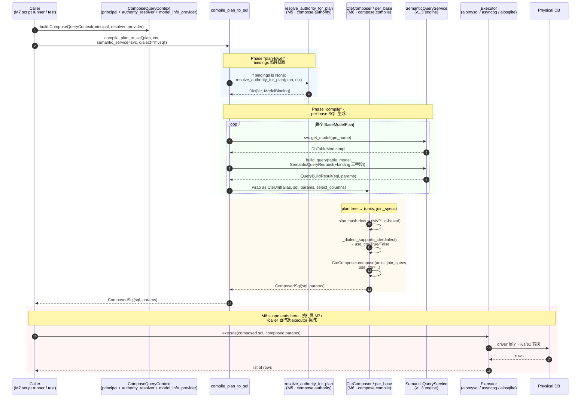
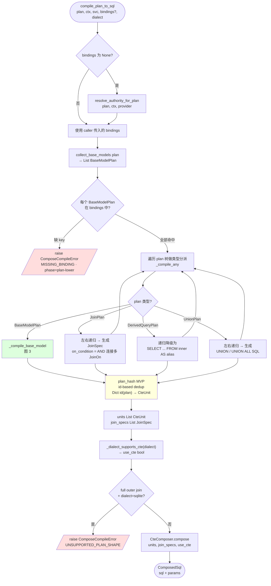
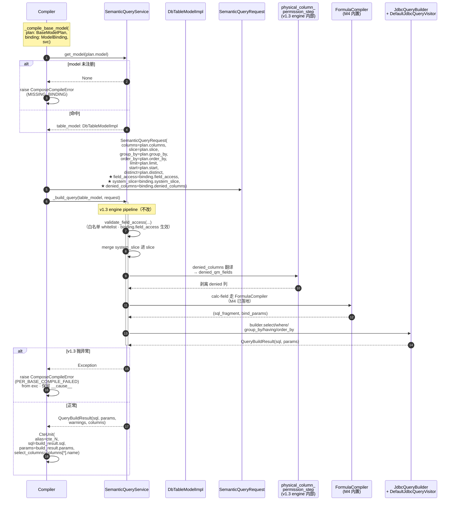
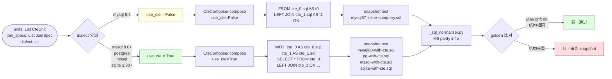
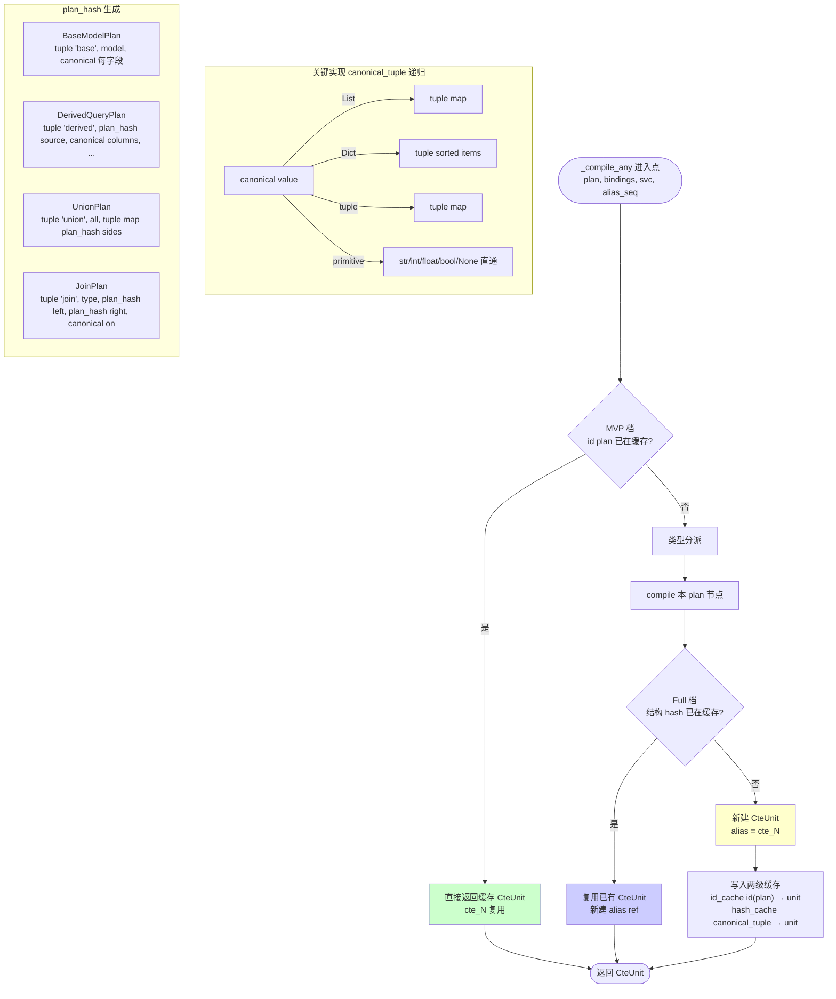
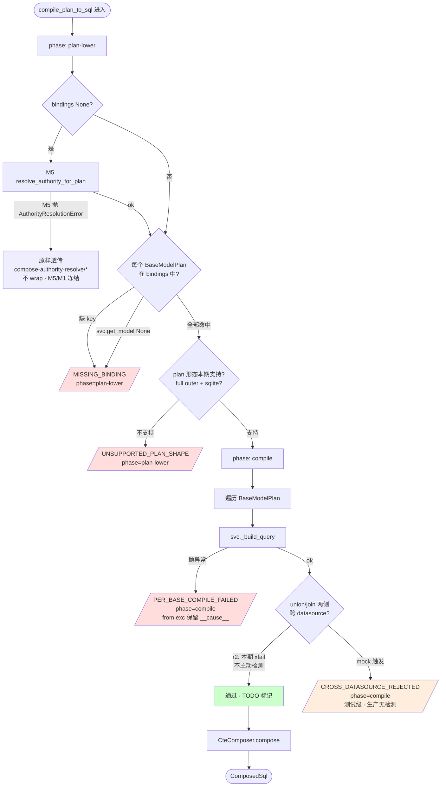

## r3 修订说明（2026-04-22）

在 r2 基础上吸收 6+2 条评审确认：

- **Q1 确认**：M6 scope 止于 `ComposedSql`，执行归 M7 —— 无改动，但图 1 评审点加固
- **Q2 docstring 补注**：`compile_plan_to_sql` docstring 新增"caller 需要缓存时自行一次性 resolve + 复用 bindings="的使用指引（2026-04-21 决策记录不做跨请求缓存的延续）
- **Q3 6.5 扩测**：4 方言 SQL snapshot 测试新增 **derived-chain** 维度（之前只有 single/union/join），理由是 derived chain 是唯一自拼 `FROM (inner) AS alias` 的路径，snapshot 覆盖能早期发现方言 drift
- **Q4 决策记录**：`_build_query` 的内部签名依赖登记到 progress.md 决策记录（2026-04-22 第三条 · 见本文档 §决策落地），不提升为公开 API 等 M7 或后续 caller 出现再议（YAGNI）
- **Q5 MAX_PLAN_DEPTH**：`compose_planner.py` 新增 `MAX_PLAN_DEPTH = 32` 常量 + `_compile_any` / `plan_hash` 带深度计数器，超限抛 `UNSUPPORTED_PLAN_SHAPE`；防 M7 script runner DOS 风险
- **Q6 Follow-up F-7**：`CROSS_DATASOURCE_REJECTED` 真实检测推到 post-M6 follow-up F-7（需要 `ModelBinding.datasource_id` 扩展 M1/M5 契约）；本期维持 xfail；M7 script 用户文档需提示"cross-datasource queries may surface as driver-level errors"
- **Extra-1 · 包名改 `compile/` → `compilation/`**：避免与 Python builtin `compile()` 名称遮蔽；`foggy.dataset_model.engine.compose.compilation`；下游 Java 镜像时也选 `engine.compose.compilation` / `engine.compose.sqlcompile` 任一（不选 `compile` 避免撞 `java.lang.Compiler` 习惯）
- **Extra-2 · 错误码措辞**：改为 "4 个 `compose-compile-error/*` 错误码 + 1 个 `NAMESPACE` 常量，共 5 条 `error_codes.py` 模块级常量"，消除 "5 个错误码 / 表格 4 行" 的歧义；验收硬门槛 #3 同步调整

r2 内容完全保留在下方（不删，保审计轨迹）。

---

## r2 修订说明（2026-04-22）

此版本吸收 plan-evaluator 评估中的 10 项建议：

- **事实修正**：`SemanticServiceImpl` → `SemanticQueryService`；`BaseModelPlanCollector.collect()` → `collect_base_models()`；`SemanticQueryRequest` 字段行号按真实顺序 `field_access:440 / system_slice:446 / denied_columns:452`
- **D1 决策**：走内部入口 `SemanticQueryService._build_query(table_model, request)` 直接取 `QueryBuildResult(sql, params)`，保留 exception `__cause__` 链
- **D2 决策**：`compile_plan_to_sql(..., *, semantic_service: SemanticQueryService)` 新增关键字参数注入 service，不动 `ComposeQueryContext` 冻结契约
- **D3 明写**：每个 `BaseModelPlan` 先 `svc.get_model(base_plan.model)` 拿 `DbTableModelImpl`
- **D4 伪代码**：`DerivedQueryPlan` 递归降级为一条线性 `SELECT … FROM (prev)` 字符串，不走 `CteComposer` outer 包装
- **D5 降级**：`CROSS_DATASOURCE_REJECTED` 本期 xfail 占位 + TODO，因为 `ModelBinding` / `ModelInfoProvider` 都没有 datasource identifier（M1/M5 契约已冻结；不在 M6 触动）
- **D6 重估**：6.6 plan-hash 从 0.2 → 0.4 PD（含 canonical_tuple 递归转换 List/Dict → tuple/frozenset 的实际工作量）；本期 MVP 可先只做 `id(plan)` 级去重，结构性等价推到 M6 followup
- **错误码**：删除 `SANDBOX_REJECTED`（M6 不直接生成 SQL，窗口 / lateral / recursive 都由 v1.3 engine 自己处理；真正的沙箱审计在 M9 Layer A/B/C）；本期 **5 个**错误码
- **验收补证**：snapshot 归一化复用 `tests/integration/_sql_normalizer.py`
- **估算更新**：`2–3 PD` → `2.5–3.5 PD（含决策闭环）`
---

# Python M6 · Compose Query SQL 编译器 开工提示词

## 执行位置（读在最前）

- **目标仓库**：`foggy-data-mcp-bridge-python`（独立仓，非 worktree）
- **新建包**：`foggy.dataset_model.engine.compose.compilation/` · r3 从 `compile/` 改名避免遮蔽 Python builtin `compile()`
- **已有姐妹子包**：
  - `compose.context/`（M1 · `ComposeQueryContext` / `Principal`）
  - `compose.security/`（M1 · `AuthorityResolver` Protocol / `ModelBinding` / `AuthorityResolution` — SPI + 值对象都在这）
  - `compose.plan/`（M2 · `QueryPlan` / `BaseModelPlan` / `DerivedQueryPlan` / `UnionPlan` / `JoinPlan` / `JoinOn`）
  - `compose.sandbox/`（M3 · `FsscriptDialect` 方言 + `ComposeSandboxErrorCodes` + `ComposeSandboxViolationError`）
  - `compose.schema/`（M4 · `OutputSchema` / `derive_schema`）
  - `compose.authority/`（M5 · `resolve_authority_for_plan` / `collect_base_models` / `apply_field_access_to_schema`）
- **pytest**：`pytest tests/compose/compilation/` 聚焦；全仓 `pytest -q`

规范文档在 Java 仓 worktree：`D:/foggy-projects/foggy-data-mcp/foggy-data-mcp-bridge-wt-dev-compose/docs/8.2.0.beta/`。本提示词不在 Python 仓落盘（历史上 Python 侧 M1–M5 均无 per-milestone execution prompt，这次 M6 量级较大所以破例写一份；实现时 Python 仓 `docs/` 不变动）。

## 角色与语境

你是 `foggy-data-mcp-bridge-python` 的 engine 层维护者。M6 是 Compose Query 第一个**跨 base plan 组合 SQL** 的里程碑：把 M2 `QueryPlan` 树 + M5 `Map[str, ModelBinding]` 组合 → 方言感知的 CTE / 子查询 SQL。

**核心原则（2026-04-22 progress.md 决策记录已锁）**：

1. `deniedColumns` / `systemSlice` / `PhysicalColumnMapping` **完全复用 v1.3 既有链路**，不在 compose 层另起一套
2. `field_access` whitelist 在 M5 `apply_field_access_to_schema` 已覆盖声明 schema 层面；M6 只需把 `ModelBinding.field_access` 也注入 `SemanticQueryRequest.field_access`（v1.3 engine 会原样生效）
3. 底层 CTE / 子查询拼装复用已有的 `foggy.dataset_model.engine.compose.CteComposer`（`__init__.py` 里）—— **不重写**

## 必读前置

严格按顺序读完再动手：

1. **主需求**：`docs/8.2.0.beta/P0-ComposeQuery-QueryPlan派生查询与关系复用规范-需求.md`
   - §SQL 编译边界 / §错误模型规划 / §典型示例 1~3
2. **实现规划**：`docs/8.2.0.beta/P0-ComposeQuery-QueryPlan派生查询与关系复用规范-实现规划.md`
   - §SQL 编译边界（§1~§4）/ §交付顺序建议（第 6 条）
3. **progress.md 决策记录**：`docs/8.2.0.beta/P0-ComposeQuery-QueryPlan派生查询与关系复用规范-progress.md`
   - 2026-04-22 两条（M6 deniedColumns 复用 v1.3 / 节奏 Python 先落）
4. **M5 上游**：
   - `foggy.dataset_model.engine.compose.authority.resolver.resolve_authority_for_plan(plan, context, *, model_info_provider=None) → Dict[str, ModelBinding]`
   - `foggy.dataset_model.engine.compose.authority.collector.collect_base_models(plan) → List[BaseModelPlan]`（前序 DFS 去重）
   - M6 的每个 `BaseModelPlan` 都能在 bindings 里查到一条 `ModelBinding`（若缺即 M5 漏网，M6 抛 `MISSING_BINDING` 作二次防御）
5. **v1.3 复用挂点**（看懂，不改写）：
   - `foggy.mcp_spi.semantic.SemanticQueryRequest` 三个关键字段实际行号：`field_access:440` / `system_slice:446` / `denied_columns:452`
   - `foggy.dataset_model.semantic.physical_column_mapping` 的 `PhysicalColumnMapping` + `build_physical_column_mapping` + `to_denied_qm_fields`（v1.3 physical-column 权限拦截基础设施）
   - `foggy.dataset_model.semantic.service.SemanticQueryService` （**注意类名不是 `SemanticServiceImpl`**）：
     - `get_model(name) → Optional[DbTableModelImpl]` · 按 QM 名拿回 TM 实例（service.py:241）
     - `get_physical_column_mapping(model_name) → Optional[PhysicalColumnMapping]` · v1.3 mapping cache（service.py:203）
     - `_build_query(table_model, request) → QueryBuildResult(sql, params, warnings, columns)` · **M6 就走这条**（见下文 D1 决策；保留原始 exception 的 `__cause__` 链）
6. **已有 CteComposer**（M6 底层 SQL 组装器）：`foggy.dataset_model.engine.compose.__init__` 里 `CteComposer.compose(units, join_specs, use_cte=True|False) → ComposedSql(sql, params)` + `CteUnit(alias, sql, params, select_columns)` + `JoinSpec(left_alias, right_alias, on_condition, join_type)`

## 交付清单

### 新建子包 `foggy.dataset_model.engine.compose.compilation/`

```
compilation/
├── __init__.py               # 公开 API：compile_plan_to_sql, ComposeCompileError
├── errors.py                 # ComposeCompileError + 错误码常量
├── error_codes.py            # 本期新增：4 个 code + 1 个 NAMESPACE 常量（见下表）
├── per_base.py               # _compile_base_model(plan, binding, svc) 把 BaseModelPlan + ModelBinding → CteUnit (SQL + params + projection)
├── plan_hash.py              # plan-level 结构 hash，用于 M6.6 子树去重；含 MAX_PLAN_DEPTH guard
├── compose_planner.py        # 把 QueryPlan 树转成 (List[CteUnit], List[JoinSpec])；按方言决定 use_cte；MAX_PLAN_DEPTH=32 防 DOS
└── compiler.py               # compile_plan_to_sql(plan, context, *, semantic_service, bindings, model_info_provider, dialect) 入口
```

**命名说明（r3 决策）**：子包叫 `compilation` 不叫 `compile`，避免遮蔽 Python builtin `compile()`。从包里导出也用全名：`from foggy.dataset_model.engine.compose.compilation import compile_plan_to_sql`。

公开 API（`__init__.py`）：

```python
from .compiler import compile_plan_to_sql
from .errors import ComposeCompileError
from . import error_codes

__all__ = ["compile_plan_to_sql", "ComposeCompileError", "error_codes"]
```

### 核心入口签名（D2 决策：service 作关键字参数注入）

```python
def compile_plan_to_sql(
    plan: QueryPlan,
    context: ComposeQueryContext,
    *,
    semantic_service: SemanticQueryService,          # ★ D2 · 必传
    bindings: Optional[Dict[str, ModelBinding]] = None,
    model_info_provider: Optional[ModelInfoProvider] = None,
    dialect: str = "mysql",            # "mysql" / "postgres" / "mssql" / "sqlite"
) -> ComposedSql:
    """Compile a QueryPlan tree to dialect-aware SQL + params.

    - ``semantic_service`` (required, kw-only): the v1.3 ``SemanticQueryService``
      the compiler delegates per-base-plan SQL generation to. We pass it as an
      explicit keyword argument rather than add a field to ``ComposeQueryContext``
      so the M1/M5 frozen contract stays untouched.
    - ``bindings``: optional — when provided, skips the internal M5 resolve; when
      omitted, the compiler invokes
      ``resolve_authority_for_plan(plan, context, model_info_provider=...)``
      in-process. This keeps the two-step API optional for callers that already
      have bindings (e.g. M7 script runner) while still supporting one-shot use.

      **Caching (r3 Q2)**: The compiler intentionally does NOT cache the
      resolved bindings internally — see progress.md decision 2026-04-21
      "no cross-request caching in Foggy; host resolver owns caching".
      Callers that invoke ``compile_plan_to_sql`` multiple times on the
      same plan should resolve once externally and pass the result via
      ``bindings=...`` on each subsequent call::

          bindings = resolve_authority_for_plan(plan, ctx)
          sql_mysql = compile_plan_to_sql(plan, ctx,
                                           semantic_service=svc,
                                           bindings=bindings,
                                           dialect="mysql")
          sql_sqlite = compile_plan_to_sql(plan, ctx,
                                            semantic_service=svc,
                                            bindings=bindings,
                                            dialect="sqlite")
    - ``dialect``: drives CTE-vs-subquery fallback (see 6.5); the per-base
      engine call uses whatever dialect ``semantic_service`` itself was
      configured with (no override on ``SemanticQueryRequest``).
    """
```

### 4 个新错误码 + 1 个 NAMESPACE 常量（`error_codes.py` · 共 5 条模块级常量）

| 常量 | 字符串 | 触发 |
|---|---|---|
| `NAMESPACE` | `"compose-compile-error"` | 顶层 namespace · 不是错误码本身，是 4 个错误码共享的前缀 |
| `UNSUPPORTED_PLAN_SHAPE` | `compose-compile-error/unsupported-plan-shape` | M6 本期未支持的 QueryPlan 子类或组合（如 SQLite 的 `full outer join` · r3 新增：plan 深度超过 `MAX_PLAN_DEPTH=32`） |
| `CROSS_DATASOURCE_REJECTED` | `compose-compile-error/cross-datasource-rejected` | union/join 两侧来自不同数据源 · **r2 · 本期 xfail 占位**（见 D5）|
| `MISSING_BINDING` | `compose-compile-error/missing-binding` | `bindings` 没有给定 BaseModelPlan.model 的 entry（上游 M5 应先失败；M6 作为二次防御） |
| `PER_BASE_COMPILE_FAILED` | `compose-compile-error/per-base-compile-failed` | 某个 BaseModelPlan 走 v1.3 `_build_query` 失败（wrap 下层异常，保留 `__cause__`） |

两个 phase：`"compile"` / `"plan-lower"`（后者用于在 CTE 组装前的 plan→SQL 下降步骤报错）。

**r2 修订**：删除原 `SANDBOX_REJECTED` —— M6 不直接生成 SQL 语法，窗口 / lateral / recursive 走 v1.3 engine 自己处理（例如窗口函数经 `_build_calculated_field_sql` 的 `is_window_function` 分支）；真正的沙箱审计（Layer A/B/C）归 M9 独立里程碑。

**r3 措辞修订**：原措辞 "5 个新错误码" 容易让"代码逐行断言"误以为要断 5 条 `compose-compile-error/*`。真实数字是：4 个错误码 + 1 个前缀 NAMESPACE 常量 = 5 条 `error_codes.py` 模块级常量。测试按照 `assert len(error_codes.ALL_CODES) == 4`（或等价）+ `assert error_codes.NAMESPACE == "compose-compile-error"` 分开断言。

**提醒**：M6 **不新增** `compose-authority-resolve/*` 或 `compose-schema-error/*` 的错误码 —— M5/M4 已冻结，compile 阶段依赖失败由它们抛出后原样透传。

## 流程图（评审视角 · 先看图再看 6 阶段细节）

本节 6 张图按关注点分层：**顶层编排 → 编译内部 → per-base 细节 → CTE/子查询组装 → plan-hash 去重 → 错误码决策树**。执行 agent 开工前请对照 §评审引导问题 逐条确认。

### 图 1 · 顶层编排时序图（client → compile → execute → result）



**评审点**：

1. **M6 scope 边界**：最后一个 rect（红色）是客户端职责，M6 交付到 `ComposedSql` 就停 — 与 M7 `toSql()` / `execute()` 分割线对齐
2. **bindings 惰性获取**：绿色 rect 的 `if bindings is None` 分支是 API 灵活性关键 — M7 script runner 会传入已解析的 bindings 跳过；一次性 caller 则让 M6 内部 resolve
3. **三字段注入时点**：binding 三字段（`field_access / system_slice / denied_columns`）都是在 per-base `SemanticQueryRequest` 构造时塞入，**不**在 compose 层自己拦截列 — 权限正确性交给 v1.3 engine

---

### 图 2 · compile_plan_to_sql 内部控制流



**评审点**：

1. **递归分派**：`_compile_any` 是主循环，每种 plan 类型各有 lowering 策略 — 结构清晰，易测
2. **Hash 落点**：所有 compile 分支回到同一个 id-based dedup 入口（黄色节点），避免跨类型重复 CTE
3. **错误码位置**：`MISSING_BINDING` 在 `plan-lower` phase（bindings 确认阶段），`UNSUPPORTED_PLAN_SHAPE` 在 compile phase（SQL 方言能力阶段） — phase 标签不混淆

---

### 图 3 · per-base 编译细节（6.1 核心路径）



**评审点**：

1. **binding 三字段星标**：红星标记的三个字段是权限注入的唯一路径 — compose 层自己**不**再用 `PhysicalColumnMapping.to_denied_qm_fields`
2. **v1.3 pipeline 透明**：灰色 box 里的所有步骤都是 v1.3 既有逻辑，M6 不触碰 — `FormulaCompiler` 是 M4 新接入的，但 M6 只消费不关心
3. **`__cause__` 链保留**：`raise ... from exc` 是 D1 决策 `_build_query` over `query_model(VALIDATE)` 的直接兑现

---

### 图 4 · CTE vs 子查询方言回退（6.5）



**评审点**：

1. **MySQL 5.7 分叉**：唯一需要 `use_cte=False` 的分支 — 这是 `CteComposer` 既有能力，M6 只用不改
2. **Snapshot 归一化复用**：底部 `_sql_normalizer` 是 M5 验收文档专门写的 parity infra（41 parity + 14 security entries 时用过），直接复用避免重造
3. **`full outer join` SQLite** 不在此图，归 `UNSUPPORTED_PLAN_SHAPE` — 属 plan-lower 阶段前置校验

---

### 图 5 · plan-hash 去重（6.6 两档）



**评审点**：

1. **两档缓存策略**：MVP 档（绿色）本期必交付；Full 档（蓝色）本期实现但测试覆盖划 P1，验收允许其中 1 条 xfail
2. **canonical_tuple 独立子图**：这是本期最容易踩坑的点 — `frozen=True` 但 `List` 字段导致自动 `__hash__` 崩溃 —— 手写递归是 r2 重估 0.2 PD 的来源
3. **alias 分配**：新建 CteUnit 才占用新 `cte_N`；命中缓存时仅分配 **ref alias**，SQL 里 `cte_N` 出现次数 = 引用次数

---

### 图 6 · 错误码决策树（5 个 code × 2 phase）



**评审点**：

1. **5 个错误码分相**：3 个在 `plan-lower`（结构校验期）、2 个在 `compile`（SQL 生成期） — 便于测试断言分类
2. **M5/M4 错误透传**：最左分支（蓝色）—— 明确 M6 不重包装上游错误，避免错误码混战
3. **`CROSS_DATASOURCE_REJECTED` 双轨**：橙色节点 — 错误码定义在，但运行时不主动触发（测试级 mock），与 D5 决策对齐

---

### 评审引导问题

请对照 6 张图逐一确认，特别是：

| # | 问题 | 图 |
|---|---|---|
| 1 | M6 scope 是否止于 `ComposedSql`？执行该不该进 M6？ | 图 1 |
| 2 | `bindings=None` 的惰性 resolve 是否需要加一层缓存（同一 plan 多次调用）？ | 图 1 / 图 2 |
| 3 | `DerivedQueryPlan` 递归降级用 `SELECT...FROM(inner)AS alias` 串拼是否会踩 SQL dialect 转义？（alias 引号） | 图 2 / 图 3 |
| 4 | `_build_query` 是下划线方法；M6 调它算不算破坏封装？需要改成公共 API 吗？ | 图 3 |
| 5 | Full 档 plan_hash 遇到嵌套 DerivedQueryPlan（多层递归）是否会 hash 爆炸？需要深度上限吗？ | 图 5 |
| 6 | `CROSS_DATASOURCE_REJECTED` 本期 xfail 是否会在 M7 script runner 落地时暴露回归？ | 图 6 |

---

### 6 阶段拆分（建议按顺序提交 / 审阅）

#### 6.1 · BaseModelPlan + DerivedQueryPlan 编译（链式派生）

入口：`_compile_base_model(plan: BaseModelPlan, binding: ModelBinding, svc: SemanticQueryService) → CteUnit`

**D1 决策**：per-base 编译走 **`svc._build_query(table_model, request)`** 直接拿 `QueryBuildResult(sql, params)`，**不走** `svc.query_model(mode=VALIDATE)`，原因：
- `_build_query` 抛原始 exception → 上层 `try/except` 能精确 wrap 为 `PER_BASE_COMPILE_FAILED` 并保留 `__cause__` 链
- `query_model(mode=VALIDATE)` 把 exception 吞成 `SemanticQueryResponse._error` 字符串 → `__cause__` 断链，执行 agent 诊断痛

**6.1 实现路径（逐步）**：

```python
def _compile_base_model(
    plan: BaseModelPlan,
    binding: ModelBinding,
    svc: SemanticQueryService,
    alias: str,
) -> CteUnit:
    # 1. D3: 按 QM 名取 TableModel
    table_model = svc.get_model(plan.model)
    if table_model is None:
        raise ComposeCompileError(
            code=error_codes.MISSING_BINDING,       # 或专门的 MISSING_MODEL，按需再开
            phase="plan-lower",
            message=f"QM '{plan.model}' not registered with semantic service",
        )

    # 2. 构造 SemanticQueryRequest — binding 三字段是权限注入关键
    request = SemanticQueryRequest(
        columns=list(plan.columns or []),
        slice=list(plan.slice or []),
        group_by=list(plan.group_by or []),
        order_by=list(plan.order_by or []),
        limit=plan.limit,
        start=plan.start,
        distinct=bool(plan.distinct),
        # 权限三联 ★M6 核心
        field_access=binding.field_access,          # v1.3 engine 会据此生成白名单 SELECT
        system_slice=list(binding.system_slice),    # v1.3 engine 会把这些合并进 WHERE
        denied_columns=list(binding.denied_columns),# v1.3 engine 会在 physical_column_permission_step 拦截
    )

    # 3. 调 v1.3 engine — D1: _build_query 保留 exception __cause__
    try:
        build_result = svc._build_query(table_model, request)
    except Exception as exc:
        raise ComposeCompileError(
            code=error_codes.PER_BASE_COMPILE_FAILED,
            phase="compile",
            message=f"per-base compile failed for model '{plan.model}'",
        ) from exc

    # 4. 包装为 CteUnit — select_columns 取自 build_result.columns 的 name
    select_columns = [c.get("name") for c in (build_result.columns or []) if c.get("name")]
    return CteUnit(
        alias=alias,
        sql=build_result.sql,
        params=list(build_result.params or []),
        select_columns=select_columns,
    )
```

**D4 决策 · `DerivedQueryPlan` 递归降级**：不走 `CteComposer` 的 outer 包装（它只支持 "CTE + JOIN" 两种形态），而是把 derived chain **线性降级** 为一条 SQL 字符串：

```python
def _compile_derived(
    plan: DerivedQueryPlan,
    bindings: Dict[str, ModelBinding],
    svc: SemanticQueryService,
    alias_seq: Iterator[str],   # 生成 cte_0 / cte_1 / ...
) -> CteUnit:
    """Derived chain 降级：
        DerivedQueryPlan(source=base_or_derived, columns=C, slice=S, group=G, order=O, limit=L)
        → SELECT C FROM (<source_sql>) AS <inner_alias>
             WHERE S GROUP BY G ORDER BY O LIMIT L
    """
    inner_alias = next(alias_seq)
    # 递归 → source 可能是 BaseModelPlan 也可能是另一个 DerivedQueryPlan
    inner = _compile_any(plan.source, bindings, svc, alias_seq)

    # outer SELECT 自己拼（不复用 SemanticQueryRequest — 已脱离 TM 语境）
    # 列必须来自 inner.select_columns（M4 OutputSchema 已校验过）
    outer_sql, outer_params = _render_outer_select(
        inner_sql=inner.sql,
        inner_alias=inner_alias,
        columns=plan.columns,
        slice_=plan.slice,
        group_by=plan.group_by,
        order_by=plan.order_by,
        limit=plan.limit,
        start=plan.start,
        distinct=plan.distinct,
    )
    return CteUnit(
        alias=next(alias_seq),
        sql=outer_sql,
        params=inner.params + outer_params,    # 顺序：inner 先 outer 后（SELECT → WHERE 子句顺序）
        select_columns=list(plan.columns or inner.select_columns),
    )
```

- `_render_outer_select` 自行拼字符串（比调 v1.3 engine 轻量，因为已经没有 TM/measure/dimension 需要解析了）
- 参数顺序与 v1.3 引擎 M4 的 `JdbcSelect/JdbcGroupBy/JdbcOrder.params` 保持一致（SELECT → FROM → WHERE → GROUP BY → HAVING → ORDER BY）

**派发入口** `_compile_any(plan, bindings, svc, alias_seq)` 做类型分派：`BaseModelPlan / DerivedQueryPlan / UnionPlan / JoinPlan` 四选一。

测试聚焦（~20）：
- 单 base plan 基本查询
- derived(base) 选列 / group_by / order_by / limit / start
- 链式 derived 2/3/4 层（验证 param 顺序左→右扁平化对齐 inner → outer）
- `field_access` / `denied_columns` / `system_slice` 被 binding 注入后的 SQL 行为
- `distinct=True`
- 空 slice / 空 group_by / 空 order_by
- 错误：v1.3 engine 抛错时包装为 `PER_BASE_COMPILE_FAILED` 保留 `__cause__`
- 错误：`svc.get_model()` 返回 None 时报告可读错误

#### 6.2 · UnionPlan 编译

每个 side → `CteUnit`；用 SQL-level `UNION` / `UNION ALL`（不走 CteComposer 的 JoinSpec 路径 —— union 是列对齐不是 ON 条件）。

约束：
- 列数已在 M4 schema derive 时校验 —— M6 不重复
- 类型兼容性在本期 **不**校验（spec 显式推后）

**D5 决策 · `CROSS_DATASOURCE_REJECTED` 本期 xfail 占位**：
- `ModelBinding` 当前只有 `field_access / denied_columns / system_slice` 三字段，**没有 datasource identifier**
- `ModelInfoProvider.get_tables_for_model()` 返回物理表名 `List[str]`，从表名推断 datasource 要依赖 naming convention（不稳）
- M1/M5 契约已冻结；在 M6 本期给 `ModelBinding` 加 `datasource_id` 会触动上游 → **不做**
- 本期处理：
  - 错误码 `CROSS_DATASOURCE_REJECTED` 保留定义，`raise ComposeCompileError` 路径也写好（单元测试可通过 mock binding 触发），但**在实际 plan 编译里不主动检测**
  - 文档级 TODO 挂在 compile_planner.py：`# TODO[M7/D5]: datasource identity hook — requires ModelBinding.datasource_id or ModelInfoProvider.get_datasource_id`
  - 相关 E2E 测试标 `@pytest.mark.xfail(reason="cross-datasource detection deferred to post-M6 · datasource identity not in ModelBinding contract yet")`

测试聚焦（~12）：union 基本 / `all=True` vs `all=False` / 双侧 derived / union 多路（先支持 2 元；>2 元左结合递归）/ 4 方言 SQL 输出形态 / `CROSS_DATASOURCE_REJECTED` 的错误码字符串断言（mock 触发，真实检测 xfail）

#### 6.3 · JoinPlan 编译

使用 `CteComposer.compose(units, join_specs, use_cte=<by dialect>)`。

`JoinSpec` 由 `JoinOn` 列表转换而来；多个 `JoinOn` 用 `AND` 连接成一个 `on_condition` 字符串。

约束：
- `on[*].left` / `on[*].right` 合法性在 M4 已校验 —— M6 不重复
- `type` ∈ `{inner, left, right, full}`；`full` 在 SQLite 不支持 → 抛 `UNSUPPORTED_PLAN_SHAPE`

测试聚焦（~12）：inner/left/right 基本 / 多 ON 条件 / 一侧 derived / join 后再 query / full outer join 在 SQLite 被拒绝 / join 后 columns 引用两侧字段

#### 6.4 · `Map[str, ModelBinding]` 按 BaseModelPlan 注入 v1.3 挂点 ★核心

这一条是 M6 的**权限正确性关键**。

实现要点：
- `compile_plan_to_sql` 收到 `bindings` 后，遍历 `BaseModelPlanCollector.collect(plan)`（或复用 M5 结果），对每个 base plan：
  - 在 `_compile_base_model(base_plan, binding=bindings[base_plan.model], context)` 里把 binding 三字段注入 `SemanticQueryRequest`
  - 不调用 M5 的 `apply_field_access_to_schema`（那是声明 schema 层面；M6 需要让 v1.3 engine 自己根据 `field_access` 生成 SELECT）
  - 对 `denied_columns` **一定不要** 在 compose 层再用 `PhysicalColumnMapping` 翻译一次 —— v1.3 engine 已经在 `physical_column_permission_step`（或等价的 Python hook）消费了
- `bindings` 为 `None` 时，内部调 `resolve_authority_for_plan(plan, context)` 得到 bindings 再继续

测试聚焦（~20）：
- 带 `field_access = ['a','b']` 的 binding → 生成的 SQL 只 SELECT a, b
- 带 `field_access = []` → 生成的 SQL 为空列 or 合理错误（参考 v1.3 `empty field_access` 行为；两种结果都需文档化）
- 带 `denied_columns = [phys_col]` → v1.3 engine 行为保持（物理列不出现在 SQL）
- 带 `system_slice = [{field,op,value}]` → WHERE 追加
- `bindings` 缺 key（M5 应先失败，但 M6 作为二次防御）→ `MISSING_BINDING`
- `bindings=None` 的单步 API → 内部自动 resolve → SQL 生成成功
- 同一 QM 在 plan 树出现两次（union）→ 两个 CteUnit 共享同一 binding（请求级去重已在 M5；这里验证 SQL 不出现两条不同的权限）
- denied_columns 已由 v1.3 链路生效 —— M6 不再 PhysicalColumnMapping 反查（确认路径不重复）

#### 6.5 · CTE vs 子查询方言回退

根据 `dialect` 决定 `use_cte`：
- MySQL 5.7 → `use_cte=False`（不支持 CTE）
- MySQL 8.0+ / PostgreSQL / SQL Server / SQLite 3.30+ → `use_cte=True`

`CteComposer` 已支持两种模式；M6 只需提供一个 `_dialect_supports_cte(dialect: str) → bool` 的小工具。

测试聚焦（~14 · r3 从 ~10 扩：补 derived-chain 维度）：
- 4 方言 × (single / union / join) 的 SQL 形态快照（用已有 `_sql_normalizer` parity infra 做归一化比对）
- **r3 新增**：4 方言 × **derived-chain**（至少 2 层嵌套 `.query().query()`）的 SQL 形态快照。理由：derived chain 是唯一自拼 `FROM (inner) AS alias` 的编译路径，snapshot 覆盖能早期发现方言 drift（PG 要求 `AS` 关键字 / MySQL 大小写折叠 / MSSQL derived table 必须有 alias / SQLite 对 `AS` 宽容度差异）
- `use_cte=True` 输出 `WITH cte_0 AS (...)` 片段
- `use_cte=False` 输出 `FROM (...) AS t0`
- 嵌套 derived 下方言是否影响外层 SELECT 语法（不应该；方言只影响 FROM 子句形态）

#### 6.6 · plan-hash 子树去重 + plan 深度 guard（r3 重估：0.5 PD · 分 MVP + Full + MAX_PLAN_DEPTH）

**r3 新增 · `MAX_PLAN_DEPTH` guard（DOS 防线）**：

M7 script runner 会暴露 `plan = from_(...); plan = plan.query(...); plan = plan.query(...); ...` 这样的用户编排入口。用户写出任意深度嵌套的 `DerivedQueryPlan` 链时，虽然 `plan_hash` 本身不会爆炸（Python tuple hash 一次性 O(n) 并缓存），但 `_compile_any` 递归 + `plan_hash` 遍历 + 深度参数绑定会让编译时间随深度线性增长，占用 executor 线程。

实现要点（`compose_planner.py`）：

```python
MAX_PLAN_DEPTH = 32
"""
Defense-in-depth cap on nested plan recursion. A real Compose Query
rarely exceeds depth 3-5; depths above 32 signal either script abuse
or a generated-plan bug. The cap protects the M7 script runner from
pathological DOS inputs without blocking any real-world query shape.
"""

def _compile_any(plan, bindings, svc, alias_seq, *, _depth: int = 0):
    if _depth > MAX_PLAN_DEPTH:
        raise ComposeCompileError(
            code=error_codes.UNSUPPORTED_PLAN_SHAPE,
            phase="plan-lower",
            message=(
                f"Plan depth {_depth} exceeds MAX_PLAN_DEPTH={MAX_PLAN_DEPTH}; "
                "nested derivations beyond this depth are rejected as a "
                "DOS safeguard (Compose Query typical depth is 3-5)."
            ),
        )
    # ... type dispatch + recursion with _depth+1
```

测试聚焦追加（~1 条）：
- 33-level 链式 `DerivedQueryPlan` 被 `UNSUPPORTED_PLAN_SHAPE` 拒绝；32-level 通过
- 消息里出现 `MAX_PLAN_DEPTH=32` 字样便于诊断

---

**plan-hash 子树去重（MVP + Full 两档）**：

同一个 `BaseModelPlan` 子树在 plan 树里出现多次时（典型：union 左右相同 QM，或 derived chain 里复用同一 base），去重策略分两档：

**MVP 档（本期必须落地，~0.2 PD）· 基于 `id(plan)` 同实例引用**：

- 用 `Dict[int, CteUnit]` = `{id(plan_node): compiled_cte_unit}` 做缓存
- Plan 树遍历时若同一实例再次出现（例如 `a = from_("X"); union(a, a)`），直接复用 CteUnit
- 覆盖最典型的 M7 script runner 用例（`x = from(...); x.union(x)`）

**Full 档（r2 重估：0.2 PD · 本期交付，但测试覆盖划成 P1）· 结构性等价**：

M2 plan 节点虽然是 `frozen=True`，但 `BaseModelPlan.slice_ / columns / group_by / order_by` 都是 `List[…]`，`List` 不 hashable —— **dataclass 自动 `__hash__` 会抛 `TypeError`**。因此不能直接用 `hash(plan)`，需要手写 canonical-tuple 递归：

```python
def _canonical(value: Any) -> Any:
    """Recursively convert Lists/Dicts to tuples/frozensets so the
    result is hashable and order-preserving for list-like fields."""
    if isinstance(value, list):
        return tuple(_canonical(v) for v in value)
    if isinstance(value, dict):
        return tuple(sorted((k, _canonical(v)) for k, v in value.items()))
    if isinstance(value, tuple):
        return tuple(_canonical(v) for v in value)
    return value  # str / int / float / bool / None → hashable primitive

def plan_hash(plan: QueryPlan) -> Tuple:
    """Canonical hash tuple for a plan subtree — stable across instances."""
    if isinstance(plan, BaseModelPlan):
        return (
            "base",
            plan.model,
            _canonical(plan.columns),
            _canonical(plan.slice_),
            _canonical(plan.group_by),
            _canonical(plan.order_by),
            plan.limit, plan.start, bool(plan.distinct),
        )
    if isinstance(plan, DerivedQueryPlan):
        return ("derived", plan_hash(plan.source), _canonical(plan.columns), ...)
    # UnionPlan / JoinPlan 同理
```

**为什么不直接用 `__hash__` 强化 M2**：会触动 M2 frozen 契约，需要另起一轮 Java/Python 一致性签字。M6 本期把 canonical logic 放在 `compilation/plan_hash.py`，既不动 M2，也避免在多处重复实现。

测试聚焦（~10）：
- MVP 档（6 条）：
  - 同一 `BaseModelPlan` 实例在 union 两侧 → 1 个 CTE
  - 同一实例在 join 两侧 → 1 个 CTE
  - 同一实例三次引用 → 仍 1 个 CTE
  - 单次引用 → inline subquery（不生成 CTE alias）
  - MVP 档不合并"结构相同但实例不同"的两个子树（这是 Full 档）
  - `compilation/plan_hash.py::plan_hash(plan)` 对 frozen dataclass List 字段不抛 `TypeError`（这是 r2 新增的重点 guard test）
- Full 档（4 条，P1 覆盖）：
  - 结构性等价但实例不同的子树（两次 `from_("X", columns=[...])` 完全一样）→ 合并
  - 结构性不等价（`columns` 顺序不同）→ 不合并
  - 结构性不等价（`limit` 不同）→ 不合并
  - 嵌套 derived 在两处出现且源 base 相同 → 外层不合并（outer select 不同），内层 base 合并

## 非目标（禁止做）

- **不做**：跨数据源 union/join（直接抛 `CROSS_DATASOURCE_REJECTED`）
- **不做**：窗口函数 / `exists` / `lateral` / recursive CTE（抛 `SANDBOX_REJECTED`）
- **不做**：内存加工后再编排
- **不做**：`SemanticQueryRequest` / v1.3 `PhysicalColumnMapping` / v1.3 `denied_columns` 物理列拦截 的任何修改
- **不做**：`CteComposer` 的重写或扩展（现有 SQL 模板够用；不够用再单独立项）
- **不做**：`toSql()` / `execute()` 绑定到 QueryPlan（M7 scope）
- **不做**：任何 MCP 层面 / HTTP tool 入口（M7 scope）
- **不做**：M9 沙箱 Layer A/B/C 验证器实装（独立里程碑）
- **不新增**：`compose-authority-resolve/*` 或 `compose-schema-error/*` 错误码

## 验收硬门槛

1. `pytest tests/compose/compilation/ -q` 全绿
2. `pytest -q` 全回归，从 **2709 baseline** 推进到 **2709 + N**（N ≥ 82），**0 failures**, **1 skipped**（M4 snapshot 占位，不动）。允许 **≤2 xfail**（`CROSS_DATASOURCE_REJECTED` 真实检测 · F-7 / Full 档 plan-hash 结构等价的其中一条 P1 测试，两者之一或两者）
3. **4 个错误码字符串 + 1 个 `NAMESPACE` 常量**（共 5 条 `error_codes.py` 模块级常量）在与测试断言中逐字对齐（`SANDBOX_REJECTED` 已 r2 移除）。测试以 `assert error_codes.NAMESPACE == "compose-compile-error"` + 4 条错误码字符串断言分开完成
4. 4 方言（MySQL / PG / MSSQL / SQLite）至少各有 1 条 SQL snapshot 测试验证 CTE vs 子查询；snapshot 归一化**复用 M5 已有** `tests/integration/_sql_normalizer.py`（别新建一套）
5. `spec §典型示例 1`（两段聚合）+ `§典型示例 2`（union+aggregate）+ `§典型示例 3`（join+alias 消歧）3 个端到端 compile 成功 → `ComposedSql.sql` 可读（不要求 SQL 字符串完全稳定，允许 alias 命名 drift，但结构正确）
6. `compile_plan_to_sql` signature 精确匹配本文档 §核心入口签名，含 `semantic_service` 必填 kw-arg
7. 完成后把 8.2.0.beta progress.md 的 M6 行：`not-started` → `python-ready-for-review / java-pending`，追加 Python 基线数字（2709 → 2709+N，含 xfail 数）
8. 本提示词 `status: ready-to-execute` → `status: done`，填写 `completed_at` + `python_baseline_after`
9. 追加 changelog 条目到 progress.md `## 变更日志`

## 停止条件

- 发现 v1.3 `denied_columns` / `system_slice` 链路**必须修改**才能满足 M6 需求（例如 compose SQL 层引入了跨 CTE 的语义让原有 step 失效）→ 立即停，升级为 blocker，升到 progress.md 决策记录与用户讨论，**不自己改 v1.3**
- 发现 M4 schema derive 的输出和 M6 compile 的输入对不齐（比如 OutputSchema 的列顺序和 SQL projection 顺序）→ 停下反推到 M4 修订
- 发现 `CteComposer` 在某条用例下产出的 SQL 在 4 方言的任一上语法错 → 把方言问题写成 `TODO: v1.3 engine dialect escape` 并加 xfail，不急着在 M6 里修 `CteComposer`
- 任何 M1–M5 的既有测试从绿变红 → 立即停，0 regression 是硬门槛

## 预估规模（r2 更新）

- 源码：7 文件 · ~750 LOC（compile 子包主体，含 plan_hash 的 canonical_tuple 递归 ≈ 60 LOC） + 少量 `SemanticQueryService` 调用胶水
- 测试：~1500 LOC · 80+ tests（含 MVP + Full 档 plan-hash）
- 总量：**2.5 – 3.5 人日**（v1.3 复用约定收窄了 SQL 生成本体，但 D1–D6 决策闭环 + Full 档 plan-hash canonical_tuple + 4 方言 snapshot 稳定化各消耗 0.2–0.3 PD）

**工时分配参考**：

| 阶段 | 估算 | 备注 |
|---|---|---|
| 6.1 base + derived compile | 0.6 PD | 含 D4 递归降级 + D1/D3 绑定 |
| 6.2 union compile + xfail 占位 | 0.3 PD | D5 相关 |
| 6.3 join compile | 0.4 PD | `full outer join` SQLite carve-out |
| 6.4 bindings 注入收口 | 0.5 PD | 20 tests 是主工作量 |
| 6.5 4 方言 CTE/subquery snapshot | 0.4 PD | snapshot 稳定化借 M5 normalizer |
| 6.6 plan-hash MVP + Full | 0.4 PD | canonical_tuple + 10 tests |
| progress.md 回填 + CLAUDE.md 段 | 0.2 PD | |
| buffer（决策 review 往返）| 0.3 PD | |
| **合计** | **3.1 PD** | 落在 2.5–3.5 区间 |

## 决策落地（r3 · 对 progress.md 的回写清单）

r3 评审期间确认的两条决策需要在 M6 开工前或开工期间同步到
`docs/8.2.0.beta/P0-ComposeQuery-QueryPlan派生查询与关系复用规范-progress.md`
的 `## 决策记录` 与 `## 下次回写触发点` 段；本提示词不直接落盘这些改动，
由工程师在 M6 第一次 PR 里一并带上：

### D-Q4 · `_build_query` 作为内部依赖锁定（新增决策记录条目）

**回写位置**：progress.md `## 决策记录` 段，追加一条 `2026-04-22` 条目：

```
- 2026-04-22 M6 Python 实现依赖 SemanticQueryService._build_query(
  table_model, request) → QueryBuildResult(sql, params, warnings, columns)
  的内部签名。选择它的理由是保留 exception __cause__ 链（相比
  query_model(VALIDATE) 的 _error 字符串化）。本期不把 _build_query
  提升为公开 API —— YAGNI，避免给 M6 单一用例开新公共表面；
  当 M7 script runner 成为第 2 个 caller 时再议。
  • 风险：_build_query 签名改动将静默破坏 M6 编译层，M6 测试必须
    覆盖 QueryBuildResult 四字段（sql / params / warnings / columns）。
  • 验证：pytest tests/compose/compilation/ 必须包含 _build_query
    返回值 shape 断言。
```

### D-Q6 · Follow-up F-7 · `CROSS_DATASOURCE_REJECTED` 真实检测延后（新增 follow-up 登记）

**回写位置**：progress.md 如有 `## Follow-ups` 段就追加；没有就新建一段放在
`## 下次回写触发点` 之前：

```
## Follow-ups

- **F-7 · CROSS_DATASOURCE_REJECTED 真实检测**（post-M6 · 非阻断）
  当前 M6 因 ModelBinding / ModelInfoProvider 契约都没有 datasource
  identifier 字段，无法在 compile 时主动拒绝跨数据源 union/join；错误
  码定义在，但运行时只能通过 mock 触发，真实 plan 走 xfail。
  - 用户影响：跨数据源查询会在 DB driver 层报 "table not found"，不是
    compile 层结构化错误 —— UX 降级，不是安全问题（DB 最终会拒绝）。
  - 解决路径（二选一）：
    (A) ModelBinding 增 datasource_id 字段（触动 M1/M5 冻结契约，
        需 Python + Java + Odoo Pro 同步签字）
    (B) ModelInfoProvider 增 get_datasource_id(model_name) 方法
        （只触动 M5 契约）
  - 优先级：P2 · 等 M7 script runner 真实场景或 M8 Odoo Pro 多
    datasource 集成时再议
  - M7 script 用户文档须加提示语："cross-datasource queries may
    surface as driver-level errors in the current release; planned
    to be caught at compile time in a future version"
```

这两条 r3 新增的决策 / follow-up 登记好后，M6 PR 就合了；真实代码改动不欠。

## 完成后需要更新的文档

1. `docs/8.2.0.beta/P0-ComposeQuery-...-progress.md` 的 M6 行：`python-ready-for-review / java-pending`，追加 Python 基线数字；同步 D-Q4 决策 + F-7 follow-up 登记（见上 §决策落地）
2. 本提示词 `status: ready-to-execute` → `status: done`，填写完成日期 + `python_baseline_after`
3. 新增 `docs/8.2.0.beta/` 下 Java 侧开工提示词（由镜像工程师后续补写）：`M6-SQLCompilation-Java-execution-prompt.md`
4. root `CLAUDE.md` 的 "Compose Query M5 Authority 绑定管线" 段之后新增 "Compose Query M6 SQL 编译器" 段（Python 侧一段式）
