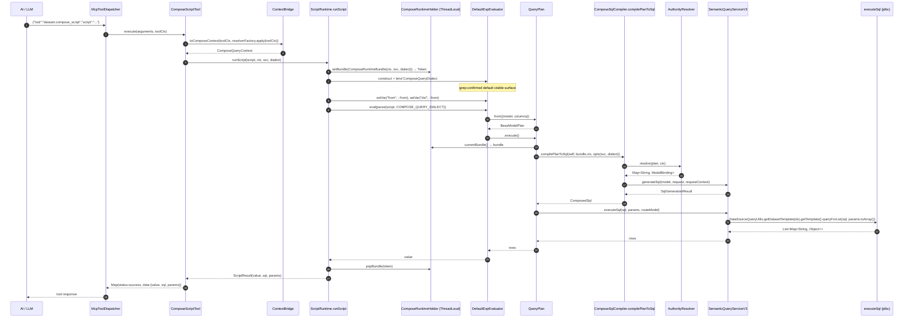

# Java M7 · Compose Query MCP `script` 工具入口 开工提示词

## 变更日志

| 版本 | 时间 | 变化 |
|---|---|---|
| r1 ready-to-execute | 2026-04-24 | 首版落盘 · Python M7 完整落地后起草 · 沿用 M6 Java 提示词结构 |
| r2 ready-to-execute | 2026-04-24 | 吸收 plan-evaluator 评审：**C1** 新工具改名 `dataset.compose_script`（对齐存量 `dataset.*` 命名）+ 旧 `ComposeQueryTool` 仅加 Javadoc 指向新工具不改代码 · **C2** frontmatter 明写 `foggy-dataset-mcp/CLAUDE.md` 是 stale 项目文档直接忽略 · **C3** Step 0 `executeSql` 的 `DataSource` 解析路径锁死（`@Resource DataSource` 注入 `SemanticQueryServiceV3Impl`；routeModel 单数据源下忽略）· **S1** §7.2 Java fact 已核实：`DefaultExpEvaluator` 不做 builtin 预注入（区别于 Python），策略简化为 `appCtx=null` + `ALLOWED_SCRIPT_GLOBALS={from, dsl}`，Java 比 Python 更严 · **S2** §对齐原则 #8 登记 `QueryPlan.execute()` 返回类型 `Object → List<Map>` 是刻意 M2 API break 需进决策记录 · **S3** §7.1 明确：本期只实装**嵌入模式**；header 模式走 stub 抛 `UnsupportedOperationException`（`foggy-auth` / JWT lib 当前仓内都不存在，真实 token 解析推迟到 M8+）· **S4** foggy-dataset-mcp baseline 改"开工时写死" · **S5** PD 从 3.0 → 3.5–4.0 · **S6** 流程图与正文 DB 调用 API 一致化 · **S7** 停止条件增补 C1/C2/C3 meta-guard + errorPayload 切 LinkedHashMap |

## ★ Java 侧已核实的事实（避免子 agent 重新做假设）

> r2 起草时已用 grep / Read 核实，以下事实不要再"开工时调研"；有变化先停工，回到 progress.md 决策记录重议

| 事实 | 值 | 证据 | 影响 |
|---|---|---|---|
| `DefaultExpEvaluator` 默认可见面 | **空**（不预注入任何 builtin） | `foggy-fsscript/src/main/java/.../DefaultExpEvaluator.java:101-119` ctor 只接 `appCtx` 和 `FsscriptClosure`；无 `_setup_builtins()` 等价调用 | §7.2 沙箱策略比 Python 简单：`appCtx=null` 就能阻掉所有 `@FsscriptExp` bean 注入；`ALLOWED_SCRIPT_GLOBALS = Set.of("from", "dsl")` |
| 现有 `ComposeQueryTool` | 已存在，走前 M6 时代 `CteComposer.compose(left, right, joinSpec, useCte)` 2-way join，name=`dataset.compose_query`，参数 `script:String`，`@Component` + `@RequiredArgsConstructor` 注 `SemanticQueryServiceV3 queryService + DataSource dataSource` | `foggy-dataset-mcp/.../tools/ComposeQueryTool.java` + `foggy-dataset-model/.../engine/compose/ComposedDataSetResult.java` | 新工具改名 `dataset.compose_script`（命名一致 + 功能语义分离） |
| Java raw-SQL 执行入口 | `DataSourceQueryUtils.getDatasetTemplate(dataSource).getTemplate().queryForList(sql, params.toArray())` | `ComposedDataSetResult.java:126-128` 证明此 API 有效 | Step 0 `executeSql` 用此路径；**不用** JdbcTemplate 直接 new（走现成 utility 统一配置） |
| `QueryModel.getDataSource()` | **已注释掉** · 不通过 interface 暴露 | `foggy-dataset-model/src/main/java/.../spi/QueryModel.java:111` | DataSource 不能从 QueryModel 解析；走 `@Resource DataSource` 注入 `SemanticQueryServiceV3Impl`（与现有 `ComposeQueryTool` 同样的注入模式） |
| `foggy-auth` / JWT 库 | **不存在** | 全仓 grep `JwtParser / io.jsonwebtoken / jwt.parse` 无命中 | header 模式 JWT 解析本期**推迟**；`authorization` 字段只作为 `authorizationHint` 原样透传；真实 header 模式 stub 抛 `UnsupportedOperationException` |
| `SemanticQueryServiceV3` | interface 当前 3 方法（`queryModel / validateQuery / generateSql`），由 `SemanticQueryServiceV3Impl` + 测试 `FakeSemanticService` 实现 | `foggy-dataset-model/src/main/java/.../semantic/service/SemanticQueryServiceV3.java` + 2 impl | M7 新增 `executeSql` 方法：interface 加方法签名 + Impl 落实装 + `FakeSemanticService`（M6 test helper）补 stub。**interface 加方法会触及 FakeSemanticService**，是本期 test 迁移范围 |
| `foggy-dataset-mcp/CLAUDE.md` | **stale / 描述另一个项目** | 最后更新 2025-11-24 · package `com.foggy.mcp` · 与本仓 `com.foggyframework.dataset.mcp` 不一致 | 子 agent 不要读这份 CLAUDE.md；以 Java worktree 根 CLAUDE.md + 现成工具代码为准 |

## 位置与角色

- **实际工作目录**：`D:\foggy-projects\foggy-data-mcp\foggy-data-mcp-bridge-wt-dev-compose`
- **逻辑仓**：`foggy-data-mcp-bridge`（Compose Query 分支最终合回 master）
- **涉及的 Maven 模块**（跨 3 个 module，是 M6 以来首次跨 module 的里程碑）：
  - `foggy-dataset-model` · 核心 compose.runtime 子包 + plan.execute/toSql wire + SemanticServiceV3 Step 0
  - `foggy-dataset-mcp` · ComposeScriptTool MCP 工具本体
  - `foggy-mcp-spi` · 视需决定是否扩 ToolExecutionContext（见 §7.1）
- **Python 事实源**：`foggy-data-mcp-bridge-python` commits `c7bcc16` + `76ff422`，基线 2947 passed / 1 skipped / 1 xfailed

## 本期 scope · 5 段式（与 Python M7 r2 §scope 对齐）

1. **Step 0 前置 · Java SemanticService raw-SQL 执行入口**（§Step 0 · 镜像 Python `SemanticQueryService.execute_sql`）
2. **`ToolExecutionContext → ComposeQueryContext` 桥**（§7.1 · Java `ToolExecutionContext` 字段比 Python 稀，需要定 host-injected Principal 机制）
3. **fsscript `DefaultExpEvaluator` 可见面锁定 + `ComposeRuntimeBundle` ThreadLocal**（§7.2）
4. **`QueryPlan.execute() / toSql()` 接治**（§7.3 · Java M2 `UnsupportedInM2Exception` 占位替换）
5. **`ComposeScriptTool` MCP 工具**（§7.4 · 实现 `com.foggyframework.mcp.spi.McpTool`）
6. **错误路径 phase 映射**（§7.5 · 对齐 Python r2 §7.5 表）

**本期不做**：
- 不实装 M9 Layer A/B/C 静态 AST 验证器（Layer B 只通过 evaluator 参数限制 + 可见面冻结测试）
- 不做 HTTP 远程 AuthorityResolver 实装
- 不改 M6 `ComposeSqlCompiler.compilePlanToSql` 签名 / 4 错误码
- 不碰 M5 `AuthorityResolutionPipeline.resolve` / 请求合并规则
- 不碰 `QueryModelTool` 等存量 MCP 工具

## 必读前置

严格按顺序读完再动手：

0. **本仓治理基线**：
   - `docs/8.2.0.beta/M7-ScriptTool-Python-execution-prompt.md` r2 · **事实源**，所有设计决策在 Python 侧已锁
   - 本 worktree 根 `CLAUDE.md` + `foggy-dataset-model/CLAUDE.md` · 分层约束 + 集成测试规范（"真实 SQL 数据比对"硬要求当前可豁免 —— M7 是编排层，M8 才补真实数据比对）

1. **Python M7 参考实现**（逐字对齐事实源）：
   - `foggy-data-mcp-bridge-python/src/foggy/dataset_model/engine/compose/runtime/{__init__.py,context_bridge.py,plan_execution.py,script_runtime.py}` · 4 source files（`errors.py` 在 simplify 中被删，M7 不需要独立错误类型）
   - `foggy-data-mcp-bridge-python/src/foggy/mcp/tools/compose_script_tool.py` · MCP 工具本体
   - `foggy-data-mcp-bridge-python/src/foggy/dataset_model/semantic/service.py::execute_sql` · Step 0 公共方法
   - `foggy-data-mcp-bridge-python/tests/compose/runtime/{test_context_bridge.py,test_plan_execution.py,test_script_runtime.py}` + `tests/test_mcp/test_compose_script_tool.py` · 共 74 tests 的行为源

2. **M6 Java 成果**（本期底层 · 不得改签名）：
   - `foggy-dataset-model/src/main/java/com/foggyframework/dataset/db/model/engine/compose/compilation/ComposeSqlCompiler.java` · `compilePlanToSql(plan, context, CompileOptions) → ComposedSql`
   - `foggy-dataset-model/src/main/java/com/foggyframework/dataset/db/model/engine/compose/compilation/ComposeCompileException.java` · 4 codes + 2 phases

3. **M1–M5 Java 契约**（一个都不改）：
   - `engine/compose/context/{ComposeQueryContext,Principal}.java` · 本期要塞进 ThreadLocal 的 bundle 之一
   - `engine/compose/security/{AuthorityResolver,AuthorityResolutionException,ModelBinding}.java`
   - `engine/compose/plan/{QueryPlan,BaseModelPlan,DerivedQueryPlan,JoinPlan,UnionPlan,SqlPreview}.java` · **`SqlPreview` 类保留不破 M2 契约**；只改 `QueryPlan.execute/toSql` 的返回类型
   - `engine/compose/authority/AuthorityResolutionPipeline.java` · M6 已内部调，M7 不需再直接触

4. **Java MCP 工具基线 + SPI**：
   - `foggy-mcp-spi/src/main/java/com/foggyframework/mcp/spi/McpTool.java` · 2 个要实现的方法：`getName()` / `execute(arguments, context)`；`getCategories()` 返工具分类 Set
   - `foggy-mcp-spi/src/main/java/com/foggyframework/mcp/spi/ToolExecutionContext.java` · 当前 5 字段（traceId / authorization / userRole / namespace / sourceIp）—— Java 侧比 Python 稀，见 §7.1 的"host-injected Principal"对策
   - `foggy-dataset-mcp/src/main/java/com/foggyframework/dataset/mcp/tools/QueryModelTool.java` · 参考现成工具的命名 / 注入 / 异常处理模式

5. **fsscript Java 引擎**：
   - `foggy-fsscript/src/main/java/com/foggyframework/fsscript/DefaultExpEvaluator.java` · 对应 Python `ExpressionEvaluator`；看 `newInstance` / `getVar/setVar` / `getContext` 等 API
   - `foggy-fsscript/src/main/java/com/foggyframework/fsscript/parser/ComposeQueryDialect.java`（M3 已落地） · dialect 钩子已 remove `from` 保留字
   - **关键调研点**：Java 侧 `DefaultExpEvaluator` 是否像 Python `_setup_builtins` 那样自动注入 17 个 builtin？开工时必先 grep / 读源确认 Java 侧实际可见面，锁 `ALLOWED_SCRIPT_GLOBALS`；如果 Java 侧默认可见面比 Python 更严 / 更宽，按实际锁。这是跨端合理差异

6. **Spec / 实现规划 / 决策记录**：
   - `docs/8.2.0.beta/P0-ComposeQuery-QueryPlan派生查询与关系复用规范-需求.md` §4/§5/§6 + §错误模型规划
   - `docs/8.2.0.beta/P0-ComposeQuery-QueryPlan派生查询与关系复用规范-progress.md` §决策记录 2026-04-22 ~ 2026-04-24（M6 Step 0 降级 / M7 Python r2 吸收 / build_query_with_governance 公共方法）

## 对齐原则（硬要求）

1. **现有存量 MCP 工具零代码改动**：`QueryModelTool / ChartTool / MetadataTool / NaturalLanguageQueryTool / ComposeQueryTool` 全部不改行为。M7 新增 `ComposeScriptTool`（name=`dataset.compose_script`）·  **关于 `ComposeQueryTool`（name=`dataset.compose_query`）与新工具命名近似 / 语义重叠的问题**：
   - 新旧并存 —— 旧的走 pre-M6 `CteComposer` 2-way join 单场景；新的走 M6 `ComposeSqlCompiler` 全量路径
   - 仅在旧 `ComposeQueryTool.java` 类级 Javadoc 加一行指引：`@implNote since 8.2.0.beta: use {@link ComposeScriptTool} (name="dataset.compose_script") for new compose queries; this tool is retained for legacy 2-way join scenarios. 不加 `@Deprecated` 注解（可能触发现有测试告警）
   - 旧工具的 body 不切到 M6 pipeline（那是 M10 或后续 cleanup scope）
   - 工具 description：新的写"**推荐**用于多模型 query / union / join 组合；走 M6 完整 SQL 编译 + 权限 pipeline"；旧的（仅 Javadoc 层）标注"legacy"
2. **错误码 100% 复用前序里程碑**：M7 **不新增错误码命名空间**。所有异常走既有 5 个家族：`AuthorityResolutionException`（M1/M5）/ `ComposeSchemaException`（M4）/ `ComposeCompileException`（M6）/ `ComposeSandboxViolationException`（M3）/ `RuntimeException`（execute phase + host-misconfig / internal）
3. **`QueryPlan.toSql()` 返回类型由 M2 占位 `SqlPreview` → M6 `ComposedSql`**（与 Python r2 §对齐原则 #8 保持一致；`SqlPreview` 类本身保留不破 M2 冻结契约）

    **`QueryPlan.execute()` 返回类型由 M2 占位 `Object` → M7 `List<Map<String, Object>>`**（刻意的 M2 API surface binary break）：
    - M2 冻结契约里 `execute` 返回 `Object` + 抛 `UnsupportedInM2Exception`，callers 无真实使用（M2 验收过的用例都是 `assertThrows(UnsupportedInM2Exception, ...)` 式）
    - M7 把返回类型精确化为 rows list · 反向断言 `QueryPlan.java` 中抛 `UnsupportedInM2Exception` 的 raise 语句被删除
    - **本变更需在 progress.md 决策记录里专门登记一条**，与"`toSql` 返回类型变更"并列；M10 签收前跨仓审计要能找到这条决策轨迹
    - Python 侧 `QueryPlan.execute` 返回类型 `Any → List[Dict]` 本来就 gradual typing 宽松，Java 这次显式登记是为了承接 Java binary compat 责任
4. **不改 M6 `ComposeSqlCompiler.compilePlanToSql` 签名**
5. **`ComposeScriptTool.execute` 只认 1 个参数 `script: String`**（不给 AI 加第二个钩子）
6. **ThreadLocal 必须在 try/finally 里干净 pop**（嵌套脚本父子 bundle 正确保存恢复；测试硬断言）
7. **Python 是事实源**：设计决策在 Python r2 已锁，本提示词不重新讨论 —— 遇到 Python 已决策的问题（"为什么不用 ctx.extensions"、"为什么要 ContextVar"），直接读 Python progress.md §决策记录 2026-04-24 条

## 交付清单

### 新增源码

#### `foggy-dataset-model` 模块

```
foggy-dataset-model/src/main/java/com/foggyframework/dataset/db/model/engine/compose/runtime/
├── package-info.java            — 模块 javadoc · 对齐 Python runtime/__init__.py
├── ComposeRuntimeBundle.java    — final class · 显式 Builder · fields: ctx (ComposeQueryContext) / semanticService (SemanticServiceV3 or specific interface) / dialect (String)
├── ComposeRuntimeHolder.java    — ThreadLocal<ComposeRuntimeBundle> 承载器 · 提供 currentBundle() / setBundle(bundle) → Token + popBundle(token) 三方法
├── ContextBridge.java           — static utility · toComposeContext(ToolExecutionContext, AuthorityResolver, host-injected Principal) → ComposeQueryContext
├── PlanExecution.java           — static utility · executePlan(plan, ctx, semanticService, dialect) → List<Map<String, Object>> + pickRouteModel(QueryPlan)
└── ScriptRuntime.java           — static utility · runScript(script, ctx, semanticService, dialect) → ScriptResult + ALLOWED_SCRIPT_GLOBALS + ScriptResult pojo
```

**为什么这么拆**（对齐 Python runtime/，一个 .py 对应一个 .java；package-info 占 __init__.py 的位）：
- `ComposeRuntimeBundle` / `ComposeRuntimeHolder` 从 Python `ComposeRuntimeBundle` + `_compose_runtime: ContextVar` 拆分（Java 没有 module-level 变量，ThreadLocal 得有载体）
- `ContextBridge` / `PlanExecution` / `ScriptRuntime` 是静态 utility（Java 风格不用 module-level 函数）；与 M1-M6 静态 utility 风格一致

#### `foggy-dataset-mcp` 模块

```
foggy-dataset-mcp/src/main/java/com/foggyframework/dataset/mcp/tools/ComposeScriptTool.java
  — implements McpTool
  — name="dataset.compose_script" · categories={ToolCategory.ANALYST, ...} (查 QueryModelTool 看现成写法)
  — execute(Map<String, Object> arguments, ToolExecutionContext context) → Map<String, Object>
    · 成功：{status: "success", data: {rows, sql, params}}
    · 失败：{status: "error", data: {error_code, phase, message, model?}}
  — Spring @Component / @Service 注入（按既有 MCP 工具注册方式，参考 QueryModelTool）
```

#### `foggy-dataset-model` 模块修改

```
engine/compose/plan/QueryPlan.java
  ├── execute()          旧：throw new UnsupportedInM2Exception(...)
  │                      新：从 ComposeRuntimeHolder.currentBundle() 读 bundle → 调 PlanExecution.executePlan
  │                           无 bundle → RuntimeException("QueryPlan.execute requires an ambient ComposeRuntimeBundle; ...")
  │
  └── toSql()            旧：throw new UnsupportedInM2Exception(...)
      改签名返回 ComposedSql（M2 SqlPreview 保留，只是 toSql 不再返回它）

semantic/service/SemanticQueryServiceV3.java (interface)
  └── ★ Step 0 新增方法签名：List<Map<String, Object>> executeSql(String sql, List<Object> params, String routeModel)
       — routeModel 可为 null（单数据源场景）
       — 实现放 SemanticQueryServiceV3Impl；复用既有 JdbcTemplate / DataSource 连接（参照
         _execute_query / queryModelResult 当前怎么走底层 executor）
       — 抛 RuntimeException 时消息含前缀 "execute_sql failed:"（见 §7.5 分类）
```

### 核心入口签名（对齐 Python `run_script` / Java M6 CompileOptions Builder 风格）

```java
public final class ScriptRuntime {
    private ScriptRuntime() { /* utility */ }

    public static final Set<String> ALLOWED_SCRIPT_GLOBALS;   // 初始化时从 DefaultExpEvaluator 默认可见面 + {"from","dsl"} 派生

    public static ScriptResult runScript(
            String script,
            ComposeQueryContext ctx,
            SemanticQueryServiceV3 semanticService,
            String dialect) {
        if (ctx == null)              throw new IllegalArgumentException("ctx must not be null");
        if (semanticService == null)  throw new IllegalArgumentException("semanticService must not be null");
        String effectiveDialect = dialect == null ? "mysql" : dialect;
        ComposeRuntimeBundle bundle = ComposeRuntimeBundle.builder()
                .ctx(ctx).semanticService(semanticService).dialect(effectiveDialect).build();
        Token token = ComposeRuntimeHolder.setBundle(bundle);
        try {
            // parse fsscript (with COMPOSE_QUERY_DIALECT) → evaluator
            // evaluator 注入 from/dsl 到 getContext()
            // run → capture return value / last-expression value
            // ScriptResult.value = 最终返回值；若最近一次 QueryPlan.toSql 被调，填 sql + params
        } finally {
            ComposeRuntimeHolder.popBundle(token);
        }
    }

    public static final class Token { /* opaque · 用于 popBundle 的 push/pop 对 */ }

    public static final class ScriptResult {
        // 显式 Builder · fields: value (Object), sql (String · nullable), params (List<Object> · nullable),
        // warnings (List<String> · default List.of())
    }
}
```

### 新错误码数 = 0

Java `ComposeScriptTool` 的错误分支（与 Python 一致）：
- `AuthorityResolutionException` → phase=`permission-resolve`
- `ComposeSchemaException` → phase=`schema-derive`
- `ComposeCompileException` → phase=`compile`（保留它自己的 `plan-lower` / `compile` 内部分类不翻译到外层）
- `ComposeSandboxViolationException` → phase=`compile`
- `RuntimeException("Plan execution failed at execute phase:...")` → phase=`execute`
- `RuntimeException("requires an ambient ComposeRuntimeBundle")` 或 `"semanticService unbound"` → phase=`internal` · error_code=`host-misconfig`（明文字符串 tag · 不进错误码命名空间）
- 其他 `Exception` → phase=`internal` · error_code=`internal-error`

## 实现步骤

### Step 0 · `SemanticQueryServiceV3.executeSql` 公共方法

**必须先做**。与 Python `SemanticQueryService.execute_sql` 1:1 对齐。

**实现路径已锁**（r2 · 事实见 §已核实的事实）：
- 执行层用 `DataSourceQueryUtils.getDatasetTemplate(dataSource).getTemplate().queryForList(sql, params.toArray())`（与 `ComposedDataSetResult.execute()` 同款）
- `DataSource` 通过 `@Resource` 注入到 `SemanticQueryServiceV3Impl`（新增第 4 个字段，与 `ComposeQueryTool` 同样的注入模式 —— 单数据源部署下 Spring 自动 autowire 主 DataSource）
- `routeModel` 参数本期**只占位不实装**：javadoc 写 `@param routeModel reserved for multi-datasource routing (M8+); ignored in M7`；实装单数据源路径即可
- **不要造** `JdbcExecutor` 抽象（M6 Java 已否决此方向）

**interface 改动**（`SemanticQueryServiceV3.java`）：

```java
public interface SemanticQueryServiceV3 {
    // 既有 3 方法不动：queryModel / validateQuery / generateSql

    /**
     * Execute raw SQL compiled by M6 {@link ComposeSqlCompiler} and return rows.
     *
     * <p>Used by M7 {@code PlanExecution.executePlan} as the raw-SQL primitive
     * behind {@code QueryPlan.execute()}. Does NOT re-run governance —
     * governance already applied during {@link #generateSql} inside
     * {@code ComposeSqlCompiler}.</p>
     *
     * @param sql         compiled SQL (positional ? placeholders)
     * @param params      positional bind parameters
     * @param routeModel  reserved for multi-datasource routing (M8+);
     *                    ignored in M7 single-datasource deployment.
     *                    Always null-safe.
     * @return list of rows (Map&lt;column_name, value&gt;)
     * @throws RuntimeException with message prefix "executeSql failed:"
     *         when executor未配置 / SQL语法错 / DB 连接错
     */
    List<Map<String, Object>> executeSql(String sql, List<Object> params, String routeModel);
}
```

**impl 实现要点**（`SemanticQueryServiceV3Impl.java` 加 `@Resource DataSource dataSource` 字段 + 新方法）：

```java
@Resource
private DataSource dataSource;

@Override
public List<Map<String, Object>> executeSql(String sql, List<Object> params, String routeModel) {
    if (dataSource == null) {
        throw new RuntimeException(
            "executeSql failed: DataSource not injected into SemanticQueryServiceV3Impl;"
            + " host must configure a primary DataSource bean");
    }
    try {
        Object[] paramsArray = params == null ? new Object[0] : params.toArray(new Object[0]);
        return DataSourceQueryUtils.getDatasetTemplate(dataSource)
                .getTemplate()
                .queryForList(sql, paramsArray);
    } catch (Exception e) {
        throw new RuntimeException("executeSql failed: " + e.getMessage(), e);
    }
}
```

**`FakeSemanticService`**（M6 test helper · `CompileTestHelpers.java`）同步加该方法 stub 返回一个预置的 `List<Map<String, Object>>`，测试时像 `stub(model, sql, ...)` 那样 `stubExec(rows)` / `stubExecThrows(e)`。

**测试**（`foggy-dataset-model/src/test/java/.../semantic/service/SemanticQueryServiceV3ExecuteSqlTest.java`，~5 tests）：
- DataSource 未注入（null 字段 · 用反射 mock） → RuntimeException 消息前缀 "executeSql failed: DataSource not injected"
- 单行 / 多行返回 ok（用 `org.springframework.jdbc.datasource.embedded.EmbeddedDatabaseBuilder` 起 HSQL，或跟 M6 `CompileTestHelpers` 一样纯 mock）
- DB 抛 SQLException → RuntimeException 包装 · `getCause()` 保留
- routeModel 非 null 时当前忽略（与 null 结果一致）· javadoc 承诺保持
- params null 时视作 empty 正常执行

### §7.1 · `ToolExecutionContext → ComposeQueryContext` 桥

**Java `ToolExecutionContext` 字段比 Python 稀**，只有 5 个（traceId / authorization / userRole / namespace / sourceIp）。Python 侧依赖的 `X-User-Id / X-Tenant-Id / X-Roles / X-Dept-Id / X-Policy-Snapshot-Id / X-Trace-Id` header 在 Java 走 `authorization` 一个字段汇总。

**本期策略（r2 已锁）**：**只实装嵌入模式**；header / JWT 模式推迟。理由：`foggy-auth` / `io.jsonwebtoken` 等 JWT 解析依赖当前仓内**都不存在**（r2 grep 已确认）—— 强行上马 header 模式要么拖入新依赖、要么 spike 手写 JWT 解析，都超出 M7 scope。

**嵌入模式**（本期唯一正式路径）：
- host（比如 Odoo Pro Java 网关 / 任何 Java-embedded caller）调用 `ComposeScriptTool.execute(...)` **之前**已经在 `ComposeRuntimeHolder.setBundle(ComposeRuntimeBundle(...))` 里预置了一个完整的 `ComposeQueryContext`（含 `Principal` 全字段 + `AuthorityResolver` + `namespace` + `traceId`）
- `ContextBridge.toComposeContext(toolCtx, resolver)` 本期实现：**先查** `ComposeRuntimeHolder.currentBundle()`，若已有 bundle（嵌入模式）→ 直接返回 `bundle.ctx()`；若无 bundle（header 模式触发）→ 抛 `UnsupportedOperationException("ComposeScriptTool header-mode not implemented in M7; host must pre-set ComposeRuntimeBundle via ComposeRuntimeHolder.setBundle(...) before invoking. JWT / header-based Principal parsing is a follow-up scoped to M8+.")`

**header 模式 stub**（本期仅占位）：
- 不实装 `authorization` 解析
- `ContextBridge.toComposeContext` 在 bundle 未预置时**直接抛** `UnsupportedOperationException`，消息里明写推迟原因
- **不**尝试做任何 opaque-token 兜底；就是 fail-fast

**`Principal` 字段映射表保留**（供 M8+ 实装 header 模式时参考；本期不用）：

| 来源 | `Principal` 字段 | 备注 |
|---|---|---|
| 嵌入 host 预置 | `userId / tenantId / roles / deptId / authorizationHint / policySnapshotId` | 本期唯一路径 |
| `traceId` | `ComposeQueryContext.traceId` | 直通 · 即便嵌入 host 没塞 traceId，也从 toolCtx 这里补 |
| `namespace` | `ComposeQueryContext.namespace` | 同上：嵌入 host 塞了优先用 bundle，否则 fallback to `toolCtx.getNamespace()` |
| token `sub` / `tenant_id` / `roles` / `dept_id` / `policy_snapshot_id` | **M8+ 实装** | stub：`UnsupportedOperationException` |
| `authorization` 原串 | `authorizationHint` | M8+ 用；本期忽略 |

**测试**（`foggy-dataset-model/src/test/java/.../engine/compose/runtime/ContextBridgeTest.java`，~12 tests）：
- bundle 已预置 · 返回 `bundle.ctx()` 同引用
- bundle 已预置 + toolCtx.traceId 不同 · 本期保持 bundle.ctx（不 override · 避免逻辑膨胀 · M8+ 重议）
- bundle 未预置 · 抛 `UnsupportedOperationException` 消息含 "header-mode not implemented"
- bundle 未预置 + toolCtx null · 同上抛 `UnsupportedOperationException`（不抛 NPE）
- resolver null · 抛 `IllegalArgumentException("resolver must not be null")`
- 多线程隔离：A 线程预置 bundle，B 线程调 toComposeContext（B 线程 bundle 为空 · 抛 UnsupportedOperationException）
- 其他 4 条覆盖 ThreadLocal 清理、嵌套、authorizationHint 预置场景

### §7.2 · fsscript evaluator 可见面锁定 + `ComposeRuntimeHolder`

**事实已锁（r2）**：Java `DefaultExpEvaluator` **不做 builtin 预注入** —— ctor 只接 `appCtx` 和 `FsscriptClosure`，没有 `_setup_builtins()` 等价动作。这与 Python `ExpressionEvaluator` **不同**（Python 有 17 个自动注入 builtin），所以：

- **Java 的 Layer B 沙箱比 Python 更简单**：默认可见面就是空的（加上 script 里定义的变量）。危险源不是"pre-injected builtins"而是"`appCtx` 里的 Spring bean"
- **M7 策略**：`ScriptRuntime.runScript` 构造 evaluator 时**不传 appCtx**（即 `DefaultExpEvaluator.newInstance()` / `DefaultExpEvaluator(null, closure)`），阻掉所有 `@FsscriptExp` bean 可见性
- **`ALLOWED_SCRIPT_GLOBALS`** 收窄到 `Set.of("from", "dsl")`（比 Python 的 19 项少得多，且硬断言等于)

```java
public static final Set<String> ALLOWED_SCRIPT_GLOBALS = Set.of("from", "dsl");
```

**`ComposeRuntimeHolder` 实现要点**：
- 底层 `private static final ThreadLocal<Deque<ComposeRuntimeBundle>> STACK = ThreadLocal.withInitial(ArrayDeque::new);`
- `setBundle(bundle)` 往 deque push + 返回 `Token`（持 deque 引用 + 原 size 快照）
- `popBundle(token)` 弹到 token 记录的 size；超弹抛 IllegalStateException
- `currentBundle()` peek deque；空 deque 返 null
- **为什么用 Deque 不用 InheritableThreadLocal**：Java async 任务不像 Python asyncio 那样自动继承 ContextVar；但 M7 目前不跨线程执行脚本。Deque 支持嵌套 `runScript` 父子 bundle 正确保存恢复

**`runScript` 骨架**（关键：`DefaultExpEvaluator.newInstance()` 传 null appCtx，然后 `setVar("from", ...)` / `setVar("dsl", ...)`）：

```java
DefaultExpEvaluator evaluator = DefaultExpEvaluator.newInstance();   // appCtx=null · 阻 @FsscriptExp bean
// 注入白名单 2 个全局函数
evaluator.setVar("from", fromFunctionRef);
evaluator.setVar("dsl", fromFunctionRef);   // dsl 是 from 的别名
// parse + eval with COMPOSE_QUERY_DIALECT
```

**测试**（`foggy-dataset-model/src/test/java/.../engine/compose/runtime/{ComposeRuntimeHolderTest.java, ScriptRuntimeTest.java}`，合计 ~15 tests）：
- Holder：push/pop 配对、嵌套 push/pop、空 deque `currentBundle() == null`、**多线程隔离**（spawn Thread, 子线程 holder 为空）、`popBundle` 超弹抛 IllegalStateException
- Runtime 功能：`runScript("return 1;", ...)` 返回 `ScriptResult(value=1)`、`from({model, columns})` / `dsl(...)` 别名等价、fsscript 语法错冒泡
- Runtime 沙箱：evaluator `getVar("JSON") == null`（confirm Java 没像 Python 那样注 JSON）、evaluator `getVar("someSpringBean") == null`（appCtx=null 生效）、`ALLOWED_SCRIPT_GLOBALS` 与 evaluator 可见面**严格相等**（Java 可见面空 + `{from, dsl}` = 2 项，不像 Python 需要 `startswith("__")` / `Array_*` / `Console_*` 过滤）
- Runtime import 路径封：`import '@someBean'` 在 appCtx=null / bean_registry 未配置下抛 fsscript 原生 ImportException；测试只断抛异常类型，不断具体消息（fsscript 内部实现细节不 freeze）
- **安全 red-line 扫描**（Python `test_script_runtime.py::test_no_eval_exec_in_runtime` 对齐）：`src/main/java/.../engine/compose/runtime/` 下不得出现字面量 `Runtime.getRuntime().exec(` / `eval(` / `System.exit(` / `ProcessBuilder(` 等

### §7.3 · `QueryPlan.execute() / toSql()` 接治

**修改 `QueryPlan.java`**：

```java
// 旧（M2）
public final Object execute(ComposeQueryContext context) {
    throw new UnsupportedInM2Exception(...);
}
public final SqlPreview toSql() {
    throw new UnsupportedInM2Exception(...);
}

// 新（M7）
public final List<Map<String, Object>> execute() {
    return execute(null);
}
public final List<Map<String, Object>> execute(ComposeQueryContext explicitCtx) {
    ComposeRuntimeBundle bundle = ComposeRuntimeHolder.currentBundle();
    if (bundle == null) {
        throw new RuntimeException(
            "QueryPlan.execute requires an ambient ComposeRuntimeBundle; "
            + "call from inside ScriptRuntime.runScript(), or wrap manually via "
            + "ComposeRuntimeHolder.setBundle(...). Host misconfiguration "
            + "(semanticService / dialect not bound) cannot be surfaced as "
            + "ComposeCompileException — that family is reserved for compile-phase failures.");
    }
    ComposeQueryContext effectiveCtx = explicitCtx != null ? explicitCtx : bundle.ctx();
    return PlanExecution.executePlan(this, effectiveCtx,
            bundle.semanticService(), bundle.dialect());
}

public final ComposedSql toSql() { return toSql(null, null); }
public final ComposedSql toSql(ComposeQueryContext explicitCtx) { return toSql(explicitCtx, null); }
public final ComposedSql toSql(ComposeQueryContext explicitCtx, String dialect) {
    ComposeRuntimeBundle bundle = ComposeRuntimeHolder.currentBundle();
    if (bundle == null && explicitCtx == null) {
        throw new RuntimeException(
            "QueryPlan.toSql requires either an explicit ctx or an ambient ComposeRuntimeBundle");
    }
    ComposeQueryContext effectiveCtx = explicitCtx != null ? explicitCtx :
            bundle.ctx();
    SemanticQueryServiceV3 effectiveSvc = bundle != null ? bundle.semanticService() : null;
    String effectiveDialect = dialect != null ? dialect :
            (bundle != null ? bundle.dialect() : "mysql");
    if (effectiveSvc == null) {
        throw new RuntimeException(
            "QueryPlan.toSql: semanticService unbound (pass ctx + setBundle, "
            + "or call from inside ScriptRuntime.runScript)");
    }
    return ComposeSqlCompiler.compilePlanToSql(this, effectiveCtx,
            ComposeSqlCompiler.CompileOptions.builder()
                    .semanticService(effectiveSvc).dialect(effectiveDialect).build());
}
```

**`SqlPreview` 类本身不动**（M2 冻结契约）；Python 侧已同样处理。

**PlanExecution.executePlan（`pickRouteModel` 用 M5 `BaseModelPlanCollector`）**：

```java
public static List<Map<String, Object>> executePlan(
        QueryPlan plan, ComposeQueryContext ctx,
        SemanticQueryServiceV3 semanticService, String dialect) {
    ComposedSql composed = ComposeSqlCompiler.compilePlanToSql(plan, ctx,
            ComposeSqlCompiler.CompileOptions.builder()
                    .semanticService(semanticService).dialect(dialect).build());
    String routeModel = pickRouteModel(plan);
    try {
        return semanticService.executeSql(composed.sql(), composed.params(), routeModel);
    } catch (Exception exc) {
        throw new RuntimeException(
            "Plan execution failed at execute phase: " + exc.getMessage(), exc);
    }
}

private static String pickRouteModel(QueryPlan plan) {
    List<BaseModelPlan> bases = BaseModelPlanCollector.collect(plan);
    return bases.isEmpty() ? null : bases.get(0).model();
}
```

**M2/M7 testing migration**：M2 的 `QueryPlan.execute()` / `toSql()` 测试之前断言 `UnsupportedInM2Exception`，现在改断言 `RuntimeException`；Python 同样做法（`test_plan_composition.py` 等）。

**测试**（`foggy-dataset-model/src/test/java/.../engine/compose/runtime/PlanExecutionTest.java`，~15 tests）：对齐 Python `test_plan_execution.py` 的 12 tests + 额外几条 Java-specific 断言（例如 ThreadLocal 多线程隔离）。

### §7.4 · `ComposeScriptTool` MCP 工具

**文件**：`foggy-dataset-mcp/src/main/java/com/foggyframework/dataset/mcp/tools/ComposeScriptTool.java`

**骨架**（参考 `QueryModelTool` / Python `compose_script_tool.py`）：

```java
@Component
public class ComposeScriptTool implements McpTool {

    private final SemanticQueryServiceV3 semanticService;
    private final Function<ToolExecutionContext, AuthorityResolver> resolverFactory;
    private final String defaultDialect;

    public ComposeScriptTool(
            SemanticQueryServiceV3 semanticService,
            @Qualifier("composeAuthorityResolverFactory")
            Function<ToolExecutionContext, AuthorityResolver> resolverFactory,
            @Value("${foggy.compose.dialect:mysql}") String defaultDialect) {
        this.semanticService = Objects.requireNonNull(semanticService);
        this.resolverFactory = Objects.requireNonNull(resolverFactory);
        this.defaultDialect = defaultDialect != null ? defaultDialect : "mysql";
    }

    @Override public String getName() { return "dataset.compose_script"; }

    @Override
    public Set<ToolCategory> getCategories() {
        // 参照 QueryModelTool · 通常 ANALYST + BUSINESS_USER
        return Set.of(ToolCategory.ANALYST);
    }

    @Override
    public Object execute(Map<String, Object> arguments, ToolExecutionContext toolCtx) {
        String script = (String) arguments.get("script");
        if (script == null || script.isBlank()) {
            return errorPayload("missing-script", "internal",
                    "parameter 'script' is required and must be non-blank", null);
        }
        try {
            AuthorityResolver resolver = resolverFactory.apply(toolCtx);
            if (resolver == null) {
                return errorPayload("host-misconfig", "internal",
                        "authority resolver factory returned null for this ToolExecutionContext", null);
            }
            ComposeQueryContext ctx = ContextBridge.toComposeContext(toolCtx, resolver);
            ScriptRuntime.ScriptResult result = ScriptRuntime.runScript(
                    script, ctx, semanticService, defaultDialect);
            // 用 LinkedHashMap 便于后续 warnings 等字段增补（见 §非阻塞提醒）
            Map<String, Object> data = new LinkedHashMap<>();
            data.put("value", result.value());
            data.put("sql", result.sql() != null ? result.sql() : "");
            data.put("params", result.params() != null ? result.params() : List.of());
            Map<String, Object> resp = new LinkedHashMap<>();
            resp.put("status", "success");
            resp.put("data", data);
            return resp;
        } catch (AuthorityResolutionException e) {
            return errorPayload(e.code(), "permission-resolve", e.getMessage(), modelOf(e));
        } catch (ComposeSchemaException e) {
            return errorPayload(e.code(), "schema-derive", e.getMessage(), modelOf(e));
        } catch (ComposeCompileException e) {
            return errorPayload(e.code(), "compile", e.getMessage(), null);
        } catch (ComposeSandboxViolationException e) {
            return errorPayload(e.code(), "compile", e.getMessage(), null);
        } catch (RuntimeException e) {
            String msg = e.getMessage() == null ? "" : e.getMessage();
            if (msg.startsWith("Plan execution failed at execute phase:")) {
                return errorPayload("execute-phase-error", "execute", msg, null);
            }
            if (msg.contains("requires an ambient ComposeRuntimeBundle")
                    || msg.contains("semanticService unbound")) {
                return errorPayload("host-misconfig", "internal", msg, null);
            }
            return errorPayload("internal-error", "internal", msg, null);
        } catch (Exception e) {
            return errorPayload("internal-error", "internal", e.getMessage(), null);
        }
    }

    private static Map<String, Object> errorPayload(String code, String phase,
                                                    String message, String model) {
        Map<String, Object> data = new LinkedHashMap<>();
        data.put("error_code", code);
        data.put("phase", phase);
        data.put("message", message);
        if (model != null) data.put("model", model);
        Map<String, Object> resp = new LinkedHashMap<>();
        resp.put("status", "error");
        resp.put("data", data);
        return resp;
    }

    private static String modelOf(Throwable e) {
        // AuthorityResolutionException / ComposeSchemaException 的 modelInvolved 字段
        // 参考 Java M5 落地：AuthorityResolutionException.modelInvolved()
        return e instanceof AuthorityResolutionException a ? a.modelInvolved() :
               e instanceof ComposeSchemaException s ? s.offendingField() : null;
    }
}
```

**测试**（`foggy-dataset-mcp/src/test/java/.../tools/ComposeScriptToolTest.java`，~15 tests）：对齐 Python `test_compose_script_tool.py` 的 18 tests：
- 构造器 null-guards（semanticService / resolverFactory）
- `getName()` == "dataset.compose_script"
- `execute({script: null})` → missing-script
- `execute({script: ""})` → missing-script
- resolverFactory 返 null → host-misconfig
- resolverFactory throw → host-misconfig / internal
- 每种 5 家族异常都返回正确的 4 字段 shape
- RuntimeException 消息前缀分流（execute / host-misconfig / internal）正确

### §7.5 · 错误路径 phase 映射集成测试

见 §7.4 的 `ComposeScriptTool` 错误分支；另外：
- 测试 `runScript` 内部抛各种异常 → `ComposeScriptTool` 返回正确的 ToolResult shape
- 反向断言：`data` 永远包含 `error_code / phase / message` 3 个必需字段；`model` 可选

## 非目标（禁止做）

- 不新增 `compose-*-error/*` 命名空间下的错误码
- 不实装 M9 Layer A/B/C 静态 AST 验证器
- 不做 HTTP 远程 AuthorityResolver 实装
- 不改 `ComposeSqlCompiler.compilePlanToSql` 签名
- 不碰单 DSL `QueryModelTool` 等存量 MCP 工具
- 不暴露 `ComposeQueryContext.principal` 到脚本可见面
- 不引入独立的 `JdbcExecutor` 抽象 —— raw-SQL 执行由 §Step 0 的 `SemanticQueryServiceV3.executeSql` 统一承担
- 不在 `ComposeQueryContext.extensions` 里写 host 基础设施 —— 走 `ComposeRuntimeHolder.ThreadLocal<ComposeRuntimeBundle>`

## 验收硬门槛

1. `mvn test -pl foggy-dataset-model -Dtest='SemanticQueryServiceV3ExecuteSqlTest,ContextBridgeTest,ComposeRuntimeHolderTest,ScriptRuntimeTest,PlanExecutionTest' -Dspring.profiles.active=sqlite -P'!multi-db'` 全绿
2. `mvn test -pl foggy-dataset-mcp -Dtest='ComposeScriptToolTest'` 全绿
3. `mvn test -pl foggy-dataset-model -Dspring.profiles.active=sqlite -P'!multi-db'` 全仓 sqlite lane · 基线 **1536** → ≥ **1606**（净增 ≥ 70）· **0 regression**
4. `mvn test -pl foggy-dataset-mcp -P'!multi-db'` 回归 · **开工时先跑一次确认 baseline 精确数字**（写入 progress.md 回写基线）→ 新增 ≥15 tests（ComposeScriptToolTest）· **0 regression**
5. 新错误码数 == 0（硬断言：`engine/compose/runtime/` 下无任何 `compose-*-error/*` 字面量；host-misconfig / internal-error / missing-script / execute-phase-error 都是明文 tag）
6. `QueryPlan.execute() / toSql()` 不再抛 `UnsupportedInM2Exception`（反向断言：`QueryPlan.java` 中这两条 throw 语句被删除；`SqlPreview` 类仍保留）
7. `ComposeScriptTool` 参数 schema 只有 `script` 一项（硬断言 · 反射扫描）
8. evaluator 可见面冻结：`ALLOWED_SCRIPT_GLOBALS` 与 Java `DefaultExpEvaluator` 的实际默认可见面一致（grep 确认再 lock）
9. ThreadLocal 正确 push/pop：嵌套 `runScript` 父子 bundle 正确恢复；`currentBundle()` 在 `runScript` 外永远 `null`；多线程隔离硬断言
10. `progress.md` 更新：M7 行 `python-ready-for-review` → `ready-for-review`（M7 双端完成）· changelog 新增条目
11. 本提示词 `status: ready-to-execute` → `done` · 填 `completed_at` + `java_baseline_after` + `java_new_tests_actual`

## 停止条件

**读提示词阶段就应命中的 meta-guard**（r2 新增）：
- 发现 §已核实的事实 里任何一项与现状不一致 → 停，上报 r3 修订
- 若试图新建 `ComposeScriptTool` name 用 `dataset.compose_script` 以外的任何名 → 停，C1 决策已锁
- 若 §7.1 试图实装 header / JWT 解析 → 停，S3 决策已锁（M8+ 再做）

**实装阶段**：
- `DefaultExpEvaluator` 默认可见面与事实表不符（比如真实注入了 `Runtime / Class / ClassLoader` 类名）→ 停，提进 progress.md 决策记录重议 M7 Java 范围
- `ComposeSqlCompiler.compilePlanToSql` 签名要改 → 停
- `SemanticQueryServiceV3` 无法加 `executeSql` 公共方法（比如 interface 已被多处实现；加方法会破接口） → 停，考虑 default method 或 interface 升级
- `FakeSemanticService`（M6 test helper）被强迫 override 超过 `executeSql` 的范围 → 停，回到 interface 设计
- `QueryModelTool / ComposeQueryTool` 等存量 MCP 工具的测试红 → 停，先回滚再排查（C1 承诺不改代码）
- 跨 Maven 模块循环依赖 → 停（`foggy-dataset-mcp` → `foggy-dataset-model` 是允许的；反向则不允许）
- `ComposeScriptTool` 错误分支返回的 `data` Map 字段数 > 4 时编译错 → `Map.of(...)` 最多 10 entry 但嵌套时不直观；见 §7.4 骨架，`data` 用 `LinkedHashMap` 动态构造

## 流程图（对齐 Python r2 流程图）



## 预估规模（r2 上调）

| 阶段 | 估算 | 备注 |
|---|---|---|
| Step 0 · `SemanticQueryServiceV3.executeSql` + impl + `FakeSemanticService` stub + 5 tests | 0.4 PD | interface 加方法 + `@Resource DataSource` 注入 + `DataSourceQueryUtils` 接线 + FakeSemanticService 同步 stub |
| 7.1 ContextBridge · 嵌入模式 only + tests | 0.3 PD | **只实装嵌入**；header/JWT 推迟（stub 抛 `UnsupportedOperationException`）· 本期省一半工作量 |
| 7.2 ComposeRuntimeHolder + ScriptRuntime + evaluator 锁定 + tests | 0.5 PD | ThreadLocal Deque + `appCtx=null` evaluator + `ALLOWED_SCRIPT_GLOBALS={from,dsl}` |
| 7.3 QueryPlan.execute / toSql 替换 + PlanExecution + tests | 0.5 PD | 含 M2 测试迁移（UnsupportedInM2Exception → RuntimeException）+ API surface 变更登记 |
| 7.4 ComposeScriptTool + Spring wiring + tests | 0.6 PD | Function factory bean 注册 · 7 家族错误 shape 断言 · ComposeQueryTool Javadoc 加指引 |
| 7.5 integration tests (分在 §7.1-§7.4 内) | - | 合入前面 |
| progress.md + CLAUDE.md 回写 + Python 仓副本 sync + 三仓 push | 0.2 PD | |
| buffer（跨 3 Maven 模块 + Spring 上下文调试 + Spring bean 注册调试 + FakeSemanticService 破坏回归定位） | 0.5 PD | r1 buffer 0.3 PD 偏紧，r2 上调 |
| **合计** | **3.5 PD**（底）/ **4.0 PD**（若 Spring bean wiring 或 FakeSemanticService 回归需要修补） | |

## 附注 · 已知限制 / 非阻塞风险（r2 补）

- **`ComposeScriptTool.data` 用 `LinkedHashMap` 不用 `Map.of`**：后续加 `warnings` / 分页等字段时可直接 `put`，不用重写（Python r2 ToolResult shape 一样保留可扩展性）
- **`FakeSemanticService` 位于 `CompileTestHelpers.java`（M6 test helper）**：interface 加 `executeSql` 会强迫它实现。本期顺手加 stub + 若干 execute 测试；如果 Fake 还有其他测试依赖，注意同步回归。这是跨 M6/M7 的唯一强耦合点
- **多数据源路由 M8+ 再做**：`routeModel` 本期仅占位（javadoc 标 reserved）；`@Qualifier("primary") DataSource` 的默认注入在单数据源部署下工作。Odoo Pro 嵌入模式 / M8 集成测试若需要多数据源 —— 追加重载 `executeSql(..., DataSource)` 或走 `@Qualifier` 解析
- **header 模式 M8+ 再做**：`foggy-auth` / JWT 库本期不引入；嵌入模式 host 预置 `ComposeRuntimeBundle.ctx.principal` 是唯一正式路径。MCP 暴露面的 ComposeScriptTool 实际只对 Java 网关的 Odoo Pro 嵌入场景可用，独立 MCP 客户端 调本工具会直接抛 `UnsupportedOperationException`（这是**期望行为**）
- **`ComposeQueryTool` 不改代码只加 Javadoc**：Java M10 统一 cleanup 时再决定是否 `@Deprecated` + 是否把 body 切到 M6 pipeline
- **Java factory 签名 `Function<ToolExecutionContext, AuthorityResolver>`** 与 Python `Callable[[ToolExecutionContext], AuthorityResolver]` 语义等价，但注意 Java 的 Function 是函数式接口 · Spring bean 可以用 `@Bean Function<...>` 或 lambda 返回；host（Odoo Pro）端实装时按此签名
- **ThreadLocal 内存泄漏**：Deque 靠 `try/finally` 里 `popBundle(token)` 保证平衡；但如果异常路径未 cover，long-running Spring worker thread 可能泄漏 `ComposeRuntimeBundle`。测试应含"finally 块缺失的模拟场景"的反向验证

## 完成后需要更新的文档

1. `docs/8.2.0.beta/progress.md` M7 行：`python-ready-for-review` → `ready-for-review`（M7 双端完成）· 追加 Java 基线数字
2. 本提示词 `status: ready-to-execute` → `done` · 填 `completed_at` + `java_baseline_after` + `java_new_tests_actual`
3. 根 `CLAUDE.md`（`D:\foggy-projects\foggy-data-mcp\CLAUDE.md`）的 "Compose Query M7 MCP script 工具入口（Python 首发）" 段追加 Java 双端完成段
4. Python 仓 README 快照 `docs/8.2.0.beta/README.md` 快照版本号递增一档
5. Odoo Pro 侧 M8 集成测试解锁（`foggy-odoo-bridge-pro/docs/prompts/v1.6/P0-01-progress.md` 里把 M5 集成测试 blocked 状态翻新 —— 不是本提示词的范围，但值得提一句）

---

**起草完毕**。Python r2 是事实源；Java 镜像按 Java 惯例调整（Lombok Data class / Spring @Component / ThreadLocal 替 ContextVar / Function<> factory）。其余设计决策直接继承。
