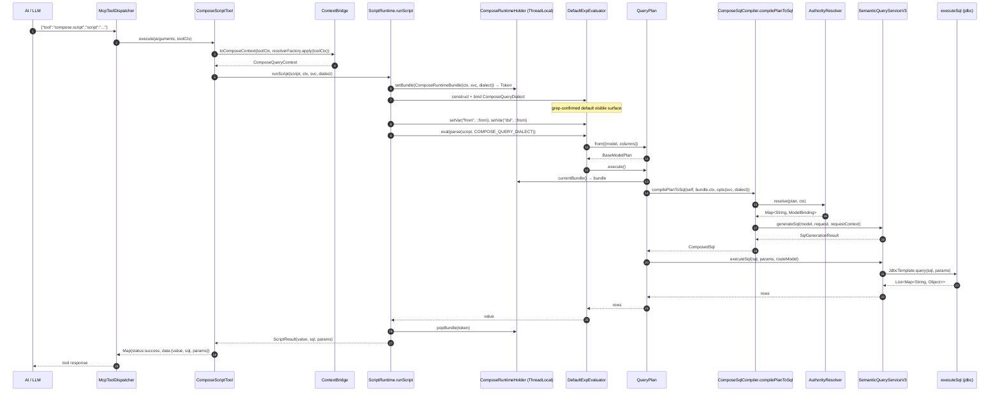

# Java M7 · Compose Query MCP `script` 工具入口 开工提示词

## 变更日志

| 版本 | 时间 | 变化 |
|---|---|---|
| r1 ready-to-execute | 2026-04-24 | 首版落盘 · Python M7 完整落地后起草 · 沿用 M6 Java 提示词结构 |

## 位置与角色

- **实际工作目录**：`D:\foggy-projects\foggy-data-mcp\foggy-data-mcp-bridge-wt-dev-compose`
- **逻辑仓**：`foggy-data-mcp-bridge`（Compose Query 分支最终合回 master）
- **涉及的 Maven 模块**（跨 3 个 module，是 M6 以来首次跨 module 的里程碑）：
  - `foggy-dataset-model` · 核心 compose.runtime 子包 + plan.execute/toSql wire + SemanticServiceV3 Step 0
  - `foggy-dataset-mcp` · ComposeScriptTool MCP 工具本体
  - `foggy-mcp-spi` · 视需决定是否扩 ToolExecutionContext（见 §7.1）
- **Python 事实源**：`foggy-data-mcp-bridge-python` commits `c7bcc16` + `76ff422`，基线 2947 passed / 1 skipped / 1 xfailed

## 本期 scope · 5 段式（与 Python M7 r2 §scope 对齐）

1. **Step 0 前置 · Java SemanticService raw-SQL 执行入口**（§Step 0 · 镜像 Python `SemanticQueryService.execute_sql`）
2. **`ToolExecutionContext → ComposeQueryContext` 桥**（§7.1 · Java `ToolExecutionContext` 字段比 Python 稀，需要定 host-injected Principal 机制）
3. **fsscript `DefaultExpEvaluator` 可见面锁定 + `ComposeRuntimeBundle` ThreadLocal**（§7.2）
4. **`QueryPlan.execute() / toSql()` 接治**（§7.3 · Java M2 `UnsupportedInM2Exception` 占位替换）
5. **`ComposeScriptTool` MCP 工具**（§7.4 · 实现 `com.foggyframework.mcp.spi.McpTool`）
6. **错误路径 phase 映射**（§7.5 · 对齐 Python r2 §7.5 表）

**本期不做**：
- 不实装 M9 Layer A/B/C 静态 AST 验证器（Layer B 只通过 evaluator 参数限制 + 可见面冻结测试）
- 不做 HTTP 远程 AuthorityResolver 实装
- 不改 M6 `ComposeSqlCompiler.compilePlanToSql` 签名 / 4 错误码
- 不碰 M5 `AuthorityResolutionPipeline.resolve` / 请求合并规则
- 不碰 `QueryModelTool` 等存量 MCP 工具

## 必读前置

严格按顺序读完再动手：

0. **本仓治理基线**：
   - `docs/8.2.0.beta/M7-ScriptTool-Python-execution-prompt.md` r2 · **事实源**，所有设计决策在 Python 侧已锁
   - 本 worktree 根 `CLAUDE.md` + `foggy-dataset-model/CLAUDE.md` · 分层约束 + 集成测试规范（"真实 SQL 数据比对"硬要求当前可豁免 —— M7 是编排层，M8 才补真实数据比对）

1. **Python M7 参考实现**（逐字对齐事实源）：
   - `foggy-data-mcp-bridge-python/src/foggy/dataset_model/engine/compose/runtime/{__init__.py,context_bridge.py,plan_execution.py,script_runtime.py}` · 4 source files（`errors.py` 在 simplify 中被删，M7 不需要独立错误类型）
   - `foggy-data-mcp-bridge-python/src/foggy/mcp/tools/compose_script_tool.py` · MCP 工具本体
   - `foggy-data-mcp-bridge-python/src/foggy/dataset_model/semantic/service.py::execute_sql` · Step 0 公共方法
   - `foggy-data-mcp-bridge-python/tests/compose/runtime/{test_context_bridge.py,test_plan_execution.py,test_script_runtime.py}` + `tests/test_mcp/test_compose_script_tool.py` · 共 74 tests 的行为源

2. **M6 Java 成果**（本期底层 · 不得改签名）：
   - `foggy-dataset-model/src/main/java/com/foggyframework/dataset/db/model/engine/compose/compilation/ComposeSqlCompiler.java` · `compilePlanToSql(plan, context, CompileOptions) → ComposedSql`
   - `foggy-dataset-model/src/main/java/com/foggyframework/dataset/db/model/engine/compose/compilation/ComposeCompileException.java` · 4 codes + 2 phases

3. **M1–M5 Java 契约**（一个都不改）：
   - `engine/compose/context/{ComposeQueryContext,Principal}.java` · 本期要塞进 ThreadLocal 的 bundle 之一
   - `engine/compose/security/{AuthorityResolver,AuthorityResolutionException,ModelBinding}.java`
   - `engine/compose/plan/{QueryPlan,BaseModelPlan,DerivedQueryPlan,JoinPlan,UnionPlan,SqlPreview}.java` · **`SqlPreview` 类保留不破 M2 契约**；只改 `QueryPlan.execute/toSql` 的返回类型
   - `engine/compose/authority/AuthorityResolutionPipeline.java` · M6 已内部调，M7 不需再直接触

4. **Java MCP 工具基线 + SPI**：
   - `foggy-mcp-spi/src/main/java/com/foggyframework/mcp/spi/McpTool.java` · 2 个要实现的方法：`getName()` / `execute(arguments, context)`；`getCategories()` 返工具分类 Set
   - `foggy-mcp-spi/src/main/java/com/foggyframework/mcp/spi/ToolExecutionContext.java` · 当前 5 字段（traceId / authorization / userRole / namespace / sourceIp）—— Java 侧比 Python 稀，见 §7.1 的"host-injected Principal"对策
   - `foggy-dataset-mcp/src/main/java/com/foggyframework/dataset/mcp/tools/QueryModelTool.java` · 参考现成工具的命名 / 注入 / 异常处理模式

5. **fsscript Java 引擎**：
   - `foggy-fsscript/src/main/java/com/foggyframework/fsscript/DefaultExpEvaluator.java` · 对应 Python `ExpressionEvaluator`；看 `newInstance` / `getVar/setVar` / `getContext` 等 API
   - `foggy-fsscript/src/main/java/com/foggyframework/fsscript/parser/ComposeQueryDialect.java`（M3 已落地） · dialect 钩子已 remove `from` 保留字
   - **关键调研点**：Java 侧 `DefaultExpEvaluator` 是否像 Python `_setup_builtins` 那样自动注入 17 个 builtin？开工时必先 grep / 读源确认 Java 侧实际可见面，锁 `ALLOWED_SCRIPT_GLOBALS`；如果 Java 侧默认可见面比 Python 更严 / 更宽，按实际锁。这是跨端合理差异

6. **Spec / 实现规划 / 决策记录**：
   - `docs/8.2.0.beta/P0-ComposeQuery-QueryPlan派生查询与关系复用规范-需求.md` §4/§5/§6 + §错误模型规划
   - `docs/8.2.0.beta/P0-ComposeQuery-QueryPlan派生查询与关系复用规范-progress.md` §决策记录 2026-04-22 ~ 2026-04-24（M6 Step 0 降级 / M7 Python r2 吸收 / build_query_with_governance 公共方法）

## 对齐原则（硬要求）

1. **现有存量 MCP 工具零改动**：`QueryModelTool / ChartTool / MetadataTool / NaturalLanguageQueryTool / ComposeQueryTool` 等全部原样，M7 只新增 `ComposeScriptTool`（名字 `compose.script`）
2. **错误码 100% 复用前序里程碑**：M7 **不新增错误码命名空间**。所有异常走既有 5 个家族：`AuthorityResolutionException`（M1/M5）/ `ComposeSchemaException`（M4）/ `ComposeCompileException`（M6）/ `ComposeSandboxViolationException`（M3）/ `RuntimeException`（execute phase + host-misconfig / internal）
3. **`QueryPlan.toSql()` 返回类型由 M2 占位 `SqlPreview` → M6 `ComposedSql`**（与 Python r2 §对齐原则 #8 保持一致；`SqlPreview` 类本身保留不破 M2 冻结契约）
4. **不改 M6 `ComposeSqlCompiler.compilePlanToSql` 签名**
5. **`ComposeScriptTool.execute` 只认 1 个参数 `script: String`**（不给 AI 加第二个钩子）
6. **ThreadLocal 必须在 try/finally 里干净 pop**（嵌套脚本父子 bundle 正确保存恢复；测试硬断言）
7. **Python 是事实源**：设计决策在 Python r2 已锁，本提示词不重新讨论 —— 遇到 Python 已决策的问题（"为什么不用 ctx.extensions"、"为什么要 ContextVar"），直接读 Python progress.md §决策记录 2026-04-24 条

## 交付清单

### 新增源码

#### `foggy-dataset-model` 模块

```
foggy-dataset-model/src/main/java/com/foggyframework/dataset/db/model/engine/compose/runtime/
├── package-info.java            — 模块 javadoc · 对齐 Python runtime/__init__.py
├── ComposeRuntimeBundle.java    — final class · 显式 Builder · fields: ctx (ComposeQueryContext) / semanticService (SemanticServiceV3 or specific interface) / dialect (String)
├── ComposeRuntimeHolder.java    — ThreadLocal<ComposeRuntimeBundle> 承载器 · 提供 currentBundle() / setBundle(bundle) → Token + popBundle(token) 三方法
├── ContextBridge.java           — static utility · toComposeContext(ToolExecutionContext, AuthorityResolver, host-injected Principal) → ComposeQueryContext
├── PlanExecution.java           — static utility · executePlan(plan, ctx, semanticService, dialect) → List<Map<String, Object>> + pickRouteModel(QueryPlan)
└── ScriptRuntime.java           — static utility · runScript(script, ctx, semanticService, dialect) → ScriptResult + ALLOWED_SCRIPT_GLOBALS + ScriptResult pojo
```

**为什么这么拆**（对齐 Python runtime/，一个 .py 对应一个 .java；package-info 占 __init__.py 的位）：
- `ComposeRuntimeBundle` / `ComposeRuntimeHolder` 从 Python `ComposeRuntimeBundle` + `_compose_runtime: ContextVar` 拆分（Java 没有 module-level 变量，ThreadLocal 得有载体）
- `ContextBridge` / `PlanExecution` / `ScriptRuntime` 是静态 utility（Java 风格不用 module-level 函数）；与 M1-M6 静态 utility 风格一致

#### `foggy-dataset-mcp` 模块

```
foggy-dataset-mcp/src/main/java/com/foggyframework/dataset/mcp/tools/ComposeScriptTool.java
  — implements McpTool
  — name="compose.script" · categories={ToolCategory.ANALYST, ...} (查 QueryModelTool 看现成写法)
  — execute(Map<String, Object> arguments, ToolExecutionContext context) → Map<String, Object>
    · 成功：{status: "success", data: {rows, sql, params}}
    · 失败：{status: "error", data: {error_code, phase, message, model?}}
  — Spring @Component / @Service 注入（按既有 MCP 工具注册方式，参考 QueryModelTool）
```

#### `foggy-dataset-model` 模块修改

```
engine/compose/plan/QueryPlan.java
  ├── execute()          旧：throw new UnsupportedInM2Exception(...)
  │                      新：从 ComposeRuntimeHolder.currentBundle() 读 bundle → 调 PlanExecution.executePlan
  │                           无 bundle → RuntimeException("QueryPlan.execute requires an ambient ComposeRuntimeBundle; ...")
  │
  └── toSql()            旧：throw new UnsupportedInM2Exception(...)
      改签名返回 ComposedSql（M2 SqlPreview 保留，只是 toSql 不再返回它）

semantic/service/SemanticQueryServiceV3.java (interface)
  └── ★ Step 0 新增方法签名：List<Map<String, Object>> executeSql(String sql, List<Object> params, String routeModel)
       — routeModel 可为 null（单数据源场景）
       — 实现放 SemanticQueryServiceV3Impl；复用既有 JdbcTemplate / DataSource 连接（参照
         _execute_query / queryModelResult 当前怎么走底层 executor）
       — 抛 RuntimeException 时消息含前缀 "execute_sql failed:"（见 §7.5 分类）
```

### 核心入口签名（对齐 Python `run_script` / Java M6 CompileOptions Builder 风格）

```java
public final class ScriptRuntime {
    private ScriptRuntime() { /* utility */ }

    public static final Set<String> ALLOWED_SCRIPT_GLOBALS;   // 初始化时从 DefaultExpEvaluator 默认可见面 + {"from","dsl"} 派生

    public static ScriptResult runScript(
            String script,
            ComposeQueryContext ctx,
            SemanticQueryServiceV3 semanticService,
            String dialect) {
        if (ctx == null)              throw new IllegalArgumentException("ctx must not be null");
        if (semanticService == null)  throw new IllegalArgumentException("semanticService must not be null");
        String effectiveDialect = dialect == null ? "mysql" : dialect;
        ComposeRuntimeBundle bundle = ComposeRuntimeBundle.builder()
                .ctx(ctx).semanticService(semanticService).dialect(effectiveDialect).build();
        Token token = ComposeRuntimeHolder.setBundle(bundle);
        try {
            // parse fsscript (with COMPOSE_QUERY_DIALECT) → evaluator
            // evaluator 注入 from/dsl 到 getContext()
            // run → capture return value / last-expression value
            // ScriptResult.value = 最终返回值；若最近一次 QueryPlan.toSql 被调，填 sql + params
        } finally {
            ComposeRuntimeHolder.popBundle(token);
        }
    }

    public static final class Token { /* opaque · 用于 popBundle 的 push/pop 对 */ }

    public static final class ScriptResult {
        // 显式 Builder · fields: value (Object), sql (String · nullable), params (List<Object> · nullable),
        // warnings (List<String> · default List.of())
    }
}
```

### 新错误码数 = 0

Java `ComposeScriptTool` 的错误分支（与 Python 一致）：
- `AuthorityResolutionException` → phase=`permission-resolve`
- `ComposeSchemaException` → phase=`schema-derive`
- `ComposeCompileException` → phase=`compile`（保留它自己的 `plan-lower` / `compile` 内部分类不翻译到外层）
- `ComposeSandboxViolationException` → phase=`compile`
- `RuntimeException("Plan execution failed at execute phase:...")` → phase=`execute`
- `RuntimeException("requires an ambient ComposeRuntimeBundle")` 或 `"semanticService unbound"` → phase=`internal` · error_code=`host-misconfig`（明文字符串 tag · 不进错误码命名空间）
- 其他 `Exception` → phase=`internal` · error_code=`internal-error`

## 实现步骤

### Step 0 · `SemanticQueryServiceV3.executeSql` 公共方法

**必须先做**。与 Python `SemanticQueryService.execute_sql` 1:1 对齐。

**调研前置**：先 grep 看 Java 现有执行层怎么走：
```
grep -rn "JdbcTemplate\|DataSource\|dataSource.getConnection\|query.*execute\|executeQuery" \
    foggy-dataset-model/src/main/java/com/foggyframework/dataset/db/model/semantic/ \
    --include=*.java | head -15
```
找到"拿 sql + params → 跑 DB → 返回 rows"的最低入口，公开一个包装方法即可；**不要再造 JdbcExecutor 抽象**（M6 Java 已经否决过这个方向）。

**routeModel 参数**：当前单数据源场景传 `null` 即可；多数据源路由延后；留 `@Nullable` javadoc 说明"M8 会用到"。

**测试**（`foggy-dataset-model/src/test/java/.../semantic/service/SemanticQueryServiceV3ExecuteSqlTest.java`，~5 tests）：
- executor 未配置 → RuntimeException
- 单行返回 ok
- 多行返回 ok
- Error 返回（mock DB throws） → RuntimeException 包装
- routeModel != null 时走多数据源（本期可测 mock 双 executor）

### §7.1 · `ToolExecutionContext → ComposeQueryContext` 桥

**Java `ToolExecutionContext` 字段比 Python 稀**，只有 5 个（traceId / authorization / userRole / namespace / sourceIp）。Python 侧依赖的 `X-User-Id / X-Tenant-Id / X-Roles / X-Dept-Id / X-Policy-Snapshot-Id / X-Trace-Id` 这些 header 在 Java 走 `authorization` 一个字段汇总。

**对策 · 两档**：
1. **嵌入模式** · host（比如 Odoo Pro Java 网关）直接通过 `ComposeRuntimeHolder.setBundle(...)` 预设 bundle 里的 `ComposeQueryContext.principal`；此时 `ContextBridge.toComposeContext` 不从 ToolExecutionContext 再构造 Principal
2. **header 模式**（本期写 stub，真实 JWT 解析推迟）：
   - 从 `authorization` 字段解析 token（基本假设 Bearer 形式；具体解析用现有 `foggy-auth` 或类似包 —— 开工时 grep `class.*SecurityContext\|JwtParser\|jwtSecret`）
   - `userId` = token 里的 `sub` 或同等字段；`roles` 从 token 取；`tenantId` / `deptId` 保留 null
   - 若 token 无 / 解析失败 → `IllegalArgumentException("ToolExecutionContext missing principal identity")` —— fail-closed

**Principal 字段映射**（Java 侧 `Principal` 在 `engine/compose/context/Principal.java`，含 `userId / tenantId / roles / deptId / authorizationHint / policySnapshotId`）：

| 来源 | Principal 字段 |
|---|---|
| token `sub` / 嵌入 host | `userId` |
| token `tenant_id` / 嵌入 host | `tenantId` |
| token `roles` (逗号或 JSON 数组) / `userRole` fallback | `roles` |
| token `dept_id` | `deptId` |
| `authorization` 原串 | `authorizationHint` |
| token `policy_snapshot_id` | `policySnapshotId` |
| `namespace` | `ComposeQueryContext.namespace` |
| `traceId` | `ComposeQueryContext.traceId` |

**测试**（`foggy-dataset-model/src/test/java/.../engine/compose/runtime/ContextBridgeTest.java`，~15 tests）：嵌入 / header 两档各 6–7 条 + user_id / namespace 缺失（抛 IllegalArgumentException）+ authorizationHint 携带 + traceId 直通等。

### §7.2 · fsscript evaluator 可见面锁定 + `ComposeRuntimeHolder`

**先 grep 看 DefaultExpEvaluator 默认可见面**：
```
grep -n "setVar\|addBuiltin\|pushClosure\|standard.*[Vv]ar" \
    foggy-fsscript/src/main/java/com/foggyframework/fsscript/DefaultExpEvaluator.java \
    foggy-fsscript/src/main/java/com/foggyframework/fsscript/parser/spi/*.java
```
确认 Java fsscript 默认向可见面注入哪些名字（可能有 `Math / Date / Array / JSON` 等 builtin 集），以实际为准 locked 到 `ALLOWED_SCRIPT_GLOBALS`。

**`ComposeRuntimeHolder` 实现要点**：
- 底层 `private static final ThreadLocal<Deque<ComposeRuntimeBundle>> STACK = ThreadLocal.withInitial(ArrayDeque::new);`
- `setBundle(bundle)` 往 deque push + 返回 `Token`（持 deque 引用 + 原 size 快照）
- `popBundle(token)` 弹到 token 记录的 size；超弹抛 IllegalStateException
- `currentBundle()` peek deque；空 deque 返 null
- **为什么用 Deque 不用 inheritedThreadLocal**：Java async 任务不像 Python asyncio 那样自动继承 ContextVar；但 M7 目前不跨线程执行脚本。Deque 支持嵌套 `runScript` 父子 bundle 正确保存恢复

**测试**（`foggy-dataset-model/src/test/java/.../engine/compose/runtime/{ComposeRuntimeHolderTest.java, ScriptRuntimeTest.java}`，合计 ~15 tests）：
- Holder：push/pop 配对、嵌套 push/pop、空 deque currentBundle() == null、多线程隔离（spawn Thread, 子线程 holder 为空）、popBundle 超弹抛异常
- Runtime：`runScript("return 1;", ...)` 返回 `ScriptResult(value=1)`、`from({model, columns})` / `dsl(...)` 别名、fsscript 语法错冒泡、`import '@bean'` 在默认构造下抛（fsscript 原生错）、`ALLOWED_SCRIPT_GLOBALS` 硬断言（evaluator.getContext() keys ⊇ ALLOWED）
- **安全 red-line 扫描**（Python `test_script_runtime.py::test_no_eval_exec_in_runtime` 对齐）：`src/main/java/.../engine/compose/runtime/` 下不得出现字面量 `Runtime.getRuntime().exec(` / `eval(` / `System.exit(` / `ProcessBuilder(` 等

### §7.3 · `QueryPlan.execute() / toSql()` 接治

**修改 `QueryPlan.java`**：

```java
// 旧（M2）
public final Object execute(ComposeQueryContext context) {
    throw new UnsupportedInM2Exception(...);
}
public final SqlPreview toSql() {
    throw new UnsupportedInM2Exception(...);
}

// 新（M7）
public final List<Map<String, Object>> execute() {
    return execute(null);
}
public final List<Map<String, Object>> execute(ComposeQueryContext explicitCtx) {
    ComposeRuntimeBundle bundle = ComposeRuntimeHolder.currentBundle();
    if (bundle == null) {
        throw new RuntimeException(
            "QueryPlan.execute requires an ambient ComposeRuntimeBundle; "
            + "call from inside ScriptRuntime.runScript(), or wrap manually via "
            + "ComposeRuntimeHolder.setBundle(...). Host misconfiguration "
            + "(semanticService / dialect not bound) cannot be surfaced as "
            + "ComposeCompileException — that family is reserved for compile-phase failures.");
    }
    ComposeQueryContext effectiveCtx = explicitCtx != null ? explicitCtx : bundle.ctx();
    return PlanExecution.executePlan(this, effectiveCtx,
            bundle.semanticService(), bundle.dialect());
}

public final ComposedSql toSql() { return toSql(null, null); }
public final ComposedSql toSql(ComposeQueryContext explicitCtx) { return toSql(explicitCtx, null); }
public final ComposedSql toSql(ComposeQueryContext explicitCtx, String dialect) {
    ComposeRuntimeBundle bundle = ComposeRuntimeHolder.currentBundle();
    if (bundle == null && explicitCtx == null) {
        throw new RuntimeException(
            "QueryPlan.toSql requires either an explicit ctx or an ambient ComposeRuntimeBundle");
    }
    ComposeQueryContext effectiveCtx = explicitCtx != null ? explicitCtx :
            bundle.ctx();
    SemanticQueryServiceV3 effectiveSvc = bundle != null ? bundle.semanticService() : null;
    String effectiveDialect = dialect != null ? dialect :
            (bundle != null ? bundle.dialect() : "mysql");
    if (effectiveSvc == null) {
        throw new RuntimeException(
            "QueryPlan.toSql: semanticService unbound (pass ctx + setBundle, "
            + "or call from inside ScriptRuntime.runScript)");
    }
    return ComposeSqlCompiler.compilePlanToSql(this, effectiveCtx,
            ComposeSqlCompiler.CompileOptions.builder()
                    .semanticService(effectiveSvc).dialect(effectiveDialect).build());
}
```

**`SqlPreview` 类本身不动**（M2 冻结契约）；Python 侧已同样处理。

**PlanExecution.executePlan（`pickRouteModel` 用 M5 `BaseModelPlanCollector`）**：

```java
public static List<Map<String, Object>> executePlan(
        QueryPlan plan, ComposeQueryContext ctx,
        SemanticQueryServiceV3 semanticService, String dialect) {
    ComposedSql composed = ComposeSqlCompiler.compilePlanToSql(plan, ctx,
            ComposeSqlCompiler.CompileOptions.builder()
                    .semanticService(semanticService).dialect(dialect).build());
    String routeModel = pickRouteModel(plan);
    try {
        return semanticService.executeSql(composed.sql(), composed.params(), routeModel);
    } catch (Exception exc) {
        throw new RuntimeException(
            "Plan execution failed at execute phase: " + exc.getMessage(), exc);
    }
}

private static String pickRouteModel(QueryPlan plan) {
    List<BaseModelPlan> bases = BaseModelPlanCollector.collect(plan);
    return bases.isEmpty() ? null : bases.get(0).model();
}
```

**M2/M7 testing migration**：M2 的 `QueryPlan.execute()` / `toSql()` 测试之前断言 `UnsupportedInM2Exception`，现在改断言 `RuntimeException`；Python 同样做法（`test_plan_composition.py` 等）。

**测试**（`foggy-dataset-model/src/test/java/.../engine/compose/runtime/PlanExecutionTest.java`，~15 tests）：对齐 Python `test_plan_execution.py` 的 12 tests + 额外几条 Java-specific 断言（例如 ThreadLocal 多线程隔离）。

### §7.4 · `ComposeScriptTool` MCP 工具

**文件**：`foggy-dataset-mcp/src/main/java/com/foggyframework/dataset/mcp/tools/ComposeScriptTool.java`

**骨架**（参考 `QueryModelTool` / Python `compose_script_tool.py`）：

```java
@Component
public class ComposeScriptTool implements McpTool {

    private final SemanticQueryServiceV3 semanticService;
    private final Function<ToolExecutionContext, AuthorityResolver> resolverFactory;
    private final String defaultDialect;

    public ComposeScriptTool(
            SemanticQueryServiceV3 semanticService,
            @Qualifier("composeAuthorityResolverFactory")
            Function<ToolExecutionContext, AuthorityResolver> resolverFactory,
            @Value("${foggy.compose.dialect:mysql}") String defaultDialect) {
        this.semanticService = Objects.requireNonNull(semanticService);
        this.resolverFactory = Objects.requireNonNull(resolverFactory);
        this.defaultDialect = defaultDialect != null ? defaultDialect : "mysql";
    }

    @Override public String getName() { return "compose.script"; }

    @Override
    public Set<ToolCategory> getCategories() {
        // 参照 QueryModelTool · 通常 ANALYST + BUSINESS_USER
        return Set.of(ToolCategory.ANALYST);
    }

    @Override
    public Object execute(Map<String, Object> arguments, ToolExecutionContext toolCtx) {
        String script = (String) arguments.get("script");
        if (script == null || script.isBlank()) {
            return errorPayload("missing-script", "internal",
                    "parameter 'script' is required and must be non-blank", null);
        }
        try {
            AuthorityResolver resolver = resolverFactory.apply(toolCtx);
            if (resolver == null) {
                return errorPayload("host-misconfig", "internal",
                        "authority resolver factory returned null for this ToolExecutionContext", null);
            }
            ComposeQueryContext ctx = ContextBridge.toComposeContext(toolCtx, resolver);
            ScriptRuntime.ScriptResult result = ScriptRuntime.runScript(
                    script, ctx, semanticService, defaultDialect);
            return Map.of(
                    "status", "success",
                    "data", Map.of(
                            "value", result.value(),
                            "sql", result.sql() != null ? result.sql() : "",
                            "params", result.params() != null ? result.params() : List.of()));
        } catch (AuthorityResolutionException e) {
            return errorPayload(e.code(), "permission-resolve", e.getMessage(), modelOf(e));
        } catch (ComposeSchemaException e) {
            return errorPayload(e.code(), "schema-derive", e.getMessage(), modelOf(e));
        } catch (ComposeCompileException e) {
            return errorPayload(e.code(), "compile", e.getMessage(), null);
        } catch (ComposeSandboxViolationException e) {
            return errorPayload(e.code(), "compile", e.getMessage(), null);
        } catch (RuntimeException e) {
            String msg = e.getMessage() == null ? "" : e.getMessage();
            if (msg.startsWith("Plan execution failed at execute phase:")) {
                return errorPayload("execute-phase-error", "execute", msg, null);
            }
            if (msg.contains("requires an ambient ComposeRuntimeBundle")
                    || msg.contains("semanticService unbound")) {
                return errorPayload("host-misconfig", "internal", msg, null);
            }
            return errorPayload("internal-error", "internal", msg, null);
        } catch (Exception e) {
            return errorPayload("internal-error", "internal", e.getMessage(), null);
        }
    }

    private static Map<String, Object> errorPayload(String code, String phase,
                                                    String message, String model) {
        Map<String, Object> data = new LinkedHashMap<>();
        data.put("error_code", code);
        data.put("phase", phase);
        data.put("message", message);
        if (model != null) data.put("model", model);
        return Map.of("status", "error", "data", data);
    }

    private static String modelOf(Throwable e) {
        // AuthorityResolutionException / ComposeSchemaException 的 modelInvolved 字段
        // 参考 Java M5 落地：AuthorityResolutionException.modelInvolved()
        return e instanceof AuthorityResolutionException a ? a.modelInvolved() :
               e instanceof ComposeSchemaException s ? s.offendingField() : null;
    }
}
```

**测试**（`foggy-dataset-mcp/src/test/java/.../tools/ComposeScriptToolTest.java`，~15 tests）：对齐 Python `test_compose_script_tool.py` 的 18 tests：
- 构造器 null-guards（semanticService / resolverFactory）
- `getName()` == "compose.script"
- `execute({script: null})` → missing-script
- `execute({script: ""})` → missing-script
- resolverFactory 返 null → host-misconfig
- resolverFactory throw → host-misconfig / internal
- 每种 5 家族异常都返回正确的 4 字段 shape
- RuntimeException 消息前缀分流（execute / host-misconfig / internal）正确

### §7.5 · 错误路径 phase 映射集成测试

见 §7.4 的 `ComposeScriptTool` 错误分支；另外：
- 测试 `runScript` 内部抛各种异常 → `ComposeScriptTool` 返回正确的 ToolResult shape
- 反向断言：`data` 永远包含 `error_code / phase / message` 3 个必需字段；`model` 可选

## 非目标（禁止做）

- 不新增 `compose-*-error/*` 命名空间下的错误码
- 不实装 M9 Layer A/B/C 静态 AST 验证器
- 不做 HTTP 远程 AuthorityResolver 实装
- 不改 `ComposeSqlCompiler.compilePlanToSql` 签名
- 不碰单 DSL `QueryModelTool` 等存量 MCP 工具
- 不暴露 `ComposeQueryContext.principal` 到脚本可见面
- 不引入独立的 `JdbcExecutor` 抽象 —— raw-SQL 执行由 §Step 0 的 `SemanticQueryServiceV3.executeSql` 统一承担
- 不在 `ComposeQueryContext.extensions` 里写 host 基础设施 —— 走 `ComposeRuntimeHolder.ThreadLocal<ComposeRuntimeBundle>`

## 验收硬门槛

1. `mvn test -pl foggy-dataset-model -Dtest='SemanticQueryServiceV3ExecuteSqlTest,ContextBridgeTest,ComposeRuntimeHolderTest,ScriptRuntimeTest,PlanExecutionTest' -Dspring.profiles.active=sqlite -P'!multi-db'` 全绿
2. `mvn test -pl foggy-dataset-mcp -Dtest='ComposeScriptToolTest'` 全绿
3. `mvn test -pl foggy-dataset-model -Dspring.profiles.active=sqlite -P'!multi-db'` 全仓 sqlite lane · 基线 **1536** → ≥ **1606**（净增 ≥ 70）· **0 regression**
4. `mvn test -pl foggy-dataset-mcp` 回归 · 基线（当前 foggy-dataset-mcp 测试数从 git log 查；~222 passed）→ ≥ baseline + 15 · **0 regression**
5. 新错误码数 == 0（硬断言：`engine/compose/runtime/` 下无任何 `compose-*-error/*` 字面量；host-misconfig / internal-error / missing-script / execute-phase-error 都是明文 tag）
6. `QueryPlan.execute() / toSql()` 不再抛 `UnsupportedInM2Exception`（反向断言：`QueryPlan.java` 中这两条 throw 语句被删除；`SqlPreview` 类仍保留）
7. `ComposeScriptTool` 参数 schema 只有 `script` 一项（硬断言 · 反射扫描）
8. evaluator 可见面冻结：`ALLOWED_SCRIPT_GLOBALS` 与 Java `DefaultExpEvaluator` 的实际默认可见面一致（grep 确认再 lock）
9. ThreadLocal 正确 push/pop：嵌套 `runScript` 父子 bundle 正确恢复；`currentBundle()` 在 `runScript` 外永远 `null`；多线程隔离硬断言
10. `progress.md` 更新：M7 行 `python-ready-for-review` → `ready-for-review`（M7 双端完成）· changelog 新增条目
11. 本提示词 `status: ready-to-execute` → `done` · 填 `completed_at` + `java_baseline_after` + `java_new_tests_actual`

## 停止条件

- `DefaultExpEvaluator` 默认可见面与 Python 差异过大（比如包含 `Runtime / Class / ClassLoader` 这类危险名）→ 停，提进 progress.md 决策记录重议 M7 Java 范围
- `ComposeSqlCompiler.compilePlanToSql` 签名要改 → 停
- `SemanticQueryServiceV3` 无法加 `executeSql` 公共方法（比如 interface 已被多处实现；加方法会破接口） → 停，考虑 default method 或 interface 升级
- `QueryModelTool` 等存量 MCP 工具的测试红 → 停，先回滚再排查
- 跨 Maven 模块循环依赖 → 停（`foggy-dataset-mcp` 依赖 `foggy-dataset-model` 是允许的；反向则不允许）

## 流程图（对齐 Python r2 流程图）



## 预估规模

| 阶段 | 估算 | 备注 |
|---|---|---|
| Step 0 · `SemanticQueryServiceV3.executeSql` + 5 tests | 0.3 PD | 调研 Java 既有 raw-SQL 入口 + minimal 公共方法 |
| 7.1 ContextBridge + tests | 0.4 PD | Java ToolExecutionContext 比 Python 稀 · JWT 解析可能要看 `foggy-auth` |
| 7.2 ComposeRuntimeHolder + ScriptRuntime + evaluator 锁定 + tests | 0.5 PD | ThreadLocal Deque + DefaultExpEvaluator 实际可见面 grep + `ALLOWED_SCRIPT_GLOBALS` |
| 7.3 QueryPlan.execute / toSql 替换 + PlanExecution + tests | 0.5 PD | 含 M2 测试迁移（UnsupportedInM2Exception → RuntimeException） |
| 7.4 ComposeScriptTool + Spring wiring + tests | 0.5 PD | Function factory bean 注册 · 7 家族错误 shape 断言 |
| 7.5 integration tests (分在 §7.1-§7.4 内) | - | 合入前面 |
| progress.md + CLAUDE.md 回写 + Python 仓副本 sync + 三仓 push | 0.2 PD | |
| buffer（跨 3 Maven 模块 + Spring 上下文调试 + JWT 解析 spike） | 0.3 PD | |
| **合计** | **3.0 PD** | |

## 完成后需要更新的文档

1. `docs/8.2.0.beta/progress.md` M7 行：`python-ready-for-review` → `ready-for-review`（M7 双端完成）· 追加 Java 基线数字
2. 本提示词 `status: ready-to-execute` → `done` · 填 `completed_at` + `java_baseline_after` + `java_new_tests_actual`
3. 根 `CLAUDE.md`（`D:\foggy-projects\foggy-data-mcp\CLAUDE.md`）的 "Compose Query M7 MCP script 工具入口（Python 首发）" 段追加 Java 双端完成段
4. Python 仓 README 快照 `docs/8.2.0.beta/README.md` 快照版本号递增一档
5. Odoo Pro 侧 M8 集成测试解锁（`foggy-odoo-bridge-pro/docs/prompts/v1.6/P0-01-progress.md` 里把 M5 集成测试 blocked 状态翻新 —— 不是本提示词的范围，但值得提一句）

---

**起草完毕**。Python r2 是事实源；Java 镜像按 Java 惯例调整（Lombok Data class / Spring @Component / ThreadLocal 替 ContextVar / Function<> factory）。其余设计决策直接继承。
