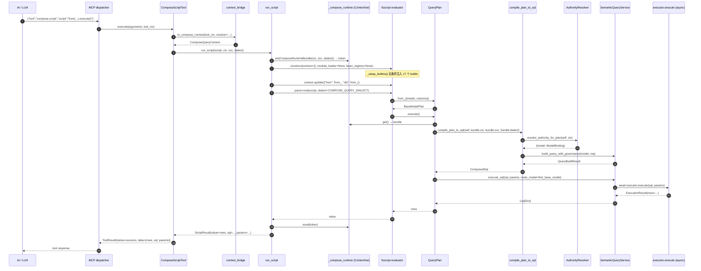

# Python M7 · Compose Query MCP `script` 工具入口 开工提示词

## 变更日志

| 版本 | 时间 | 变化 |
|---|---|---|
| r1 ready-to-execute | 2026-04-23 | 首版落盘，基于 M6 双端 ready-for-review 后的交付形态 |
| r2 ready-to-execute | 2026-04-24 | 吸收 plan-evaluator 评审：**B1** evaluator 实际 builtin 面锁定（`_setup_builtins` 无条件注入 Array_* / Console_* / JSON / parseInt / String / Number / typeof 等 ~17 个名字；改策略为 "允许既有 builtin + 追加 {from, dsl}，测试冻结整个可见面"）· **B2** 新 Step 0：`SemanticQueryService.execute_sql(sql, params, *, route_model=None)` 公共方法补齐（现有 `_execute_query_async` 是 private），M7 的 `plan_execution.py` 调用它而不是虚构的 `jdbc_executor`· **B3** host 配置缺失改用 `contextvars.ContextVar[ComposeRuntimeBundle]` + `RuntimeError`，不借用 `ComposeCompileError`，`ComposeQueryContext.extensions` 不再被 M7 写入· **S1** `QueryPlan.to_sql` 返回 `ComposedSql` 替换 M2 占位 `SqlPreview` 已记在 §对齐原则 与 decision log· **S3** Python 仓 CLAUDE.md 入 §必读前置 #0· **S4** §7.2 测试修正（fsscript 用 `import`，不是 `require`；删 `process / eval / globalThis` JS-world 词）· **S6** 顶部加 `intended_for`· 附注：同一脚本多次 execute/to_sql 触发多次 resolver、Java 镜像 factory 签名预告 |

## 位置与角色

- **实际工作仓**：`foggy-data-mcp-bridge-python`（独立仓 · 非 worktree）
- **Java 镜像**：本版本落地后，Java 侧再按 M1–M6 的节奏起草 Java M7 prompt
- **M7 目标**：把 M6 `compile_plan_to_sql` 通过 MCP 入口暴露给 AI —— 新增独立 `script` 工具，body 仅接收 JavaScript/FSScript 文本，上下文从 `ToolExecutionContext` / HTTP header 解析，最终在服务端构造 `ComposeQueryContext`、调 `AuthorityResolver`、编译 + 执行 SQL，返回标准 MCP `ToolResult`

## 本期 scope · 3 段式

1. **`ToolExecutionContext → ComposeQueryContext` 桥**（§7.1 · 对应 spec §4 入口工具输入协议 + §5 上游回调时机 / §6 请求响应协议）
2. **`QueryPlan.execute() / toSql()` 接治**（§7.3 · M2 当时占位 `UnsupportedInM2Error`，本期替换为调 M6 `compile_plan_to_sql` + 执行器）
3. **`script` 工具本体**（§7.4 · 名字暂定 `compose.script`，继承 `BaseMcpTool`；body 只有 `script` 字符串 · 其他都来自 context / header）

## ★ Step 0 前置 · `SemanticQueryService.execute_sql` 公共方法补齐

**本期实现的第一件事**，类似 Java M6 "复用既有 `generateSql`" 的镜像决策，但方向相反 —— Python 这边 raw-SQL 执行入口当前只有 private `_execute_query_async`，需要补一个最小公共方法再开工。

**现状**（已核实 2026-04-24）：
- `SemanticQueryService._executor` / `set_executor(...)` 已有，底层 `executor.execute(sql, params) → ExecutionResult`（含 `.rows / .total / .error / .has_more`）是**async**
- `SemanticQueryService._execute_query(build_result, model)` 做 sync→async 桥（持久 event loop + ThreadPoolExecutor 兜底）—— 但只接受 `QueryBuildResult`，不接受 raw `(sql, params)`
- M7 compile_plan_to_sql 产出的是 `ComposedSql(sql, params)`，**不是** `QueryBuildResult`；复用 `_execute_query` 不划算，会被迫构造一个假的 QueryBuildResult

**加公共方法**（最小增量，放 `src/foggy/dataset_model/semantic/service.py`）：

```python
def execute_sql(
    self,
    sql: str,
    params: List[Any],
    *,
    route_model: Optional[str] = None,
) -> List[Dict[str, Any]]:
    """Execute raw SQL (already compiled by M6 compile_plan_to_sql)
    against the service's database executor and return rows.

    M7 的 ``run_script`` / ``QueryPlan.execute()`` 通过 compose_planner
    拿到 ``ComposedSql`` 后调本方法得到行数据；不走 build_query_with_governance
    也不走 _execute_query（它们只接 QueryBuildResult）。

    ``route_model`` 可选，用于多 datasource 路由 ——
    Compose Query 跨 base-model 时应传 base-model 之一（M7 约定取
    plan 树左前序首个 BaseModelPlan.model）；单数据源场景传 None 即可。

    sync / async 行为：与 ``_execute_query`` 一致 —— 持久 event loop 或
    ThreadPoolExecutor 包装；async 场景请直接 await 底层 executor。

    Raises:
        RuntimeError: 无 executor 配置（host 未调用 set_executor）。
        Exception: 底层 executor / DB driver 抛出的原始异常（M7 不重包）。
    """
    executor = (self._resolve_executor(route_model)
                if route_model else self._executor)
    if executor is None:
        raise RuntimeError(
            "SemanticQueryService.execute_sql: no executor configured; "
            "host must call set_executor(...) before running compose scripts"
        )
    # 复用既有 sync wrapper 逻辑（持久 loop + ThreadPoolExecutor）——
    # 抽出一个私有 helper _run_sync_coro 或直接调 _get_sync_loop()，
    # 实现时小心不要破坏 _execute_query 既有 async 兼容路径
    import asyncio
    try:
        loop = asyncio.get_running_loop()
    except RuntimeError:
        loop = None
    async def _run():
        return await executor.execute(sql, params)
    if loop and loop.is_running():
        import concurrent.futures
        with concurrent.futures.ThreadPoolExecutor(max_workers=1) as pool:
            sync_loop = self._get_sync_loop()
            future = pool.submit(sync_loop.run_until_complete, _run())
            result = future.result(timeout=60)
    else:
        result = self._get_sync_loop().run_until_complete(_run())
    if result.error:
        raise RuntimeError(
            f"execute_sql failed: {result.error}"
        )
    return list(result.rows or [])
```

**测试**（放现有 `tests/dataset_model/semantic/` 下，~3 tests）：
- executor 未配置 → `RuntimeError`
- executor.execute 成功 → 返回 rows
- executor.execute 抛错 → RuntimeError 包装原错

**完成后**，M7 后续阶段的 `plan_execution.py` 只调 `semantic_service.execute_sql(composed_sql.sql, composed_sql.params, route_model=...)`，不新增任何"jdbc_executor"抽象。

---

**本期不做**（对齐 spec §非目标 + §交付顺序建议第 7 条边界）：
- 不实装 M9 Layer A/B/C validator（仅搭 Layer B bean 注入白名单的基础架，实际审查放 M9）
- 不做远程 `HttpAuthorityResolver`（M7 只要求嵌入模式能跑；远程模式 header 协议留 docstring 说明）
- 不改 `compile_plan_to_sql` 已冻结的签名 / 4 错误码
- 不动 M5 的 fail-closed 分支 / 请求合并规则

## 必读前置

严格按顺序读完再动手：

0. **本仓治理基线**：
   - `foggy-data-mcp-bridge-python/CLAUDE.md` — 开工必读。其中 "禁止 `eval()`" 一条是 M7 script 执行的硬红线：fsscript `ExpressionEvaluator` 走 AST 派发，不调 Python `eval()`；M7 的代码也禁止任何 `eval / exec / __import__` 调用；测试里加一条硬断言 `src/foggy/dataset_model/engine/compose/runtime/` 下无字面量 `eval(` / `exec(` 出现
   - `foggy-data-mcp-bridge-python/docs/8.2.0.beta/README.md` — 本仓 Compose Query 快照索引
1. **M6 Python 成果**（本期底层）：
   - `src/foggy/dataset_model/engine/compose/compilation/compiler.py` — `compile_plan_to_sql(plan, context, *, semantic_service, bindings=None, model_info_provider=None, dialect="mysql") → ComposedSql`
   - `src/foggy/dataset_model/engine/compose/compilation/errors.py` — `ComposeCompileError` 结构化异常（4 codes + 2 phases）
2. **M5 Python 管线**（仍由 M6 内部调用）：
   - `src/foggy/dataset_model/engine/compose/authority/resolver.py` — `resolve_authority_for_plan(plan, ctx, *, model_info_provider=None)`
   - `src/foggy/dataset_model/engine/compose/authority/apply.py` — `apply_field_access_to_schema(schema, binding)`（M7 用这个对声明 schema 做 field_access 过滤 —— 用于预检返回 shape）
3. **M1 Context / Principal**：
   - `src/foggy/dataset_model/engine/compose/context/compose_query_context.py`
   - `src/foggy/dataset_model/engine/compose/context/principal.py`
   - `src/foggy/dataset_model/engine/compose/security/models.py` — `AuthorityResolver` Protocol
4. **M2 QueryPlan 层**（本期要改 `plan.py` 的 `execute` / `to_sql`）：
   - `src/foggy/dataset_model/engine/compose/plan/plan.py` — `QueryPlan.execute` / `.to_sql` 当前抛 `UnsupportedInM2Error`；M7 替换实现
   - `src/foggy/dataset_model/engine/compose/plan/__init__.py` — `from_(...)` 入口函数
5. **M3 Dialect + Sandbox**：
   - `src/foggy/dataset_model/engine/compose/sandbox/error_codes.py` / `exceptions.py` — Layer A/B/C 错误码与 `ComposeSandboxViolationError`（M7 用 Layer B `ALLOWLIST_FAILED` 作为 bean 注入拒绝码；Layer A 已在 fsscript dialect 层生效）
   - `src/foggy/fsscript/parser/dialect.py::COMPOSE_QUERY_DIALECT` — 已移除 `from` 保留字
6. **MCP 工具基类 + context**：
   - `src/foggy/mcp/tools/base.py::BaseMcpTool` / `src/foggy/mcp_spi/context.py::ToolExecutionContext`
   - `src/foggy/mcp_spi/tool.py::ToolResult`（返回形态）
   - 存量工具示范：`src/foggy/mcp/tools/metadata_tool.py` / `nl_query_tool.py`（参考命名、schema、异常处理模式）
7. **FSScript 引擎**（`script` 文本的真实执行时机）：
   - `src/foggy/fsscript/evaluator.py::ExpressionEvaluator`（构造传 `context: Dict[str, Any]` 即可把 `from_` / `dsl` 等函数注入脚本可见域）
   - `src/foggy/fsscript/parser/__init__.py`（parse 入口 —— 记得 parse 时传 `dialect=COMPOSE_QUERY_DIALECT`）
8. **Spec / 实现规划 / 决策记录**（本期要 cross-read）：
   - `docs/8.2.0.beta/P0-ComposeQuery-QueryPlan派生查询与关系复用规范-需求.md` §4 入口工具输入协议 / §5 上游回调时机 / §6 请求响应协议 / §错误模型规划
   - `docs/8.2.0.beta/P0-ComposeQuery-QueryPlan派生查询与关系复用规范-实现规划.md` §MCP/HTTP 工具契约 / §测试规划 §4 MCP 工具层
   - `docs/8.2.0.beta/P0-ComposeQuery-QueryPlan派生查询与关系复用规范-progress.md` §决策记录 2026-04-22（M6 相关的 Step 0 降级 + `build_query_with_governance`）

## 对齐原则（硬要求）

1. **现有单 DSL `query_model` 工具零改动**：M7 只新增 `compose.script`，不触动存量工具的参数 schema / 行为 / 测试基线（spec §保持原单 DSL 工具不变）
2. **错误码 100% 复用前序里程碑**：M7 **不新增错误码**。所有异常走：
   - `AuthorityResolutionError`（M1/M5，resolver 失败）
   - `ComposeSchemaError`（M4，派生 schema 校验）
   - `ComposeCompileError`（M6，SQL 编译）
   - `ComposeSandboxViolationError`（M3，sandbox violation —— 本期主要 Layer B bean 注入白名单失败）
3. **`principal` 构造统一从 header 走**：嵌入模式允许宿主直接塞 `Principal`（spec §5），但 M7 的 `ToolExecutionContext → ComposeQueryContext` 桥仍然提供 header 路径作为 fallback
4. **`ToolResult` 成功 / 失败两档**：成功时 `ToolResult(status="success", data=...)`；失败时结构化把 `error_code / phase / message` 放进 `data`（遵循 `metadata_tool.py` 现有模式）
5. **`compose.script` 工具 schema** 只有 1 个参数 `script: str`，不给 AI 加第二个钩子
6. **不改 M6 签名**：`compile_plan_to_sql` 继续 kw-only；`QueryBuildResult` 的 3 字段不动
7. **Python 是 M7 事实来源**：Java 镜像等 Python M7 落地后再起草
8. **`QueryPlan.to_sql` 返回类型从 M2 `SqlPreview` 占位 → M6 `ComposedSql`**（这是一次显式的 API 表面变化；已在 progress.md 决策记录 2026-04-24 登记）。`SqlPreview` 类本身不动（M2 冻结契约不破），只是 `to_sql` 方法签名升级。Java 镜像同步（Java M2 `SqlPreview` 也保留，`QueryPlan.toSql()` 返回 `ComposedSql`）

## 交付清单

### 新增源码

```
src/foggy/dataset_model/engine/compose/runtime/           ← 新子包
├── __init__.py                    — public: run_script, ScriptResult, ScriptRuntimeError
├── context_bridge.py              — to_compose_context(tool_ctx, *, principal_header, authority_resolver) → ComposeQueryContext
├── plan_execution.py              — execute_plan(plan, ctx, *, semantic_service, dialect) + _pick_route_model
├── script_runtime.py              — run_script(script, ctx, *, semantic_service, dialect) → ScriptResult + ComposeRuntimeBundle ContextVar
└── errors.py                      — ScriptRuntimeError（结构化包装，内部 cause 保留 M1/M3/M4/M5/M6 原始异常）

src/foggy/mcp/tools/
└── compose_script_tool.py         — ComposeScriptTool(BaseMcpTool) · name="compose.script"
```

**为什么开 `runtime/` 子包**：
- `compilation/` 已存在（M6 · plan → SQL）；`runtime/` 放 plan → 真实 rows 的那一层，语义独立
- 职责边界：`compilation/` 只给 `ComposedSql`；`runtime/` 把 `ComposedSql` 交给 §Step 0 的 `SemanticQueryService.execute_sql`（= async `executor.execute(sql, params)` 的公共包装），拿回 rows
- 同时放 `run_script` 是因为"执行脚本"和"执行 plan"共享同一条 executor 链路 + 同一个 ContextVar bundle，工具类直接调 `run_script`

### 修改源码

```
src/foggy/dataset_model/engine/compose/plan/plan.py
  ├── QueryPlan.execute(self, ctx: Optional[ComposeQueryContext]=None) → List[Dict]
  │       旧：raise UnsupportedInM2Error(...)
  │       新：从 runtime.script_runtime.current_bundle() 读 ComposeRuntimeBundle；
  │            无 bundle → RuntimeError；有 bundle → execute_plan(self, ..., svc, dialect)
  │
  └── QueryPlan.to_sql(self, ctx=None, *, dialect=None) → ComposedSql
          旧：raise UnsupportedInM2Error(...)
          新：同上，走 current_bundle() + compile_plan_to_sql；
               dialect 参数优先于 bundle.dialect 用于 multi-dialect snapshot 场景

src/foggy/dataset_model/semantic/service.py
  └── ★ Step 0 · 新增公共方法 execute_sql(sql, params, *, route_model=None) → rows
         见本文顶部 §Step 0 前置章节
```

**注入策略**：不用 `ComposeQueryContext.extensions`、不用 module-level singleton，走 `contextvars.ContextVar[ComposeRuntimeBundle]`（详见 §7.3）。Java 镜像用 `ThreadLocal<ComposeRuntimeBundle>` 对等。

## 实现步骤

### 7.1 · `ToolExecutionContext → ComposeQueryContext` 桥

**文件**：`src/foggy/dataset_model/engine/compose/runtime/context_bridge.py`

```python
def to_compose_context(
    tool_ctx: ToolExecutionContext,
    *,
    authority_resolver: AuthorityResolver,
    extensions: Optional[Dict[str, Any]] = None,
) -> ComposeQueryContext:
    """把 MCP 层的 ToolExecutionContext 转成 Compose Query 执行上下文。

    优先级（mirrors spec §4）：
      1. 嵌入模式 — host 直接在 tool_ctx.state['compose.principal'] 塞一个 Principal
      2. header 模式 — 从 tool_ctx.headers 解析 X-User-Id / Authorization / X-Namespace / ...

    若两种都缺 user_id，抛 ValueError("ToolExecutionContext missing principal identity")
    —— 这是 fail-closed 设计；sandbox 层 M9 再决定是否可匿名。
    """
```

**Header → Principal 映射**：

| Header | Principal 字段 |
|---|---|
| `Authorization` | `authorization_hint` |
| `X-User-Id` | `user_id` |
| `X-Tenant-Id` | `tenant_id` |
| `X-Roles`（逗号分隔） | `roles`（list） |
| `X-Dept-Id` | `dept_id` |
| `X-Policy-Snapshot-Id` | `policy_snapshot_id` |
| `X-Namespace` 或 `tool_ctx.namespace` | `ComposeQueryContext.namespace` |
| `X-Trace-Id` | `ComposeQueryContext.trace_id` |

缺失时：namespace 若两处都没给 → 抛 `ValueError`（compose spec 要求 namespace 非空）。

**测试**：`tests/compose/runtime/test_context_bridge.py` ~15 tests。覆盖嵌入 / header / 两种缺失（user_id / namespace）/ roles 逗号解析 / namespace 两处冲突的优先级 / authority_resolver 是否原样携带到输出 ctx。

### 7.2 · FSScript evaluator global-surface 锁定 · Layer B 入口

**事实基线**（r2 在 plan-evaluator 复核时核验；写代码前请自己再 `grep _setup_builtins` 一次确认）：

Python `ExpressionEvaluator.__init__` 里调 `_setup_builtins()` **无条件**注入这 17 个名字到脚本可见域：

| 类别 | 具体名字 |
|---|---|
| Array 函数族 | `Array_*`（`ArrayGlobal.get_functions()` 返回的全部函数名前缀 `Array_`） |
| Console 函数族 | `Console_*`（同上，前缀 `Console_`） |
| JSON 对象 | `JSON`（`JsonGlobal()` 实例，暴露 `.parse / .stringify`） |
| 字面量/类型构造 | `parseInt` / `parseFloat` / `toString` / `String` / `Number` / `Boolean` / `isNaN` / `isFinite` |
| 构造器类型 | `Array`（=`list`）/ `Object`（=`dict`）/ `Function` |
| 其他 | `typeof` |

`module_loader=None` + `bean_registry=None` 的默认构造下：
- `import 'x'` / `import '@bean'` 会失败（`__module_loader__` 未注入到 ctx → ImportExpression 运行期抛错）—— 这是我们要的
- 以上 17 个 builtin 则**不可抑制**，除非 subclass / 重写 `_setup_builtins`

**M7 策略**（不改 fsscript 引擎，不 subclass）：

1. 承认既有 17 个 builtin 是"Compose Query script 的合法 Layer B 可见面"。这些都是无状态、无副作用的 pure helper；没有 `import / require / eval / process / globalThis` 这类危险入口（fsscript 根本没造它们）。
2. 追加 `from` / `dsl` 两个名字到 evaluator context：构造 evaluator 后 `evaluator.context["from"] = from_; evaluator.context["dsl"] = from_`。
3. **不把** `ComposeQueryContext / SemanticQueryService / executor` 塞进 evaluator.context —— 它们走 contextvar（见 §7.3 的 `ComposeRuntimeBundle`），脚本完全看不见。
4. 用一个 frozen set `ALLOWED_SCRIPT_GLOBALS` 在测试里硬断言可见名字集合 = 上述 17 个 + `{"from", "dsl"}`。未来 M9 若要收窄，就改这张表 + subclass evaluator；本期不做。

**文件**：`src/foggy/dataset_model/engine/compose/runtime/script_runtime.py`

```python
# 可见名字冻结集合（测试硬断言）
# 该集合 = fsscript ExpressionEvaluator._setup_builtins 注入的 17 个名字
# + M7 追加的 {"from", "dsl"}
ALLOWED_SCRIPT_GLOBALS: frozenset[str] = frozenset({
    # fsscript builtins (实现在 foggy.fsscript.evaluator._setup_builtins；
    # 若未来改名，这里和测试都要同步更新)
    "JSON", "parseInt", "parseFloat", "toString",
    "String", "Number", "Boolean", "isNaN", "isFinite",
    "Array", "Object", "Function", "typeof",
    # Array_* / Console_* 是函数族 —— 测试里用 any(startswith(...)) 断言存在即可
    # M7 追加
    "from", "dsl",
})


def run_script(
    script: str,
    ctx: ComposeQueryContext,
    *,
    semantic_service: Any,
    dialect: str = "mysql",
) -> ScriptResult:
    """Parse + 执行 compose query script。

    - parse 时传 ``dialect=COMPOSE_QUERY_DIALECT``（M3 已落地）
    - evaluator 构造时 ``module_loader=None`` / ``bean_registry=None``
      （禁止脚本 import 任意模块 / bean）
    - 构造后向 evaluator.context 追加 ``from`` / ``dsl``
    - 在入口设 ContextVar ``_compose_runtime`` = ComposeRuntimeBundle(
        ctx, semantic_service, dialect)；脚本里 QueryPlan.execute() /
      .to_sql() 从 ContextVar 读，不从 evaluator 可见面读
    """
```

**`ScriptResult`**（`runtime/__init__.py` 公开）：

```python
@dataclass
class ScriptResult:
    value: Any                       # 脚本 return 的值（通常是 rows list 或 ComposedSql）
    sql: Optional[str] = None        # 最近一次 .execute() 的最终 SQL（方便 AI 排障）
    params: Optional[List[Any]] = None
    warnings: List[str] = field(default_factory=list)
```

**测试**：`tests/compose/runtime/test_script_runtime.py` ~10 tests。聚焦 evaluator 可见面 & 安全语义：

- `run_script("return 1;", ctx, svc)` 成功返回 `ScriptResult(value=1)`
- `from({model: 'M', columns: ['id']})` 与 `dsl(...)` 别名等价（两者都返回 BaseModelPlan 实例）
- **`import '@bean'` 在 `bean_registry=None` 下抛**（断言异常类型 = fsscript 原生 ImportError 或 evaluator 抛出的运行期错误；**不要**硬断言 ComposeSandboxViolationError，除非 M9 已经接治 —— 真实抛的是 fsscript 引擎自己的错）
- evaluator context 完整 key set ⊇ `ALLOWED_SCRIPT_GLOBALS`（+ 少量内部 `__*__` 名字，用 `startswith("__")` 过滤后断言等于 `ALLOWED_SCRIPT_GLOBALS ∪ {Array_*, Console_* 函数族}`）
- 脚本语法错误（比如 `from(` 未闭合）→ fsscript parse 错误冒泡；M7 可选择包装为 `ComposeSandboxViolationError(layer-a/scan)` 或原样放行 —— **决策：原样放行**（M9 再收敛；M7 测试只断 parse 错冒泡为某种异常即可）
- `run_script("")` 或空白脚本 → `ScriptResult(value=None)`
- `run_script(script, ctx=None, ...)` → `ValueError("ctx is required")`
- `run_script(script, ctx, semantic_service=None, ...)` → `ValueError("semantic_service is required")`

**反面不测**（r1 写错的项已删除）：
- ~~`require(...)` 抛 Layer B violation~~ —— fsscript 里没有 `require`，这是 JS-world 词；真实 API 是 `import`
- ~~`process / eval / globalThis` 不可见~~ —— 这些是 Node.js / browser global，fsscript 本来就没造；写这条测试等于在断言空气

### 7.3 · `QueryPlan.execute / to_sql` 接治 · 通过 `ComposeRuntimeBundle` ContextVar

**设计要点**：
- 不借用 `ComposeQueryContext.extensions` 传 host 基础设施（spec §1 说 `extensions` 是 upstream passthrough，语义不同）
- 新建 `ComposeRuntimeBundle(ctx, semantic_service, dialect)` dataclass（不含 `jdbc_executor` —— 见 §Step 0，raw-SQL 执行由 `semantic_service.execute_sql(...)` 统一负担）
- `run_script` 入口设 `_compose_runtime: ContextVar[Optional[ComposeRuntimeBundle]]`；`QueryPlan.execute` / `.to_sql` 从里面读
- host 配置缺失 / 脚本外直接调 `.execute()` 的情况一律抛 `RuntimeError`，**不**借用 `ComposeCompileError` 的 4 个码 —— 那些是 compile 失败的结构化码，host 配置问题不应该污染它们

**`ComposeRuntimeBundle`**（放 `runtime/script_runtime.py` 顶端）：

```python
from contextvars import ContextVar
from dataclasses import dataclass

@dataclass(frozen=True)
class ComposeRuntimeBundle:
    ctx: ComposeQueryContext
    semantic_service: Any            # has .execute_sql(sql, params, *, route_model)
    dialect: str = "mysql"

_compose_runtime: ContextVar[Optional[ComposeRuntimeBundle]] = ContextVar(
    "_compose_runtime", default=None
)


def current_bundle() -> Optional[ComposeRuntimeBundle]:
    """Read the ambient compose runtime bundle. Returns None when called
    outside ``run_script`` (e.g., a unit test wiring ``plan.execute(ctx=...)``
    by hand)."""
    return _compose_runtime.get()


def set_bundle(bundle: ComposeRuntimeBundle):
    """Set-and-return the reset token for use in a ``try/finally``; ``run_script``
    uses this so nested scripts restore the parent's bundle correctly."""
    return _compose_runtime.set(bundle)
```

**`plan_execution.py`**（调 §Step 0 的 `semantic_service.execute_sql`，不调虚构 jdbc_executor）：

```python
def execute_plan(
    plan: QueryPlan,
    ctx: ComposeQueryContext,
    *,
    semantic_service: Any,
    dialect: str = "mysql",
) -> List[Dict[str, Any]]:
    """Compile plan → SQL → execute via semantic_service.execute_sql → rows.

    Raises:
        ComposeCompileError: plan-level / compile-level failures
            (MISSING_BINDING, UNSUPPORTED_PLAN_SHAPE, etc.) 冒泡
        AuthorityResolutionError: resolver 失败冒泡
        ComposeSchemaError: schema 推导失败冒泡
        RuntimeError: execute phase 失败（DB driver / executor / route_model
            配置错；消息前缀 "Plan execution failed at execute phase:"）
    """
    composed = compile_plan_to_sql(
        plan, ctx, semantic_service=semantic_service, dialect=dialect,
    )
    # route_model 取 plan 树左前序首个 BaseModelPlan.model —— 单 datasource
    # 场景下可以 None，但传进去让 multi-datasource 路由有线索
    route_model = _pick_route_model(plan)
    try:
        return semantic_service.execute_sql(
            composed.sql, composed.params, route_model=route_model,
        )
    except Exception as exc:
        # execute phase 失败不包成 ComposeCompileError ——
        # spec §错误模型规划 把 execute 单列为一个 phase 大类
        raise RuntimeError(
            f"Plan execution failed at execute phase: {exc}"
        ) from exc


def _pick_route_model(plan: QueryPlan) -> Optional[str]:
    """返回 plan 树 left-preorder 首个 BaseModelPlan.model；
       没有 BaseModelPlan（理论上不可能）时返回 None。"""
    ...  # 实现对齐 M5 BaseModelPlanCollector
```

**修改 `plan.py`**（M2 占位 `UnsupportedInM2Error` 替换）：

```python
# 旧
def execute(self, ctx: Optional[ComposeQueryContext] = None) -> Any:
    raise UnsupportedInM2Error("QueryPlan.execute is not implemented in M2")

def to_sql(self) -> SqlPreview:
    raise UnsupportedInM2Error("QueryPlan.to_sql is not implemented in M2")

# 新
def execute(self, ctx: Optional[ComposeQueryContext] = None) -> List[Dict[str, Any]]:
    """Compile and run this plan. ``ctx`` is optional when called from
    within ``run_script``; direct callers must pass it + ensure a
    ``ComposeRuntimeBundle`` is bound (via ``run_script`` or a manual
    ``set_bundle(...)``)."""
    from ..runtime.script_runtime import current_bundle
    from ..runtime.plan_execution import execute_plan
    bundle = current_bundle()
    if bundle is None:
        raise RuntimeError(
            "QueryPlan.execute requires an ambient ComposeRuntimeBundle; "
            "call from inside run_script(), or wrap manually via set_bundle(...). "
            "Host misconfiguration (semantic_service / dialect not bound) cannot "
            "be surfaced as ComposeCompileError — that family is reserved for "
            "compile-phase failures."
        )
    effective_ctx = ctx if ctx is not None else bundle.ctx
    return execute_plan(
        self, effective_ctx,
        semantic_service=bundle.semantic_service,
        dialect=bundle.dialect,
    )

def to_sql(self, ctx: Optional[ComposeQueryContext] = None, *,
           dialect: Optional[str] = None) -> ComposedSql:
    """Compile this plan to SQL + params (no execution). Return type
    changed from the M2 ``SqlPreview`` placeholder to M6 ``ComposedSql`` —
    see §对齐原则 #8."""
    from ..runtime.script_runtime import current_bundle
    from ..compilation.compiler import compile_plan_to_sql
    bundle = current_bundle()
    if bundle is None and ctx is None:
        raise RuntimeError(
            "QueryPlan.to_sql requires either an explicit ctx or an "
            "ambient ComposeRuntimeBundle"
        )
    effective_ctx = ctx if ctx is not None else bundle.ctx
    effective_svc = bundle.semantic_service if bundle else None
    effective_dialect = dialect or (bundle.dialect if bundle else "mysql")
    if effective_svc is None:
        raise RuntimeError(
            "QueryPlan.to_sql: semantic_service unbound (pass ctx + set_bundle, "
            "or call from inside run_script)"
        )
    return compile_plan_to_sql(
        self, effective_ctx,
        semantic_service=effective_svc, dialect=effective_dialect,
    )
```

**异步行为声明**：`contextvars.ContextVar` 在 `asyncio` 任务间自动继承（每个 `Task` 有自己的 Context copy）；在 `ThreadPoolExecutor` 下需要 `contextvars.copy_context().run(...)` 手动传递。M7 `run_script` 目前是 sync 调 sync；未来 async evaluator 上线时本文件仍可用，只需确认调度器把 Context 带上即可。

**Java 镜像预告**：Java 对应的抽象是 `ThreadLocal<ComposeRuntimeBundle>` + 相同的 `set / get / remove` 三操作，差别在 Java 无 ContextVar，嵌套用 try/finally 手动 push/pop。Java M7 提示词起草时照此对齐。

**测试**：`tests/compose/runtime/test_plan_execution.py` ~12 tests。

- `BaseModelPlan.execute()` 在 `run_script` 体内 → 成功返回 rows
- 直接裸调 `.execute()`（bundle 未设）→ `RuntimeError("requires an ambient ComposeRuntimeBundle")`
- `.execute(ctx=...)` 但 bundle 未设 → 仍然 `RuntimeError`（因为 execute 还要拿 semantic_service）
- `to_sql()` 在 bundle 体内 → 返回 `ComposedSql`
- `to_sql(ctx=...)` 裸调 → `RuntimeError("semantic_service unbound")`
- `to_sql()` 透传 `dialect` 覆盖 bundle 默认
- `execute_plan` 内部：compile 抛 `ComposeCompileError` → 原样冒泡，**不**被 RuntimeError 包
- `execute_plan` 内部：`semantic_service.execute_sql` 抛异常 → `RuntimeError("Plan execution failed at execute phase:")` 包装，`__cause__` 保留
- 嵌套 `run_script` 内的 `run_script` 正确保存 / 恢复父 bundle（`ContextVar.reset(token)` 验证）
- `_pick_route_model` 对 BaseModelPlan / DerivedQueryPlan / UnionPlan / JoinPlan 都返回第一个 base model 名
- `ComposeRuntimeBundle` frozen（赋值抛 `dataclasses.FrozenInstanceError`）
- `current_bundle()` 在 run_script 外调 → None（不抛）

### 7.4 · `ComposeScriptTool` — MCP 工具入口

**文件**：`src/foggy/mcp/tools/compose_script_tool.py`

```python
class ComposeScriptTool(BaseMcpTool):
    """MCP tool exposing Compose Query script entry — body is a single
    ``script`` string; context is extracted from ToolExecutionContext.

    参考 spec §4 入口工具输入协议：
      - body 仅接收 {"script": "..."}
      - principal / namespace / trace 从 ToolExecutionContext 或 header 取
      - host 须提前注入 `AuthorityResolver`（嵌入模式）或配置远程
        resolver factory（远程模式 · 本期不实装）
    """

    tool_name: ClassVar[str] = "compose.script"
    tool_description: ClassVar[str] = (
        "Run a Compose Query script (JavaScript-like syntax). Use for "
        "multi-model queries requiring query/union/join composition. "
        "Single-model queries should still use 'query_model'."
    )
    tool_category: ClassVar[ToolCategory] = ToolCategory.DATA_ANALYSIS

    def __init__(
        self,
        authority_resolver_factory: Callable[[ToolExecutionContext], AuthorityResolver],
        semantic_service: Any,                   # 须已 set_executor + 实现 execute_sql (§Step 0)
        default_dialect: str = "mysql",
        config: Optional[Dict[str, Any]] = None,
    ):
        super().__init__(config)
        self._resolver_factory = authority_resolver_factory
        self._semantic_service = semantic_service
        self._default_dialect = default_dialect

    def get_parameters(self) -> List[Dict[str, Any]]:
        return [
            {
                "name": "script",
                "type": "string",
                "required": True,
                "description": (
                    "Compose Query script. Access base QMs via "
                    "`from({model: 'XxxModel', columns: [...], slice: [...]})`. "
                    "Chain with .query(), .union(), .join(); end with "
                    ".execute() to get rows or .toSql() for SQL preview."
                ),
            },
        ]

    async def execute(
        self, arguments: Dict[str, Any], context: Optional[ToolExecutionContext] = None
    ) -> ToolResult:
        # 1. validate script
        # 2. build ComposeQueryContext via context_bridge + authority_resolver_factory
        # 3. run_script(...)
        # 4. wrap ScriptResult → ToolResult
        # 5. error branches: AuthorityResolutionError / ComposeSchemaError /
        #    ComposeCompileError / ComposeSandboxViolationError → ToolResult(
        #    status="error", data={"error_code": ..., "phase": ..., "message": ...})
        ...
```

**测试**：`tests/mcp/tools/test_compose_script_tool.py` ~15 tests。覆盖：
- 快乐路径（`FakeSemanticService`（带预置 `execute_sql` 返回 stub rows）+ FakeResolver 跑出 rows）
- 每种错误码路径（5 大家族都要至少一条）
- 缺 script 参数 → `ToolResult(status="error")`
- `ToolExecutionContext` 缺 user_id → `ValueError`
- `AuthorityResolver` factory 抛异常 → `ToolResult(status="error")`
- 远程模式未实装的 NotImplementedError 标签（docstring only，跳过实装）

### 7.5 · 错误路径与消息文本

全部对齐 spec §错误模型规划 §4 要求的 4 字段：

```
{
  "error_code": "<code 全串>",
  "phase":       "<permission-resolve | schema-derive | compile | execute>",
  "message":     "<human-readable>",
  "model":       "<optional·QM 名>"   // 若适用
}
```

`phase` 映射规则：

| 抛出异常 | phase | 备注 |
|---|---|---|
| `AuthorityResolutionError` | `permission-resolve` | M1/M5 家族 |
| `ComposeSchemaError` | `schema-derive` | M4 家族 |
| `ComposeCompileError` | 用它自己 `.phase`（`plan-lower` / `compile`）都归到 `compile` 大类 | M6 家族 |
| `ComposeSandboxViolationError` | `compile` | M3/M9 家族；M9 Layer A/B/C 都发生在 parse/evaluate 期 |
| `RuntimeError` 来自 `execute_plan` / `execute_sql` | `execute` | spec §错误模型 单列的 execute phase |
| `RuntimeError` 来自 `QueryPlan.execute` bundle 未绑定 | `internal` | host 配置错，与脚本无关；`error_code="host-misconfig"`（纯字符串，不属于任何错误码命名空间） |
| `ValueError` 来自 `run_script(ctx=None)` / `run_script(semantic_service=None)` | `internal` | 同上 |
| fsscript parse / evaluate 原生错误（bean 未注入、语法错、类型错）| `compile` | 本期透传原生异常 message；M9 接治后再包成 `ComposeSandboxViolationError(layer-a/scan)` |

## 非目标（禁止做）

- 不新增 `compose-*-error/*` 命名空间下的错误码（`host-misconfig` 是纯字符串 tag、不进错误码命名空间 —— 见 §7.5）
- 不实装 M9 Layer A/B/C 静态 AST 验证器（本期只通过 evaluator 构造参数禁 `module_loader` / `bean_registry`，并用测试冻结可见面；真实 AST 扫描在 M9）
- 不做 HTTP 远程 AuthorityResolver 实装（spec 要求 header 协议冻结但实装延后）
- 不改 `compile_plan_to_sql` 签名 · 不动 `QueryBuildResult`
- 不碰单 DSL `query_model` 工具的现有行为
- 不暴露 `ComposeQueryContext.principal` 到脚本可见面（spec §Layer C）
- 不引入独立的 `JdbcExecutor` 抽象 —— raw-SQL 执行由 §Step 0 的 `SemanticQueryService.execute_sql` 统一承担；避免在 `executor.execute(sql, params)` 之上再造一层适配器
- 不在 `ComposeQueryContext.extensions` 里写 host 基础设施（`semantic_service` / `dialect` 等）—— 走 ContextVar `ComposeRuntimeBundle`；`extensions` 仅为 spec §1 的 upstream passthrough 保留

## 验收硬门槛

1. `pytest -q tests/compose/runtime/ tests/mcp/tools/test_compose_script_tool.py tests/dataset_model/semantic/` 全绿（含 Step 0 的 execute_sql 新测）
2. `pytest -q` 全仓回归 · 基线 2873 → ≥ 2933（净增 ≥ 60；Step 0 约 +3，§7.1~§7.5 约 +60）· **0 regression**
3. 新增错误码数量 == 0（硬断言：`src/foggy/dataset_model/engine/compose/runtime/` 下不得出现任何 `compose-*-error/*` 新 namespace 字符串；host-misconfig / internal 用明文字符串 tag，不进命名空间）
4. `QueryPlan.execute()` / `QueryPlan.to_sql()` 不再抛 `UnsupportedInM2Error`（反向断言：`plan.py` 中这两条 raise 语句被删除；`SqlPreview` 类仍保留，但不再是 `to_sql` 的返回类型）
5. `ComposeScriptTool.get_parameters()` 只返回 1 个 `script` 参数（硬断言）
6. `ToolResult` 错误分支 `data` 4 字段 shape 断言（`error_code` / `phase` / `message` / `model`（optional））
7. evaluator 可见面冻结：测试硬断言 `run_script` 启动的 evaluator `.context` keys（去掉 `__*__` / `Array_*` / `Console_*` 函数族）= `ALLOWED_SCRIPT_GLOBALS`
8. ContextVar 隔离：嵌套 `run_script` 的父子 bundle 正确 push/pop；`_compose_runtime.get()` 在 `run_script` 体外永远返回 `None`
9. `progress.md` 更新：M7 行 → `python-ready-for-review`，追加 Python 基线数字；changelog 新增条目
10. 本提示词 `status: ready-to-execute` → `done`，填 `completed_at` + `python_baseline_after` + `python_new_tests_actual`

## 停止条件

- `compile_plan_to_sql` 在本期被发现需要签名改 → 立即停，回到 M6 决策记录
- `QueryPlan.execute` 改动导致 M1-M6 任一测试红 → 立即停，回滚 plan.py
- FSScript 引擎无法承接 `COMPOSE_QUERY_DIALECT` 的 `from(...)` 调用 → 立即停，产出 dialect-integration issue 并提交到决策记录（M3 Layer A 本应已覆盖）
- evaluator 实际注入的 builtin 与本文 §7.2 "事实基线" 表不一致（比如后续改过 `_setup_builtins`，多了危险名） → 立即停，同步更新本 §7.2 + `ALLOWED_SCRIPT_GLOBALS` 再继续；不得直接吞掉
- `SemanticQueryService` 当前类结构无法承载公共 `execute_sql` 方法（比如 `_executor` 已被别的重构移走） → 立即停，回到决策记录重议 Step 0 方案

## 流程图



## 预估规模（r2 上调）

| 阶段 | 估算 | 备注 |
|---|---|---|
| Step 0 · `SemanticQueryService.execute_sql` 加公共方法 + 3 tests | 0.3 PD | 最小增量；复用 `_get_sync_loop` + 现有 async 适配 |
| 7.1 context_bridge + tests | 0.3 PD | header 解析 + 嵌入 vs header 优先级 |
| 7.2 evaluator global-surface lockdown + tests | 0.4 PD | 承接 evaluator `_setup_builtins`；`ALLOWED_SCRIPT_GLOBALS` 冻结 + 反面测试冗余项先做出来 |
| 7.3 QueryPlan.execute / to_sql 替换 + `ComposeRuntimeBundle` ContextVar | 0.6 PD | 嵌套隔离 + Java-mirror 等价提示 + `_pick_route_model` helper + RuntimeError 文本稳定 |
| 7.4 ComposeScriptTool | 0.4 PD | ToolResult shape + 7 家族错误分支（含 host-misconfig / internal） |
| 7.5 集成错误路径测试 | 0.3 PD | 覆盖 authority / schema / compile / sandbox / execute / host-misconfig |
| progress.md + README + 决策记录回写 | 0.2 PD | |
| buffer（跨文件改动 + full regression debug + async/sync loop 调试） | 0.5 PD | 首次 contextvars + 异步 executor 桥接，留余量 |
| **合计** | **3.0 PD**（底）/ **3.5 PD**（含调试 buffer 兑现） | |

## 附注 · 已知限制 / 非阻塞风险

写在提示词里让子 agent 有心理预期，不作为本期硬门槛：

- **同一脚本多次 `.execute()` / `.to_sql()` 会触发多次 resolver**：M6 r3 Q2 决定不做跨请求 binding 缓存。AI 写 `const p = from(...); p.toSql(); p.execute();` 会触发 resolver 两次。本期接受；需要时由 AI 脚本自行 `const rows = p.execute();` 一次到底，或调用 M5 `resolve_authority_for_plan` 预先拿 bindings 再传下去。§ComposeScriptTool docstring / tool_description 里简单加一句用户提示即可。
- **evaluator 可见的 17 个 fsscript builtin 不是"绝对安全"的语义保证**：`JSON.parse / Array` 等仍可能被脚本用于异常构造，但这不是沙箱逃逸面；真正的 Layer B 审查（含调用频率 / 执行时长 / 危险模式检测）由 M9 负责。本期只保证"M7 没有主动扩大 evaluator 可见面"。
- **脚本用下划线变量名（如 `__foo`）不受 M7 保护**：下划线只是 Python 约定，fsscript 不强制；脚本可以自由创建 `__x` 变量。但 `_compose_runtime` 是 Python ContextVar，脚本根本摸不到；所以 host 基础设施真的隐藏。
- **Java 镜像预告 · `authority_resolver_factory` 签名冻结**：Python `Callable[[ToolExecutionContext], AuthorityResolver]`，Java 对应 `Function<ToolExecutionContext, AuthorityResolver>`；Java M7 起草时按此对齐。
- **`_pick_route_model` 单数据源场景空转**：纯单 MySQL 的部署下，路由没意义；但这是 3 行代码的 helper，提前放进来对 M8 多数据源嵌入场景也无代价。
- **`ToolResult` 错误分支的 `error_code` 字段允许是 `compose-*-error/*` 命名空间字符串 OR 明文 tag（`host-misconfig` / `internal-error`）**：前者进错误码家族、后者不进。两种都被测试 shape 断言接受，客户端按是否含 `/` 分辨即可。

## 完成后需要更新的文档

1. 8.2.0.beta `progress.md` M7 行：`not-started` → `python-ready-for-review`；添加 Python 基线数字
2. 本提示词 `status: ready-to-execute` → `done`
3. 根 `CLAUDE.md` 新增 "Compose Query M7 MCP script 工具入口（8.2.0.beta · Python 首发）" 段
4. Python 仓 README 快照 `docs/8.2.0.beta/README.md` 补一行 `M7-ScriptTool-Python-execution-prompt.md`
5. Java 侧稍后按 M1–M6 节奏起草 Java M7 prompt（Python-first 完成后的镜像）
