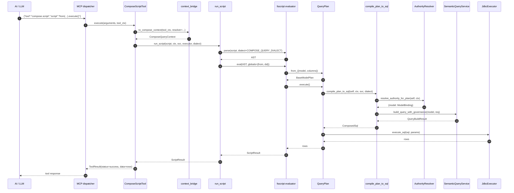

# Python M7 · Compose Query MCP `script` 工具入口 开工提示词

## 变更日志

| 版本 | 时间 | 变化 |
|---|---|---|
| r1 ready-to-execute | 2026-04-23 | 首版落盘，基于 M6 双端 ready-for-review 后的交付形态 |

## 位置与角色

- **实际工作仓**：`foggy-data-mcp-bridge-python`（独立仓 · 非 worktree）
- **Java 镜像**：本版本落地后，Java 侧再按 M1–M6 的节奏起草 Java M7 prompt
- **M7 目标**：把 M6 `compile_plan_to_sql` 通过 MCP 入口暴露给 AI —— 新增独立 `script` 工具，body 仅接收 JavaScript/FSScript 文本，上下文从 `ToolExecutionContext` / HTTP header 解析，最终在服务端构造 `ComposeQueryContext`、调 `AuthorityResolver`、编译 + 执行 SQL，返回标准 MCP `ToolResult`

## 本期 scope · 3 段式

1. **`ToolExecutionContext → ComposeQueryContext` 桥**（§7.1 · 对应 spec §4 入口工具输入协议 + §5 上游回调时机 / §6 请求响应协议）
2. **`QueryPlan.execute() / toSql()` 接治**（§7.3 · M2 当时占位 `UnsupportedInM2Error`，本期替换为调 M6 `compile_plan_to_sql` + 执行器）
3. **`script` 工具本体**（§7.4 · 名字暂定 `compose.script`，继承 `BaseMcpTool`；body 只有 `script` 字符串 · 其他都来自 context / header）

**本期不做**（对齐 spec §非目标 + §交付顺序建议第 7 条边界）：
- 不实装 M9 Layer A/B/C validator（仅搭 Layer B bean 注入白名单的基础架，实际审查放 M9）
- 不做远程 `HttpAuthorityResolver`（M7 只要求嵌入模式能跑；远程模式 header 协议留 docstring 说明）
- 不改 `compile_plan_to_sql` 已冻结的签名 / 4 错误码
- 不动 M5 的 fail-closed 分支 / 请求合并规则

## 必读前置

严格按顺序读完再动手：

1. **M6 Python 成果**（本期底层）：
   - `src/foggy/dataset_model/engine/compose/compilation/compiler.py` — `compile_plan_to_sql(plan, context, *, semantic_service, bindings=None, model_info_provider=None, dialect="mysql") → ComposedSql`
   - `src/foggy/dataset_model/engine/compose/compilation/errors.py` — `ComposeCompileError` 结构化异常（4 codes + 2 phases）
2. **M5 Python 管线**（仍由 M6 内部调用）：
   - `src/foggy/dataset_model/engine/compose/authority/resolver.py` — `resolve_authority_for_plan(plan, ctx, *, model_info_provider=None)`
   - `src/foggy/dataset_model/engine/compose/authority/apply.py` — `apply_field_access_to_schema(schema, binding)`（M7 用这个对声明 schema 做 field_access 过滤 —— 用于预检返回 shape）
3. **M1 Context / Principal**：
   - `src/foggy/dataset_model/engine/compose/context/compose_query_context.py`
   - `src/foggy/dataset_model/engine/compose/context/principal.py`
   - `src/foggy/dataset_model/engine/compose/security/models.py` — `AuthorityResolver` Protocol
4. **M2 QueryPlan 层**（本期要改 `plan.py` 的 `execute` / `to_sql`）：
   - `src/foggy/dataset_model/engine/compose/plan/plan.py` — `QueryPlan.execute` / `.to_sql` 当前抛 `UnsupportedInM2Error`；M7 替换实现
   - `src/foggy/dataset_model/engine/compose/plan/__init__.py` — `from_(...)` 入口函数
5. **M3 Dialect + Sandbox**：
   - `src/foggy/dataset_model/engine/compose/sandbox/error_codes.py` / `exceptions.py` — Layer A/B/C 错误码与 `ComposeSandboxViolationError`（M7 用 Layer B `ALLOWLIST_FAILED` 作为 bean 注入拒绝码；Layer A 已在 fsscript dialect 层生效）
   - `src/foggy/fsscript/parser/dialect.py::COMPOSE_QUERY_DIALECT` — 已移除 `from` 保留字
6. **MCP 工具基类 + context**：
   - `src/foggy/mcp/tools/base.py::BaseMcpTool` / `src/foggy/mcp_spi/context.py::ToolExecutionContext`
   - `src/foggy/mcp_spi/tool.py::ToolResult`（返回形态）
   - 存量工具示范：`src/foggy/mcp/tools/metadata_tool.py` / `nl_query_tool.py`（参考命名、schema、异常处理模式）
7. **FSScript 引擎**（`script` 文本的真实执行时机）：
   - `src/foggy/fsscript/evaluator.py::ExpressionEvaluator`（构造传 `context: Dict[str, Any]` 即可把 `from_` / `dsl` 等函数注入脚本可见域）
   - `src/foggy/fsscript/parser/__init__.py`（parse 入口 —— 记得 parse 时传 `dialect=COMPOSE_QUERY_DIALECT`）
8. **Spec / 实现规划 / 决策记录**（本期要 cross-read）：
   - `docs/8.2.0.beta/P0-ComposeQuery-QueryPlan派生查询与关系复用规范-需求.md` §4 入口工具输入协议 / §5 上游回调时机 / §6 请求响应协议 / §错误模型规划
   - `docs/8.2.0.beta/P0-ComposeQuery-QueryPlan派生查询与关系复用规范-实现规划.md` §MCP/HTTP 工具契约 / §测试规划 §4 MCP 工具层
   - `docs/8.2.0.beta/P0-ComposeQuery-QueryPlan派生查询与关系复用规范-progress.md` §决策记录 2026-04-22（M6 相关的 Step 0 降级 + `build_query_with_governance`）

## 对齐原则（硬要求）

1. **现有单 DSL `query_model` 工具零改动**：M7 只新增 `compose.script`，不触动存量工具的参数 schema / 行为 / 测试基线（spec §保持原单 DSL 工具不变）
2. **错误码 100% 复用前序里程碑**：M7 **不新增错误码**。所有异常走：
   - `AuthorityResolutionError`（M1/M5，resolver 失败）
   - `ComposeSchemaError`（M4，派生 schema 校验）
   - `ComposeCompileError`（M6，SQL 编译）
   - `ComposeSandboxViolationError`（M3，sandbox violation —— 本期主要 Layer B bean 注入白名单失败）
3. **`principal` 构造统一从 header 走**：嵌入模式允许宿主直接塞 `Principal`（spec §5），但 M7 的 `ToolExecutionContext → ComposeQueryContext` 桥仍然提供 header 路径作为 fallback
4. **`ToolResult` 成功 / 失败两档**：成功时 `ToolResult(status="success", data=...)`；失败时结构化把 `error_code / phase / message` 放进 `data`（遵循 `metadata_tool.py` 现有模式）
5. **`compose.script` 工具 schema** 只有 1 个参数 `script: str`，不给 AI 加第二个钩子
6. **不改 M6 签名**：`compile_plan_to_sql` 继续 kw-only；`QueryBuildResult` 的 3 字段不动
7. **Python 是 M7 事实来源**：Java 镜像等 Python M7 落地后再起草

## 交付清单

### 新增源码

```
src/foggy/dataset_model/engine/compose/runtime/           ← 新子包
├── __init__.py                    — public: run_script, ScriptResult, ScriptRuntimeError
├── context_bridge.py              — to_compose_context(tool_ctx, *, principal_header, authority_resolver) → ComposeQueryContext
├── plan_execution.py              — execute_plan(plan, ctx, *, semantic_service, dialect, jdbc_executor)
├── script_runtime.py              — run_script(script, ctx, *, semantic_service, jdbc_executor, dialect) → ScriptResult
└── errors.py                      — ScriptRuntimeError（结构化包装，内部 cause 保留 M1/M3/M4/M5/M6 原始异常）

src/foggy/mcp/tools/
└── compose_script_tool.py         — ComposeScriptTool(BaseMcpTool) · name="compose.script"
```

**为什么开 `runtime/` 子包**：
- `compilation/` 已存在（M6 · plan → SQL）；`runtime/` 放 plan → 真实 rows 的那一层，语义独立
- 职责边界：`compilation/` 只给 `ComposedSql`；`runtime/` 把 `ComposedSql` 塞进 v1.3 `JdbcExecutor`（或 `_execute_sql` 等价私有），拿回 rows + total
- 同时放 `run_script` 是因为"执行脚本"和"执行 plan"共享同一条 executor 链路，工具类直接调 `run_script`

### 修改源码

```
src/foggy/dataset_model/engine/compose/plan/plan.py
  ├── QueryPlan.execute(self, ctx: ComposeQueryContext) → Any
  │       旧：raise UnsupportedInM2Error(...)
  │       新：from ..runtime.plan_execution import execute_plan
  │            return execute_plan(self, ctx, semantic_service=<injected>, ...)
  │       注：semantic_service 从 ctx.extensions["semantic_service"] 拿，或 host
  │            启动时注册到 module-level singleton。
  │
  └── QueryPlan.to_sql(self, ctx: ComposeQueryContext, *, dialect="mysql") → ComposedSql
          旧：raise UnsupportedInM2Error(...)
          新：from ..compilation.compiler import compile_plan_to_sql
               return compile_plan_to_sql(self, ctx, semantic_service=<injected>, dialect=dialect)
```

两个方法的 `semantic_service` 注入策略对齐 Java 侧 Spring `@Resource` —— Python 走 context `extensions` 字典 + 一个 module-level `set_default_semantic_service(svc)` 钩子，host 启动时调一次。`extensions` 优先于默认注入。

## 实现步骤

### 7.1 · `ToolExecutionContext → ComposeQueryContext` 桥

**文件**：`src/foggy/dataset_model/engine/compose/runtime/context_bridge.py`

```python
def to_compose_context(
    tool_ctx: ToolExecutionContext,
    *,
    authority_resolver: AuthorityResolver,
    extensions: Optional[Dict[str, Any]] = None,
) -> ComposeQueryContext:
    """把 MCP 层的 ToolExecutionContext 转成 Compose Query 执行上下文。

    优先级（mirrors spec §4）：
      1. 嵌入模式 — host 直接在 tool_ctx.state['compose.principal'] 塞一个 Principal
      2. header 模式 — 从 tool_ctx.headers 解析 X-User-Id / Authorization / X-Namespace / ...

    若两种都缺 user_id，抛 ValueError("ToolExecutionContext missing principal identity")
    —— 这是 fail-closed 设计；sandbox 层 M9 再决定是否可匿名。
    """
```

**Header → Principal 映射**：

| Header | Principal 字段 |
|---|---|
| `Authorization` | `authorization_hint` |
| `X-User-Id` | `user_id` |
| `X-Tenant-Id` | `tenant_id` |
| `X-Roles`（逗号分隔） | `roles`（list） |
| `X-Dept-Id` | `dept_id` |
| `X-Policy-Snapshot-Id` | `policy_snapshot_id` |
| `X-Namespace` 或 `tool_ctx.namespace` | `ComposeQueryContext.namespace` |
| `X-Trace-Id` | `ComposeQueryContext.trace_id` |

缺失时：namespace 若两处都没给 → 抛 `ValueError`（compose spec 要求 namespace 非空）。

**测试**：`tests/compose/runtime/test_context_bridge.py` ~15 tests。覆盖嵌入 / header / 两种缺失（user_id / namespace）/ roles 逗号解析 / namespace 两处冲突的优先级 / authority_resolver 是否原样携带到输出 ctx。

### 7.2 · FSScript bean 注入 · Layer B 入口

M7 不实装 M9 的静态 AST 扫描，但要保证脚本可见的全局只有白名单里允许的东西。策略：

1. 建立 `COMPOSE_SCRIPT_GLOBALS` 白名单常量：`{"from": from_, "dsl": from_}` （`from` + alias `dsl`）
2. `ExpressionEvaluator(context=COMPOSE_SCRIPT_GLOBALS)` 时不传 `module_loader`（禁 `import`）、不传 `bean_registry`（禁 `@bean`）
3. 若脚本通过 member access 触碰到 `console` / `JSON` 等 global，**M7 暂允许**（调试体验），但把完整白名单硬断言放到测试里 —— 未来 M9 要更严时，只改白名单常量

**文件**：`src/foggy/dataset_model/engine/compose/runtime/script_runtime.py`

```python
COMPOSE_SCRIPT_GLOBALS: Dict[str, Any] = {
    "from": from_,    # 让 AI 写 const p = from({model: 'x', columns: [...]})
    "dsl": from_,     # alias — AI 脚本里习惯性写 dsl(...)
}


def run_script(
    script: str,
    ctx: ComposeQueryContext,
    *,
    semantic_service: Any,
    jdbc_executor: Any,
    dialect: str = "mysql",
) -> ScriptResult:
    """Parse + 执行 compose query script。

    parse 时带 COMPOSE_QUERY_DIALECT；evaluator 用
    COMPOSE_SCRIPT_GLOBALS + ctx 注入到 compose-query-context 专用变量
    ``__compose_ctx`` / ``__semantic_service`` / ``__jdbc_executor`` /
    ``__dialect``（下划线前缀表示脚本不得显式使用，仅给 QueryPlan.execute
    内部读取 —— Layer B 的变量隐私保护，真实 AST 扫描在 M9 拉紧）。
    """
```

**`ScriptResult`**（`runtime/__init__.py` 公开）：

```python
@dataclass
class ScriptResult:
    value: Any                       # 脚本 return 的值（通常是 rows list 或 ComposedSql）
    sql: Optional[str] = None        # 最近一次 .execute() 的最终 SQL（方便 AI 排障）
    params: Optional[List[Any]] = None
    warnings: List[str] = field(default_factory=list)
```

**测试**：`tests/compose/runtime/test_script_runtime.py` ~10 tests。覆盖：简单 `return` / `from_` 可用 / `dsl` 别名可用 / `require(...)` 抛 Layer B violation / `process / eval / globalThis` 不可见 / 脚本语法错误走 ComposeSandboxViolationError 'layer-a/scan' / 不带 ctx 抛 ValueError。

### 7.3 · `QueryPlan.execute / to_sql` 接治

**文件**：`src/foggy/dataset_model/engine/compose/runtime/plan_execution.py`

```python
def execute_plan(
    plan: QueryPlan,
    ctx: ComposeQueryContext,
    *,
    semantic_service: Any,
    jdbc_executor: Any,
    dialect: str = "mysql",
) -> List[Dict[str, Any]]:
    """Compile plan → SQL → execute via v1.3 JdbcExecutor → list of rows."""
    composed = compile_plan_to_sql(
        plan, ctx, semantic_service=semantic_service, dialect=dialect,
    )
    try:
        return jdbc_executor.execute_sql(composed.sql, composed.params)
    except Exception as exc:
        # v1.3 执行错误不重包成 ComposeCompileError ——
        # execute 阶段错误在 spec §错误模型规划 里单独分类（execute phase）
        raise RuntimeError(
            f"Plan execution failed at execute phase: {exc}"
        ) from exc
```

**修改 `plan.py`**：

```python
# 旧
def execute(self, ctx: Optional[ComposeQueryContext] = None) -> Any:
    raise UnsupportedInM2Error("QueryPlan.execute is not implemented in M2")

# 新
def execute(self, ctx: Optional[ComposeQueryContext] = None) -> Any:
    effective_ctx = ctx if ctx is not None else _current_compose_ctx()
    if effective_ctx is None:
        raise ComposeCompileError(
            code=error_codes.MISSING_BINDING,
            phase="plan-lower",
            message="QueryPlan.execute requires a ComposeQueryContext; "
                    "either pass it explicitly or invoke from within run_script "
                    "which sets it via contextvars",
        )
    svc = effective_ctx.extensions.get("semantic_service") if effective_ctx.extensions else None
    executor = effective_ctx.extensions.get("jdbc_executor") if effective_ctx.extensions else None
    dialect = (effective_ctx.extensions or {}).get("dialect", "mysql")
    if svc is None or executor is None:
        raise ComposeCompileError(
            code=error_codes.PER_BASE_COMPILE_FAILED,
            phase="compile",
            message="ComposeQueryContext.extensions missing 'semantic_service' "
                    "or 'jdbc_executor'; host must inject these before script execution",
        )
    return execute_plan(self, effective_ctx, semantic_service=svc, jdbc_executor=executor, dialect=dialect)
```

`_current_compose_ctx()` 用 `contextvars.ContextVar` 实现 —— `run_script` 入口 `set` 一次，嵌套调用共享同一个 ctx。避免把 `ctx` 变成全局可变状态，也避免脚本需要显式传 `this` / `self`。

**测试**：`tests/compose/runtime/test_plan_execution.py` ~12 tests。覆盖：BaseModelPlan.execute() 成功返回 rows / execute() 无 ctx → 抛 `ComposeCompileError(MISSING_BINDING)` / extensions 缺 semantic_service → `PER_BASE_COMPILE_FAILED` / to_sql() 成功返回 ComposedSql / 透传 dialect / v1.3 执行失败冒泡 `RuntimeError` / contextvars 在嵌套 script 调用隔离 / 等。

### 7.4 · `ComposeScriptTool` — MCP 工具入口

**文件**：`src/foggy/mcp/tools/compose_script_tool.py`

```python
class ComposeScriptTool(BaseMcpTool):
    """MCP tool exposing Compose Query script entry — body is a single
    ``script`` string; context is extracted from ToolExecutionContext.

    参考 spec §4 入口工具输入协议：
      - body 仅接收 {"script": "..."}
      - principal / namespace / trace 从 ToolExecutionContext 或 header 取
      - host 须提前注入 `AuthorityResolver`（嵌入模式）或配置远程
        resolver factory（远程模式 · 本期不实装）
    """

    tool_name: ClassVar[str] = "compose.script"
    tool_description: ClassVar[str] = (
        "Run a Compose Query script (JavaScript-like syntax). Use for "
        "multi-model queries requiring query/union/join composition. "
        "Single-model queries should still use 'query_model'."
    )
    tool_category: ClassVar[ToolCategory] = ToolCategory.DATA_ANALYSIS

    def __init__(
        self,
        authority_resolver_factory: Callable[[ToolExecutionContext], AuthorityResolver],
        semantic_service: Any,
        jdbc_executor: Any,
        default_dialect: str = "mysql",
        config: Optional[Dict[str, Any]] = None,
    ):
        super().__init__(config)
        self._resolver_factory = authority_resolver_factory
        self._semantic_service = semantic_service
        self._jdbc_executor = jdbc_executor
        self._default_dialect = default_dialect

    def get_parameters(self) -> List[Dict[str, Any]]:
        return [
            {
                "name": "script",
                "type": "string",
                "required": True,
                "description": (
                    "Compose Query script. Access base QMs via "
                    "`from({model: 'XxxModel', columns: [...], slice: [...]})`. "
                    "Chain with .query(), .union(), .join(); end with "
                    ".execute() to get rows or .toSql() for SQL preview."
                ),
            },
        ]

    async def execute(
        self, arguments: Dict[str, Any], context: Optional[ToolExecutionContext] = None
    ) -> ToolResult:
        # 1. validate script
        # 2. build ComposeQueryContext via context_bridge + authority_resolver_factory
        # 3. run_script(...)
        # 4. wrap ScriptResult → ToolResult
        # 5. error branches: AuthorityResolutionError / ComposeSchemaError /
        #    ComposeCompileError / ComposeSandboxViolationError → ToolResult(
        #    status="error", data={"error_code": ..., "phase": ..., "message": ...})
        ...
```

**测试**：`tests/mcp/tools/test_compose_script_tool.py` ~15 tests。覆盖：
- 快乐路径（真实 FakeSemantic + FakeJdbcExecutor 跑出 rows）
- 每种错误码路径（5 大家族都要至少一条）
- 缺 script 参数 → `ToolResult(status="error")`
- `ToolExecutionContext` 缺 user_id → `ValueError`
- `AuthorityResolver` factory 抛异常 → `ToolResult(status="error")`
- 远程模式未实装的 NotImplementedError 标签（docstring only，跳过实装）

### 7.5 · 错误路径与消息文本

全部对齐 spec §错误模型规划 §4 要求的 4 字段：

```
{
  "error_code": "<code 全串>",
  "phase":       "<permission-resolve | schema-derive | compile | execute>",
  "message":     "<human-readable>",
  "model":       "<optional·QM 名>"   // 若适用
}
```

`phase` 映射规则：

| 抛出异常 | phase |
|---|---|
| `AuthorityResolutionError` | `permission-resolve` |
| `ComposeSchemaError` | `schema-derive` |
| `ComposeCompileError` | 用它自己 `.phase`（`plan-lower` / `compile`）—— 都归到 `compile` 大类 |
| `ComposeSandboxViolationError` | `compile`（因 M9 Layer A/B/C 都发生在 parse/evaluate 期） |
| `RuntimeError` from `execute_plan` | `execute` |

## 非目标（禁止做）

- 不新增错误码 · 不动 M3/M4/M5/M6 已冻结 code 字符串
- 不实装 M9 Layer A/B/C 静态 AST 验证器（本期只做 Layer B bean 白名单的 evaluator 注入 + 约定）
- 不做 HTTP 远程 AuthorityResolver 实装（spec 要求 header 协议冻结但实装延后）
- 不改 `compile_plan_to_sql` 签名 · 不动 `QueryBuildResult`
- 不碰单 DSL `query_model` 工具的现有行为
- 不暴露 `ComposeQueryContext.principal` 到脚本可见面（spec §Layer C）

## 验收硬门槛

1. `pytest -q tests/compose/runtime/ tests/mcp/tools/test_compose_script_tool.py` 全绿
2. `pytest -q` 全仓回归 · 基线 2873 → ≥ 2933（净增 ≥ 60）· **0 regression**
3. 新增错误码数量 == 0（硬断言：文件 `src/foggy/dataset_model/engine/compose/runtime/` 下不得出现任何 `compose-*-error/*` 新字符串；所有抛出的异常必须复用既有 code）
4. `QueryPlan.execute()` / `QueryPlan.to_sql()` 不再抛 `UnsupportedInM2Error`（反向断言：`plan.py` 中这两条 raise 语句被删除）
5. `ComposeScriptTool.get_parameters()` 只返回 1 个 `script` 参数（硬断言）
6. `ToolResult` 错误分支 `data` 4 字段 shape 断言（`error_code` / `phase` / `message` / `model`（optional））
7. `progress.md` 更新：M7 行 → `python-ready-for-review`，追加 Python 基线数字；changelog 新增条目
8. 本提示词 `status: ready-to-execute` → `done`，填 `completed_at` + `python_baseline_after` + `python_new_tests_actual`

## 停止条件

- `compile_plan_to_sql` 在本期被发现需要签名改 → 立即停，回到 M6 决策记录
- `QueryPlan.execute` 改动导致 M1-M6 任一测试红 → 立即停，回滚 plan.py
- FSScript 引擎无法承接 COMPOSE_QUERY_DIALECT 的 `from(...)` 调用 → 立即停，产出 dialect-integration issue 并提交到决策记录（M3 Layer A 本应已覆盖）

## 流程图



## 预估规模

| 阶段 | 估算 | 备注 |
|---|---|---|
| 7.1 context_bridge + tests | 0.3 PD | 主要是 header 解析 + 嵌入 vs header 优先级 |
| 7.2 script_runtime 白名单注入 | 0.3 PD | evaluator 接线 + COMPOSE_SCRIPT_GLOBALS |
| 7.3 QueryPlan.execute / to_sql 替换 + contextvars | 0.5 PD | 注意嵌套脚本隔离 + 错误消息一致 |
| 7.4 ComposeScriptTool | 0.4 PD | ToolResult shape + 5 家族错误分支 |
| 7.5 集成错误路径测试 | 0.3 PD | 覆盖 authority / schema / compile / sandbox / execute |
| progress.md + README + 决策记录回写 | 0.2 PD | |
| buffer（跨文件改动 + full regression debug） | 0.3 PD | |
| **合计** | **2.3 PD** | |

## 完成后需要更新的文档

1. 8.2.0.beta `progress.md` M7 行：`not-started` → `python-ready-for-review`；添加 Python 基线数字
2. 本提示词 `status: ready-to-execute` → `done`
3. 根 `CLAUDE.md` 新增 "Compose Query M7 MCP script 工具入口（8.2.0.beta · Python 首发）" 段
4. Python 仓 README 快照 `docs/8.2.0.beta/README.md` 补一行 `M7-ScriptTool-Python-execution-prompt.md`
5. Java 侧稍后按 M1–M6 节奏起草 Java M7 prompt（Python-first 完成后的镜像）
